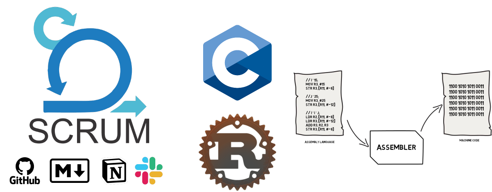
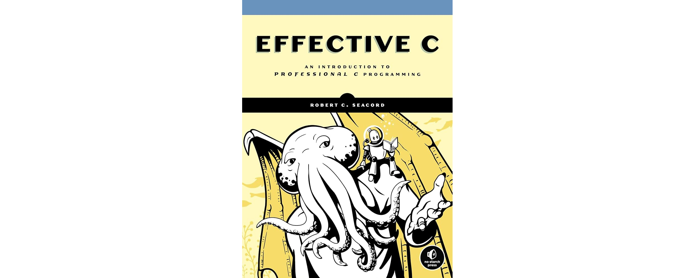
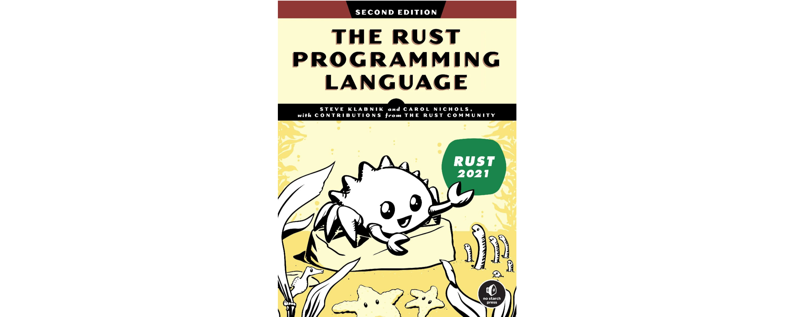
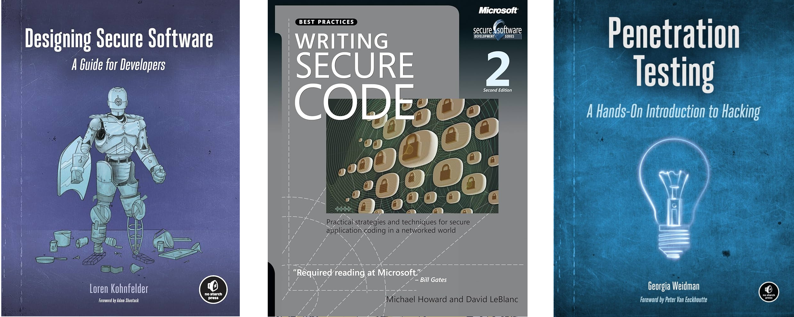
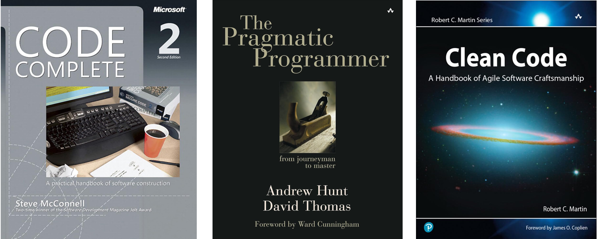

# Presentació

---

## Informació de l'assignatura

- **Nom**: Seguretat del Software
- **Titulació**: 613 - GTT2 - Grau d'Enginyeria Telemàtica (Pla 2020)
- **Codi**: 22660
- **Tipus**: Optativa
- **Crèdits**: 6.0
- **Curs**: 4t
- **Semestre**: Segon semestre
- **Professorat**: Miquel Àngel Cabot Nadal

---

## Temes

1. Introducció a la seguretat del software
2. Git i GitHub. Sistemes de control de versions
3. Llenguatge de marques Markdown
4. Programació en C
5. Seguretat de baix nivell: atacs i exploits
6. Defensa contra exploits de baix nivell
7. Programació en Rust
8. Metodologia Scrum
9. Desenvolupament segur de software
10. Revisió del codi: testing i anàlisi
11. Proves de penetració (Pentesting)

---

---

## Continguts

### 🔥 Atacs de baix nivell

- Trencament de la pila
- Atacs de cadenes de format
- Accés a la memòria obsoleta
- Programació orientada al retorn (ROP)

### 🛡️ Defenses contra atacs basats en memòria

- _Stack canaries_
- Dades no executables (W+X o DEP)
- Aleatorització de disseny d'espai d'adreces (ASLR)
- Aplicació de seguretat de memòria (p. ex., SoftBound)
- Integritat del flux de control (CFI)

---v

### 🏗️ Disseny segur

- Modelatge d'amenaces
- Principis de disseny de seguretat:
  - Simplicitat
  - Confiar amb reticència (_trust with reluctance_)
  - Defensar en profunditat (_defend in depth_)
- Exemples reals de dissenys bons i dolents

### 🧪 Revisió de codi automatitzada

- Anàlisi estàtica
- Execució simbòlica
- Proves de fuzz de caixa blanca

### 🎯 Proves de penetració i fuzzing

- Objectius, tècniques i eines

---

## Avaluació

- **Activitats pràctiques**: 60% de la nota fina
  - Pràctica 1: Temes 1 a 3
  - Pràctica 2: Temes 4 a 6
  - Pràctica 3: Temes 7 a 8
  - Pràctica 4: Temes 9 a 11
- **Exàmens escrits**: 40% de la nota final
  - Exàmen 1r parcial: Temes 1 a 6
  - Exàmen 2n parcial: Temes 7 a 11
- **Exàmen de recuperació**

---

## Programació en C

- Algunes pràctiques es faran amb llenguatge C
- **Llibre recomanat**:
  - _Effective C: An Introduction to Professional C Programming_, Robert C. Seacord

---

## Programació en Rust

- També es faran pràctiques amb llenguatge Rust
- **Llibre recomanat**:
  - _The Rust Programming Language_, Steve Klabnik i Carol Nichols
  - Disponible online: [Rust Book](https://doc.rust-lang.org/book/)

---

## Llibres recomanats per aquesta assignatura

- _Designing Secure Software: A Guide for Developers_, Loren Kohnfelder
- _Writing Secure Code_, David LeBlanc i Michael Howard
- _Penetration Testing: A Hands-On Introduction to Hacking_, Georgia Weidman

---

## Llibres imprescindibles per a programadors

- _Code Complete: A Practical Handbook of Software Construction, Second Edition_, Steve McConnell
- _The Pragmatic Programmer: Your Journey to Mastery_, David Thomas i Andrew Hunt
- _Clean Code: A Handbook of Agile Software Craftsmanship_, Robert C. Martin

---

## 🔗 Enllaços d'interès

- [Informació de l'assignatura](https://estudis.uib.cat/estudis-de-grau/grau/telematica/GTT2-P/22660/index.html)
- [Cronograma](https://academic.uib.es/pds/consultaPublica/look[conpub]InicioPubHora?entradaPublica=true&lock=true&idiomaPais=ca.ES&planDocente=2024&centro=9399&estudio=331&planEstudio=613&curso=4&trimestre=S/2&asignatura22660=22660&&grupo0=4&consultarAsignaturaGrupoPrivada=S)
- [Guia docent](https://academic.uib.es/doa/consultaPublica/look%5bconpub%5dMostrarPubGuiaDocAs?entradaPublica=true&idiomaPais=ca.ES&_anoAcademico=2024&_codAsignatura=22660)
