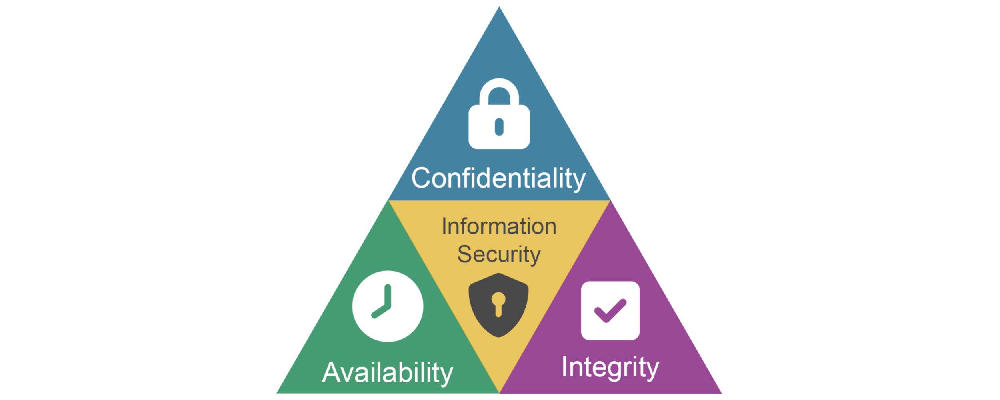
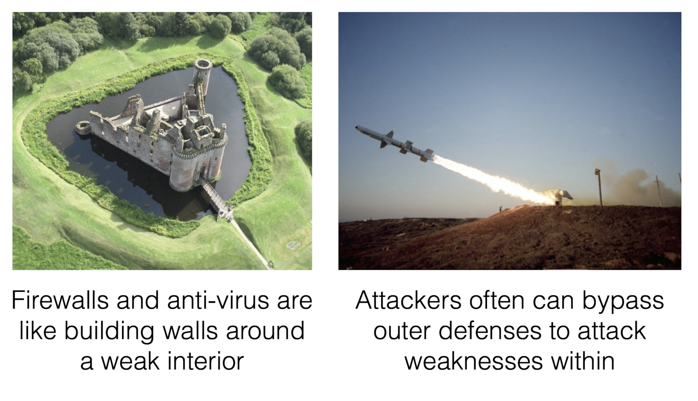
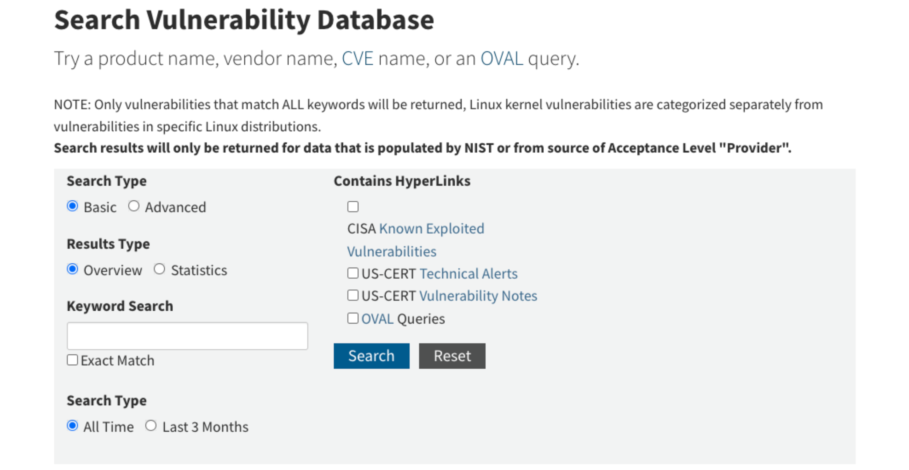
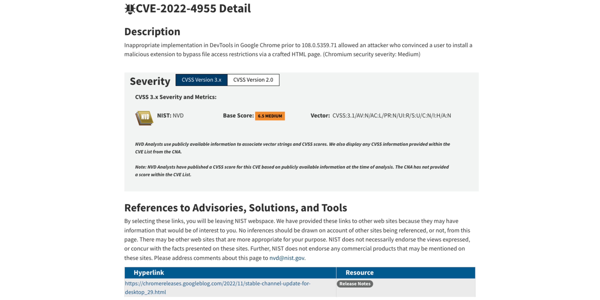
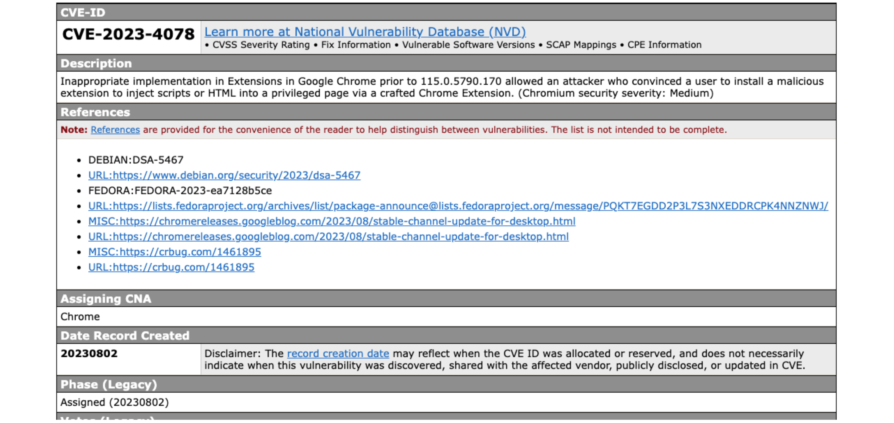

# Introducció a la seguretat del software

---

## Seguretat informàtica o ciberseguretat

- **Definició**: Branca de la informàtica que estudia com assegurar que els recursos dels sistemes informàtics siguin utilitzats de la forma en què es van definir.
- **Objectiu**: Creació de plataformes segures on els agents que hi interaccionen (programes i usuaris) només puguin realitzar accions autoritzades.

---

## Correcció vs. Seguretat

- **Correcció**: Assegura que els sistemes es comportin com s'espera en circumstàncies normals.
  - Exemple: Un sistema de pagament que processa correctament les transaccions.
- **Seguretat**: Es preocupa de prevenir **comportaments no desitjats**.
  - Considera un enemic/oponent/hacker/adversari que intenta de forma **activa** i **maliciosa** eludir qualsevol mesura de protecció

---

## Diferència clau

- **Correcció** -> Què _ha de fer_ un sistema.
- **Seguretat** -> Què _no ha de fer_ un sistema.

---

## Tipus de comportament no desitjat

1. **Confidencialitat**:
   - Assegura que només els usuaris amb drets, privilegis i necessitat d'accedir a la informació poden fer-ho
   - Exemple: Robatori d'informació com secrets corporatius, dades personals,...
2. **Integritat**:
   - Fa que les dades estiguin emmagatzemades com espera l'usuari: que no siguin alterades sense el seu consentiment
   - Exemple: instal·lar software no desitjat (spyware,...), destrucció o modificació de dades (logs, registres de bases de dades...)
3. **Disponibilitat _(Availability)_**:
   - Intenta que els usuaris puguin accedir als serveis amb normalitat en el moment desitjat.
   - Exemple: atac de denegació d'accés (DoS)

---

## Triada CIA

---

## Exemples de violacions de seguretat

- **RSA (març 2011)**
  - Es varen robar fitxes que van permetre el compromís posterior dels clients amb dispositius RSA SecureID
  - [Més informació](https://www.bankvault.com/classics-the-2011-rsa-hack/)
- **Adobe (octubre 2013)**: Codi font i registres de clients robats.
  - Es va robar el codi font, i 130 milions de registres de clients (incloses les contrasenyes)
  - [Més informació](https://www.bbc.com/news/technology-24740873)
- **Target (novembre 2013)**: 40 milions de dades de targetes de crèdit i dèbit robades.
  - Es varen robar uns 40 milions de dades de targetes de crèdit i dèbit
  - [Més informació](https://www.nbcnews.com/business/business-news/target-settles-2013-hacked-customer-data-breach-18-5-million-n764031)

---

## Tipus d'atacs informàtics

1. **Interrupció**: Atempta contra la **disponibilitat** d'un recurs informàtic, ja sigui hardware, un servei o informació.
2. **Intercepció**: Vulnera la **confidencialitat** de les comunicacions de dades, ja s'està accedint a informació per a la qual no es té permís.
3. **Fabricació**: Vulnera la característica d'**integritat**, creant recursos nous per a suplantar els autèntics.
4. **Modificació**: Vulnera la **integritat** de les dades, alterant-les d'alguna manera des de la seva font original fins al receptor d'aquestes.

---

## Defectes i vulnerabilitats

- Moltes infraccions comencen explotant una **vulnerabilitat**
- **Vulnerabilitat**: **Defecte del programari** rellevant per a la seguretat que pot ser **explotat** (_exploit_) per produir un comportament no desitjat
- Hi ha un **defecte** del programari quan el programari es comporta incorrectament, és a dir, no compleix el seu requisits
- **Defectes**:
  - **Flaw** (defecte): Defecte en el **disseny**
  - **Bug** (error): Defecte en la **implementació**

---

## Correcció i seguretat

- És massa car corregir tots els _bugs_ abans de desplegar els programes
  - Per tant, les empreses només arreglen els que tenen més probabilitats d'afectar als usuaris normals
- A tenir en compte: els **adversaris/hackers** no són usuaris normals
- L'adversari intentarà activament trobar defectes en interaccions de característiques i casos extrems
  - Per a un usuari típic, trobar un _bugs_ (accidentalment) provocarà un error, que després intentarà evitar.
  - Un adversari treballarà per trobar un _bugs_ i explotar-lo per assolir els seus objectius

---

## Solució

> Per garantir la seguretat, hem d'**eliminar els bugs i defectes de disseny** i/o fer-los més **difícils d'explotar**

---

## Seguretat del software

- La seguretat del software és un tipus de seguretat informàtica que es centra en el **disseny i la implementació segura del software**
  - Evitar vulnerabilitats del codi, flaws i bugs
  - Utilitzant els millors llenguatges, eines i mètodes
- Focus d'estudi: **EL CODI**
- Per contra: molts enfocaments populars de seguretat tracten el programari com una **caixa negra** (ignorant el codi)
  - Seguretat del sistema operatiu, antivirus, tallafocs, etc.

---

## Per què és important la seguretat del software?

- Els **defectes del software** solen ser la causa principal dels problemes de seguretat
  - **La seguretat del software té com a objectiu abordar aquests defectes directament**
- Altres formes de seguretat solen ignorar el programari i construir defenses al seu voltant
  - Però si es mantenen els defectes del programari, els atacants poden trobar una manera de saltar-se aquestes defenses

---

---

## Altres formes de seguretat

- Seguretat del **sistema operatiu**
  - Gestionen les accions dels programes (_system calls_)
  - Per exemple, polítiques de lectura i escriptura de fitxers, enviament i recepció de paquets de xarxa, engegar nous programes...
- **Firewalls i IDSs** (_Intrusion Detection System_)
  - Observen, bloquegen i filtren els missatges intercanviats per programes
- **Antivirus**
  - Cerquen signes de comportament maliciós als fitxers locals

---

## Riscos i vulnerabilitats del programari

- Els **sistemes d'informació i comunicació** i el **programari** són **susceptibles** de **contenir errors**
  - Errors en el seu **disseny** (**_flaw_**) o **desenvolupament** (**_bug_**)
- Un programari que **funciona correctament** és aquell que fa exactament tot allò pel que va ser creat i dissenyat.
  - Pot ser **correcte** des del punt de vista **funcional** però a la vegada pot ser **insegur**

---v

- Els errors en el programari poden ser utilitzats:
  - per a atacar el sistema i posar-ne en perill el bon funcionament
  - posar en perill la **confidencialitat** i l'ús de les dades que hi ha emmagatzemades
  - com a porta d'entrada per a executar **codi maliciós**

---

## Bugs

- **_Bug_**: és un error, un defecte o fallada en un programa o sistema informàtic, que fa que es produeixi un resultat incorrecte o inesperat o que es comporti de forma no prevista
- La majoria dels errors es deuen als errors comesos per les **persones**:
  - en el **desenvolupament** del codi
  - en el **disseny**
- Quan es produeix un error en el programari, aquest error pot ser utilitzat per un **_hacker_** o un **atacant** com a **porta d'entrada**

---

## Bases de dades de vulnerabilitats

- **Vulnerabilitat**: **debilitat** de qualsevol tipus que compromet la seguretat del sistema informàtic
- Hi ha diversos organismes, fundacions i empreses que es dediquen a recollir, catalogar i **enregistrar les vulnerabilitats conegudes**
- La informació sobre les vulnerabilitats es poden trobar en diverses bases de dades, repositoris i llistes de distribució públiques _open source_ o d'iniciativa privada a través de la xarxa
- La informació és recopilada gràcies a les aportacions de:
  - la comunitat
  - els fabricants
  - els organismes governamentals
  - institucions i empreses públiques i privades

---v

- Aquestes bases de dades aporten informació addicional de gran interès, com ara:
  - tipus de vulnerabilitat
  - descripció
  - conseqüències
  - entorns i programaris afectats
  - solucions (_patches_)
  - prevencions
  - dates de descoberta de la vulnerabilitat
  - i altra informació d'interès.

---

## National Vulnerability Database

- [https://nvd.nist.gov/](https://nvd.nist.gov/)
- NVD és un repositori del govern dels EUA
  - Pertany al National Institute of Standards and Technology (NIST)
- És una base de dades pública
- Manté informació estandarditzada sobre vulnerabilitats
- Aquesta gestió permet l'automatització de les mesures i gestió de vulnerabilitats

---

## Cercador de vulnerabilitats d'NVD

---

## Informació d'una vulnerabilitat a NVD que afecta a Google Chrome

---

## Common Vulnerabilities and Exposures (CVE)

- [https://cve.mitre.org](https://cve.mitre.org)
- CVE és un diccionari de coneixement públic sobre les vulnerabilitats de seguretat
- Cada referència te un número d'identificació únic, d'aquesta forma proveeix una nomenclatura comú per al coneixement públic, que permet l'intercanvi de dades entre els productes de seguretat.

---

## Informació d'una vulnerabilitat a CVE que afecta a Google Chrome

---

## Exploit

- **_Exploit_**: codi que permet a un atacant / testejador aprofitar una vulnerabilitat del sistema i comprometre la seva seguretat, o causar un comportament no desitjat o imprevist del sistema
- Es tracta d'un programa que aconsegueix **provocar l'error** aprofitant la vulnerabilitat d'un altre **programa**
- Un cop ha provocat l'error, aprofita aquest error per a **injectar un codi** o un **_payload_** per tal que sigui executat i així obtenir el control del sistema atacat, o realitzar algun altre tipus d'atac amb altres finalitats

---

## Payload

- **_Payload_**: codi que s'executa en el destí atacat en executar-se un exploit
  - L'exploit provoca l'error del sistema aprofitant una vulnerabilitat i injecta un payload amb el codi que es vol que s'executi en la màquina atacada
- Normalment es tracta d'una seqüència d'instruccions en llenguatge assemblador amb l'objectiu d'executar-se en el sistema de destí per a crear accions, com per exemple:
  - crear un usuari en el sistema remot
  - executar alguna línia de comandes i enllaçar-ho a un port local, etc.
- Un payload pot ser utilitzat per diversos exploits i que un mateix exploit pot utilitzar diversos payloads.

---

## Exploits remots

- Un atac remot és un atac que pot ser iniciat des d'una ubicació diferent de la de l'equip de la víctima
- Funciona en una xarxa o a través d'Internet i explota la vulnerabilitat de seguretat sense accés previ al sistema vulnerable de la víctima

---v

- La gran extensió d'Internet facilita la difusió del programari maliciós a través de la xarxa
- Exemples de cucs (_worms_) que es difon per la xarxa: Sasser, Blaster o Code Red
  - Aprofitaven serveis de xarxa vulnerables explotables en remot per copiar-se d'una màquina a una altra
- En general, consisteix en servidors que intenten accedir a una aplicació client i un cop ho aconsegueixen, envien un exploit per a ser executat

---

## Code Red Worm

<!-- markdownlint-disable MD033 -->
<iframe width="560" height="315" src="https://www.youtube.com/embed/_pMF_3vDO4k?si=5BShYynR0Ez2niQq" title="YouTube video player" frameborder="0" allow="accelerometer; autoplay; clipboard-write; encrypted-media; gyroscope; picture-in-picture; web-share" referrerpolicy="strict-origin-when-cross-origin" allowfullscreen></iframe>
<!-- markdownlint-enable MD033 -->

---

## Exploits locals

- Un exploit local requereix accés previ al sistema vulnerable
- S'executa localment en l'equip
- En general eleva els privilegis al nivell de l'administrador o de root per tal que l'exploit pugui tenir un control total del sistema
  - També és possible usar diversos exploits, primer per a obtenir accés de baix nivell, i després escalar privilegis diverses vegades fins arribar a l'arrel (root) o a nivell d'administrador.
- Alguns exploits també es poden distribuir localment a través de dispositius d'emmagatzematge USB
- Per exemple: el cuc Conficker (o W32.Downadup), W32.Spybot, W32.Randex i W32.Mytob

---

## Conficker Worm

<!-- markdownlint-disable MD033 -->
<iframe width="560" height="315" src="https://www.youtube.com/embed/5FuQ9aRZL3E?si=UHIekCxYkN27cQJq" title="YouTube video player" frameborder="0" allow="accelerometer; autoplay; clipboard-write; encrypted-media; gyroscope; picture-in-picture; web-share" referrerpolicy="strict-origin-when-cross-origin" allowfullscreen></iframe>
<!-- markdownlint-enable MD033 -->

---

## Client Side

- Els atacs Client Side busquen aprofitar-se de vulnerabilitats que típicament es troben en les **aplicacions client**, instal·lades en gran part de les estacions de treball
  - Aplicacions d'ofimàtica, com Microsoft Office o Open Office, lectors de PDF, com Adobe Acrobat Reader, navegadors d'Internet, com Internet Explorer, Firefox, Chrome o Safari...
- L'exploit està dins d'un arxiu amb un format suportat per alguna d'aquestes aplicacions i que arriba a la màquina objectiu per mitjans com email o USB
- Es necessita que l'usuari obri l'arxiu, cliqui algun enllaç o realitzi alguna acció en concret.

---v

- Es tracta de programari maliciós que apareix com a fitxer o programari aparentment fiable
  - Es tracta de fitxers amb un format conegut com ara ZIP, RAR, MPEG, MP3, JPG, etc., però que en realitat incorporen codi maliciós de forma intencionada
- Per exemple: desbordament de memòria provocat en un fitxer JPEG que permet a atacants remots executar codi arbitrari a través d'una imatge JPEG
  - CVE-2004-0200 (CVE = Common Vulnerabilities and Exposures)
- Poden ser utilitzats en combinació amb el mètode d'**enginyeria social**

---

## Social Engineering - How Bad Guys Hack Users

<!-- markdownlint-disable MD033 -->
<iframe width="560" height="315" src="https://www.youtube.com/embed/uMkOphesrqI?si=RPJYUOWN8PIvjiFl" title="YouTube video player" frameborder="0" allow="accelerometer; autoplay; clipboard-write; encrypted-media; gyroscope; picture-in-picture; web-share" referrerpolicy="strict-origin-when-cross-origin" allowfullscreen></iframe>
<!-- markdownlint-enable MD033 -->

---

## Malware vs Exploits: What's the Difference?

<!-- markdownlint-disable MD033 -->
<iframe width="560" height="315" src="https://www.youtube.com/embed/a9u8-rNCHUs?si=idB-mc2qgZRZFaM4" title="YouTube video player" frameborder="0" allow="accelerometer; autoplay; clipboard-write; encrypted-media; gyroscope; picture-in-picture; web-share" referrerpolicy="strict-origin-when-cross-origin" allowfullscreen></iframe>
<!-- markdownlint-enable MD033 -->

---

## Tipus d'exploits

- Zero-day
- Full disclosure
- Responsible disclosure

---

## Zero-day

- Forat o vulnerabilitat en el programari que és desconegut per al fabricant o desenvolupador
- Pot ser explotat pels hackers abans que el venedor ho descobreixi i creï un _patch_ per tal d'eliminar-ne la vulnerabilitat
- Són els més perillosos

---

## Full disclosure

- Full disclosure és la pràctica de publicar la informació de les vulnerabilitats al mateix moment que es descobreix, de forma que sigui accessible per a tothom
  - Per tant, les víctimes potencials estan informades de com poden ser atacades i els fabricants poden desenvolupar el _patch_
- També s'anomenen **exploits de dia 1**, ja que es coneix l'error però encara no hi ha un _patch_

---

## Responsible disclosure

- El fabricant descobreix o és informat de l'error però no es fa públic
- Quan el fabricant té disponible el _patch_ i el posa a disposició dels clients és quan es dóna a conèixer i es fa públic
- Sistema molt comú en les grans empreses de programari com Microsoft
  - S'aplica el principi de no publicar res que pugui afectar la seguretat dels seus clients.

---

## Punts de vista sobre seguretat del software

---

## Black Hat vs. White Hat

- **Black Hat**: Perspectiva de l'atacant.
  - Quins defectes constitueixen vulnerabilitats?
  - Com s'exploten?
- **White Hat**: Perspectiva del defensor.
  - Com evitar defectes abans de desplegar-los?
  - Com dificultar l'explotació de vulnerabilitats?
