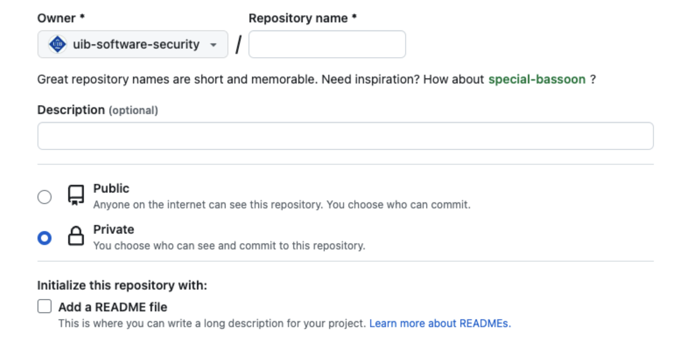
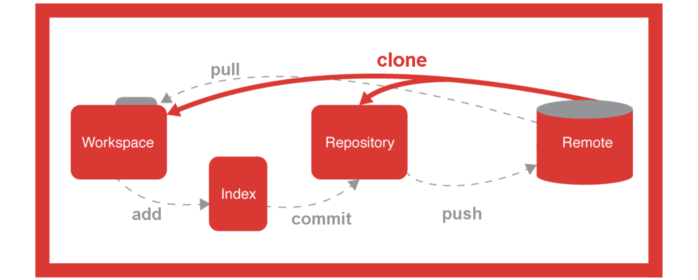
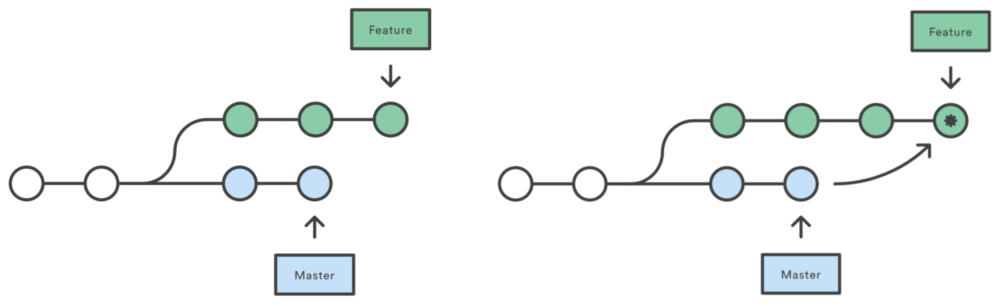
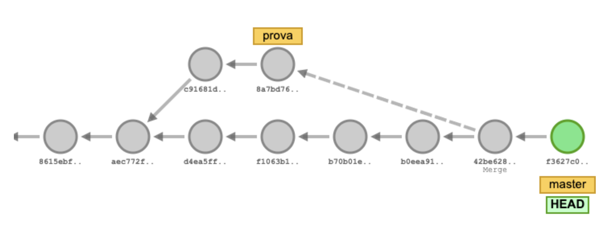
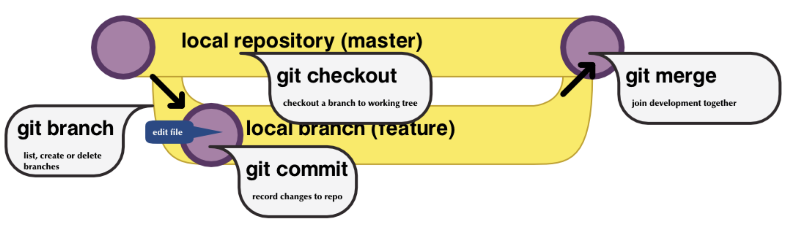

# Git i GitHub. Sistemes de control de versions

---

## Què és el software de control de versions?

- Un **sistema de control de versions** (VCS - Version Control System) és una eina que permet gestionar els canvis en fitxers al llarg del temps.
- Registra l'historial complet de modificacions, permetent:
  - Veure qui va fer cada canvi i quan
  - Recuperar versions anteriors del codi
  - Comparar diferents versions
  - Treballar en paral·lel sense sobreescriure canvis d'altres desenvolupadors

---

### Per què és necessari?

- **Col·laboració**: múltiples persones poden treballar en el mateix projecte sense conflictes
- **Historial**: es manté un registre complet de tots els canvis realitzats
- **Recuperació**: es pot tornar a qualsevol versió anterior del projecte
- **Rastrejabilitat**: es pot identificar qui va introduir un canvi i per què
- **Experimentació**: es poden crear branques per provar noves funcionalitats sense afectar el codi principal

---

### Beneficis principals

- ✅ **Seguretat**: el codi està sempre respaldat
- ✅ **Organització**: gestió ordenada de versions i canvis
- ✅ **Productivitat**: facilitat per treballar en equip
- ✅ **Qualitat**: millor seguiment i revisió del codi

---

## Història del control de versions

### Primera generació: Sistemes locals (1970s-1980s)

- **SCCS (Source Code Control System)** - 1972

  - Creat per Marc Rochkind als laboratoris Bell
  - Primer sistema de control de versions utilitzat àmpliament
  - Treballava amb fitxers individuals, no amb projectes complets
  - Exemple: utilitzat per mantenir el codi del sistema operatiu Unix
- **RCS (Revision Control System)** - 1982

  - Creat per Walter F. Tichy a la Universitat de Purdue
  - Millorava SCCS amb millor eficiència i facilitat d'ús
  - Permetia treballar amb múltiples fitxers
  - Exemple: utilitzat per mantenir el codi de GCC (GNU Compiler Collection)

---

### Segona generació: Sistemes centralitzats (1990s-2000s)

- **CVS (Concurrent Versions System)** - 1990

  - Creat per Dick Grune
  - Primer sistema que permetia treballar en xarxa
  - Múltiples desenvolupadors podien treballar simultàniament
  - Exemple: utilitzat per projectes com Apache HTTP Server, Mozilla Firefox
- **Subversion (SVN)** - 2000

  - Creat per CollabNet com a successor de CVS
  - Millorava CVS amb millor gestió de fitxers binaris i renoms
  - Sistema centralitzat amb un únic repositori
  - Exemple: utilitzat per projectes com Apache Software Foundation, SourceForge

---

### Tercera generació: Sistemes distribuïts (2000s-present)

- **Git** - 2005

  - Creat per Linus Torvalds per al desenvolupament del kernel de Linux
  - Sistema distribuït, ràpid i eficient
  - Cada còpia del repositori conté l'historial complet
  - Exemple: utilitzat per milions de projectes, incloent Linux, Android, Kubernetes
- **Mercurial** - 2005

  - Creat per Matt Mackall com a alternativa a Git
  - Interfície més simple que Git
  - Exemple: utilitzat per projectes com Mozilla Firefox (fins al 2016), Python

---

### Evolució i adopció

- **2008**: GitHub es llança, popularitzant Git i el desenvolupament col·laboratiu
- **2010s**: Git esdevé l'estàndard de facto per al control de versions
- **Actualitat**: Git domina el mercat amb més del 90% d'adopció segons diverses enquestes

---

## Git: sistema de control de versions

- **Git** és un sistema de control de versions (**Version Control System, VCS**) dissenyat per fer el seguiment dels canvis en fitxers i coordinar el treball entre múltiples persones.
- És utilitzat principalment per a la gestió del codi font en el desenvolupament de programari.
- Cada directori Git en qualsevol ordinador és un **repositori complet**, amb historial complet i capacitats de seguiment de versions, independentment de l'accés a la xarxa o a un servidor central.
- Git va ser creat per **Linus Torvalds** per al desenvolupament del kernel de Linux.
- És un programari lliure distribuït sota els termes de la **GNU General Public License versió 2**.

---

## Instal·lació de Git

- **Windows**: descarregar des de [https://git-scm.com/download/win](https://git-scm.com/download/win)
- **Linux**: executar la comanda

```sh
sudo apt install git
```

- **macOS**: instal·lar Xcode des de l'App Store i executar

```sh
xcode-select --install
```

---

## Configuració de Git

- **Nom i correu electrònic**: cal configurar el nom i correu electrònic per a identificar els commits.

```sh
git config --global user.name "<user-name>"
git config --global user.email "<user-email>"
```

- **Visualització de la configuració**:

```sh
git config --list
```

---

## Estructura d'un repositori

- **El directori de treball (_working tree_):** conté els fitxers en què estàs treballant actualment.
- **L'índex (_staging area_):** és una àrea de preparació on es configuren els canvis per validar-los (**commits**).
- **El repositori (_HEAD_):** és la ubicació final on es guarden els canvis validats.


---

## Flux de treball

1. Els canvis fets al directori de treball han de ser primer afegits a l'índex.
2. Només els canvis que es trobin a l'índex seran realment validats (**committed**) al repositori.


---

## Comandes bàsiques de Git

- Inicialitzar un repositori nou:
  - Crea un nou repositori local (`/.git`).

```sh
git init
```

- Afegir fitxers a l'índex
  - Agafa una instantània dels fitxers per a versionar, afegint-los a l'**Index** (_staging area_).
  - L'opció `-u` també afegeix els fitxers per eliminar.

```sh
git add [-u] [filename | . | pattern]
```

- Validar els canvis al repositori
  - Guarda els canvis de l'**Index** al **Repositori** (**HEAD**).

```sh
git commit -m "Missatge del commit"
```

---

## Veure l'estat del repositori git

- Llistar tots els fitxers nous o modificats (comparats amb el **HEAD**)

```sh
git status
```

- Per veure els canvis entre l'àrea de treball i el **Index** (_staging area_)

```sh
git diff <filename>
```

- Mostrar els canvis (commits) realitzats al **HEAD** (Repositori)
  - `-p` mostra els detalls de cada commit.

```sh
git log [-p]
```

- Mostrar informació d'un commit

```sh
git show <id_commit>
```

---

## Exercici pràctic Git

[Anem a practicar un poc.](./Exercici_practic_Git_local.pdf)

---

## Repositori remot: GitHub


- Per començar a compartir els nostres canvis amb altres persones, necessitem enviar-los a un **repositori remot**
- Utilitzarem **GitHub** com a repositori remot
- **GitHub** és un repositori de control de versions Git basat en web
- Per registrar-te a GitHub:
  - Ves a [https://github.com](https://github.com)
  - Registra un nou compte ("**Sign up**") amb el teu correu electrònic

---

## Crear un repositori a GitHub

- Has de triar l'opció "**New repository**" del menú "**+**" a la part superior dreta
- A la següent pantalla has de configurar:
  - **Owner**: Pot ser el teu usuari o una organització
  - **Nom del repositori**
  - **Nivell de visibilitat**: Públic o Privat
  - Opcionalment, marca "**Initialize this repository with a README**"
  - Opcionalment, afegeix un fitxer `.gitignore` del llenguatge de programació desitjat (`.gitignore` especifica els fitxers que es vol ignorar intencionadament)
  - Opcionalment, afegeix una llicència **GPL 3.0**, **MIT**,...

---v


---v



---

## URL del repositori de GitHub

- Quan estàs dins d'un repositori, pots veure la URL HTTPS del repositori per clonar-lo amb el botó "**Code**".


---

## Comandes per configurar un repositori remot

- Crea una còpia d'un repositori remot

```sh
git clone <url>
```

- Mostra el(s) repositori(s) remot(s)

```sh
git remote show [origin]
```

- Afegeix un repositori remot

```sh
git remote add origin <url>
```

---

## Comandes per treballar amb un repositori remot

- Puja tots els fitxers validades de la branca local al repositori remot

```sh
git push [origin] [master]
```

- Descarrega i incorpora els canvis del repositori remot (`git fetch` + `git merge`)

```sh
git pull [origin] [master]
```

- Descarrega els canvis del repositori remot

```sh
git fetch
```

---

## Esquema de treball amb Git



---

## Ús de branques

- A **Git**, cada **commit** sap quin _commit_ el precedeix (historial).
- Una **branch** a Git és simplement un apuntador a un commit.
  - Cada vegada que es fa un **commit**, l'apuntador de la branca activa s'actualitza automàticament. L'historial d'una branca seria la seqüència de _commits_ des de l'apuntador de la branca fins al seu inici.
- **HEAD** apunta a la **branca activa**, és a dir, a l'apuntador de l'últim _commit_*_ de la branca activa.

---

## Branques de Git



---

## Comandes de Git amb branques

- Crear una nova branca

```sh
git branch <branch_name>
```

- Mostrar les branques existents

```sh
git branch -l
```

- Esborrar la branca especificada

```sh
git branch -d <branch_name>
```

---

## Més comandes de Git amb branques

- Canviar a la branca especificada, modificant on apunta el HEAD
  - `-b` crea la branca si no existeix

```sh
git checkout [-b] <branch_name>
```

- Crear un nou commit que integri la branca especificada a la branca activa
  - Aquest commit tindrà dos "commits pare". Si no s'especifica una branca, integrarà la branca remota (_origin/master_)

```sh
git merge <branch_name> -m "message"
```

- Reescriure l'historial de commits, integrant la branca especificada en el punt on es va bifurcar

```sh
git rebase <branch_name>
```

---

## Visualitzar les branques de Git



[http://git-school.github.io/visualizing-git/](http://git-school.github.io/visualizing-git/)

---

## Resum de comandes de Git


---v



---

## Altres eines de GitHub

- **Issues**: per informar d'errors, sol·licitar noves funcionalitats o fer preguntes.
- **Pull requests**: per proposar canvis al projecte.
- **Actions**: per automatitzar el flux de treball.
- **Projects**: per organitzar i prioritzar la feina.
- **Wiki**: per documentar el projecte.º
- **Insights**: per analitzar el projecte.

---

### Comandes útils per recordar

```sh
# Afegir repositori remot
git remote add origin <url>

# Pujar branca per primera vegada
git push -u origin <nom-branca>

# Crear i canviar a nova branca
git checkout -b <nom-branca>

# Veure totes les branques (locals i remotes)
git branch -a

# Actualitzar branca principal
git checkout main
git pull origin main
```

---

## Exercici pràctic Github

[Anem a practicar amb Github.](./Exercici_practic_github_branques.pdf)

---

## Workflows de Git: Centralized Workflow

**Centralized Workflow** és el model més simple, similar a SVN, amb un únic repositori central i una única branca principal.

### Estructura

- **Repositori central**: Únic repositori compartit
- **main/master**: Única branca principal
- Tots els desenvolupadors treballen directament a la branca principal

---

### Flux de treball

1. Clonar el repositori central
2. Fer canvis localment
3. Fer commit dels canvis
4. Fer `git pull` per actualitzar amb canvis d'altres
5. Resoldre conflictes si n'hi ha
6. Fer `git push` per pujar els canvis

---

### Avantatges

- ✅ Màxima simplicitat
- ✅ Fàcil d'entendre per a qui ve de SVN
- ✅ Ideal per equips petits
- ✅ No requereix entendre branques
- ✅ Ràpid per projectes simples

---

### Desavantatges

- ❌ Tots treballen a la mateixa branca (risc de conflictes)
- ❌ Difícil treballar en funcionalitats grans sense afectar altres
- ❌ No permet desenvolupament paral·lel segur
- ❌ Pot ser problemàtic per equips grans
- ❌ No aïlla funcionalitats en desenvolupament

---

### Quan utilitzar-lo

- Equips molt petits (1-3 desenvolupadors)
- Projectes simples amb poc codi
- Transició des de SVN o altres sistemes centralitzats
- Projectes amb canvis petits i freqüents
- Quan no es necessita aïllament de funcionalitats

---

## Workflows de Git: Git Flow

**Git Flow** és un model de workflow que utilitza múltiples branques per organitzar el desenvolupament.

### Estructura de branques

- **main/master**: Codi de producció estable
- **develop**: Branca de desenvolupament principal
- **feature/**: Branques per noves funcionalitats (es fusionen a `develop`)
- **release/**: Branques per preparar noves versions (es fusionen a `main` i `develop`)
- **hotfix/**: Branques per correccions urgents (es fusionen a `main` i `develop`)
---
### Avantatges

- ✅ Separació clara entre desenvolupament i producció
- ✅ Ideal per projectes amb versions numerades
- ✅ Permet treballar en múltiples funcionalitats en paral·lel
- ✅ Facilita la gestió de releases

### Desavantatges

- ❌ Més complex que altres workflows
- ❌ Requereix mantenir múltiples branques actives
- ❌ Pot ser excessiu per projectes petits
- ❌ L'historial pot ser complicat amb moltes branques
---
### Quan utilitzar-lo

- Projectes amb cicles de release definits
- Equips grans amb múltiples desenvolupadors
- Aplicacions que requereixen versions estables per producció

---

## Workflows de Git: GitHub Flow

**GitHub Flow** és un workflow simple basat en branques de funcionalitat i Pull Requests.

### Estructura de branques

- **main**: Branca principal sempre desplegable
- **feature/**: Branques de funcionalitat que es fusionen via Pull Request

---

### Flux de treball

1. Crear una branca des de `main`
2. Desenvolupar la funcionalitat
3. Obrir un Pull Request
4. Revisar i discutir els canvis
5. Fusionar a `main` després de l'aprovació
6. Desplegar immediatament

---

### Avantatges

- ✅ Simple i fàcil d'entendre
- ✅ Ideal per desplegaments continus (CI/CD)
- ✅ Ràpid per integrar canvis
- ✅ Perfecte per equips petits i mitjans

### Desavantatges

- ❌ No gestiona versions/releases explícitament
- ❌ Requereix que `main` estigui sempre estable
- ❌ Pot ser problemàtic per projectes amb cicles de release llargs

---

### Quan utilitzar-lo

- Aplicacions web amb desplegaments continus
- Projectes que no necessiten versions numerades
- Equips que volen un workflow simple i ràpid

---

## Workflows de Git: Trunk-based Development

**Trunk-based Development** utilitza una única branca principal (`main` o `trunk`) per a tot el desenvolupament.

### Estructura de branques

- **main/trunk**: Única branca principal
- Branques de funcionalitat molt curtes (hores o dies) que es fusionen ràpidament

---

### Flux de treball

1. Tots els desenvolupadors treballen directament a `main`
2. Les branques de funcionalitat es creen només per funcionalitats grans
3. Les branques es fusionen a `main` el més aviat possible
4. Desplegament continu des de `main`

---

### Avantatges

- ✅ Màxima simplicitat
- ✅ Integració contínua real
- ✅ Menys conflictes de merge
- ✅ Ideal per desenvolupament àgil

### Desavantatges

- ❌ Requereix disciplina per mantenir `main` estable
- ❌ Pot ser difícil per equips grans sense coordinació
- ❌ No adequat per projectes amb cicles de release complexos

---

### Quan utilitzar-lo

- Equips petits i ben coordinats
- Projectes amb desplegaments continus
- Desenvolupament àgil amb integració contínua

---

## Workflows de Git: GitLab Flow

**GitLab Flow** combina Git Flow i GitHub Flow amb un enfocament en entorns de desplegament.

### Estructura de branques

- **main/master**: Branca principal
- **pre-production**: Branca per proves abans de producció
- **production**: Branca que reflecteix el codi en producció
- **feature/**: Branques de funcionalitat

---

### Flux de treball

1. Desenvolupar funcionalitats en branques
2. Fusionar a `main` via Merge Request
3. Desplegar `main` a pre-producció
4. Fusionar `main` a `production` quan estigui llest
5. Etiquetar versions a `production`

### Avantatges

- ✅ Gestiona múltiples entorns (dev, staging, prod)
- ✅ Combina simplicitat amb control de versions
- ✅ Ideal per aplicacions amb entorns separats
- ✅ Permet rollback fàcil

---

### Desavantatges

- ❌ Més complex que GitHub Flow
- ❌ Requereix mantenir múltiples branques d'entorn
- ❌ Pot ser excessiu per projectes simples

### Quan utilitzar-lo

- Aplicacions amb múltiples entorns de desplegament
- Projectes que necessiten control sobre el que està en producció
- Equips que volen un equilibri entre simplicitat i control

---

## Workflows de Git: Forking Workflow

**Forking Workflow** és un model on cada desenvolupador té la seva pròpia còpia del repositori (fork) i proposa canvis mitjançant Pull Requests.

### Estructura

- **Repositori oficial**: Repositori central del projecte (solo lectura per a la majoria)
- **Forks**: Còpies completes del repositori que cada desenvolupador crea
- **Branques locals**: Cada desenvolupador treballa en branques del seu fork

---

### Flux de treball

1. Fer un **fork** del repositori oficial al teu compte
2. Clonar el teu fork localment
3. Crear una branca per a la funcionalitat
4. Desenvolupar i fer commits a la branca
5. Pujar la branca al teu fork
6. Obrir un **Pull Request** des del teu fork al repositori oficial
7. Els mantenedors revisen i fusionen el PR

---

### Avantatges

- ✅ Control total sobre qui pot fer commits al repositori oficial
- ✅ Ideal per projectes open source amb molts contribuïdors
- ✅ Els mantenedors poden revisar tot el codi abans de fusionar
- ✅ Cada desenvolupador treballa de forma independent
- ✅ No requereix gestionar permisos d'accés per a tots els desenvolupadors

---

### Desavantatges

- ❌ Més complex que altres workflows
- ❌ Requereix mantenir sincronitzat el fork amb el repositori oficial
- ❌ Pot ser lent per equips interns que necessiten integració ràpida
- ❌ Més passos per integrar canvis

---

### Quan utilitzar-lo

- Projectes open source amb molts contribuïdors externs
- Projectes on es vol control estricte sobre el codi que s'integra
- Quan no es vol donar accés directe al repositori principal
- Projectes amb un petit equip de mantenedors

---

## Comparació de workflows

| Característica | Git Flow | GitHub Flow | Trunk-based | GitLab Flow | Forking | Centralized |
|----------------|----------|-------------|-------------|-------------|---------|-------------|
| **Complexitat** | Alta | Baixa | Mínima | Mitjana | Alta | Mínima |
| **Branques** | Múltiples | Feature branches | Principalment main | Amb entorns | Feature branches | Una sola (main) |
| **Releases** | Explícits | Implícits | Implícits | Amb etiquetes | Implícits | Implícits |
| **Desplegament** | Per release | Continu | Continu | Per entorn | Continu | Continu |
| **Equip** | Gran | Petit-Mitjà | Petit | Mitjà-Gran | Molt gran | Molt petit |
| **Control d'accés** | Mitjà | Mitjà | Baix | Mitjà | Alt | Mitjà |
| **Adequat per** | Software amb versions | Web apps | Àgil/CI-CD | Multi-entorn | Open source | Equips petits |

---

### Recomanació

- **Projectes petits (1-3 devs)**: Centralized Workflow o GitHub Flow
- **Projectes mitjans**: GitHub Flow o GitLab Flow
- **Projectes grans amb releases**: Git Flow o GitLab Flow
- **Desplegament continu**: GitHub Flow o Trunk-based
- **Projectes open source**: Forking Workflow
- **Transició des de SVN**: Centralized Workflow


---

## GitHub Project Management

<!-- markdownlint-disable MD033 -->

<iframe width="560" height="315" src="https://www.youtube.com/embed/oPQgFxHcjAw?si=Vnc_AEurpX6E4dje" title="YouTube video player" frameborder="0" allow="accelerometer; autoplay; clipboard-write; encrypted-media; gyroscope; picture-in-picture; web-share" referrerpolicy="strict-origin-when-cross-origin" allowfullscreen></iframe>
<!-- markdownlint-enable MD033 -->

---


## 🔗 Enllaços

- [Git & GitHub Crash Course For Beginners (Youtube)](https://www.youtube.com/watch?v=SWYqp7iY_Tc)
- [Using Projects for feature planning (Youtube)](https://www.youtube.com/watch?v=yFQ-p6wMS_Y)
- [Tools & Concepts for Mastering Version Control with Git (Youtube)](https://www.youtube.com/watch?v=Uszj_k0DGsg&t=2s)
- [ProGit book](https://git-scm.com/book/en/v2)
- [Git and GitHub learning resources](https://docs.github.com/en/get-started/quickstart/git-and-github-learning-resources)
- [GitHub Skills](https://skills.github.com/)
- [Git Cheat Sheet](https://education.github.com/git-cheat-sheet-education.pdf)
