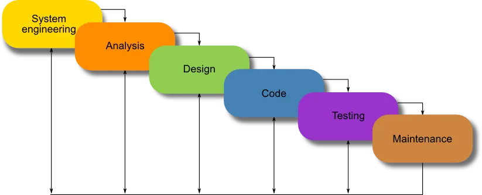
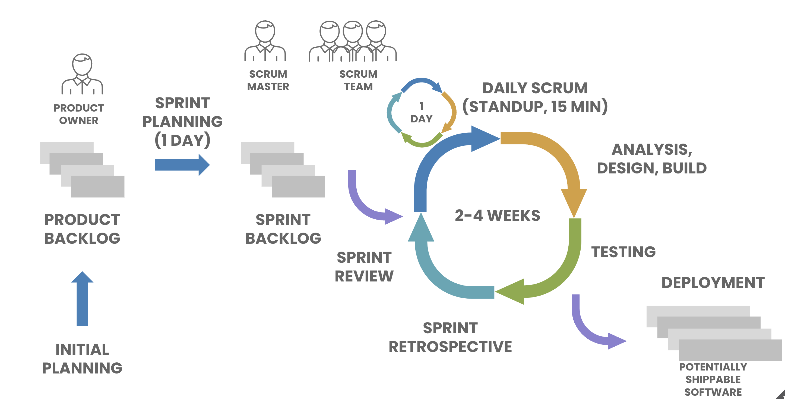
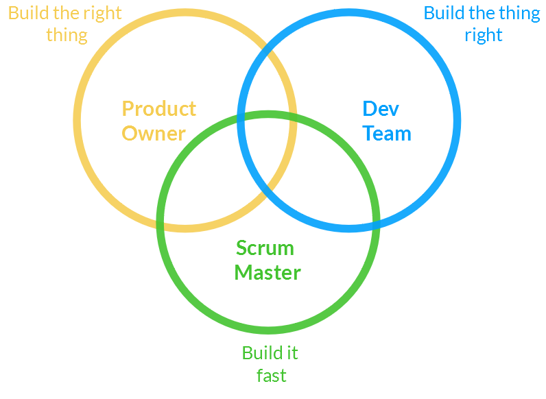
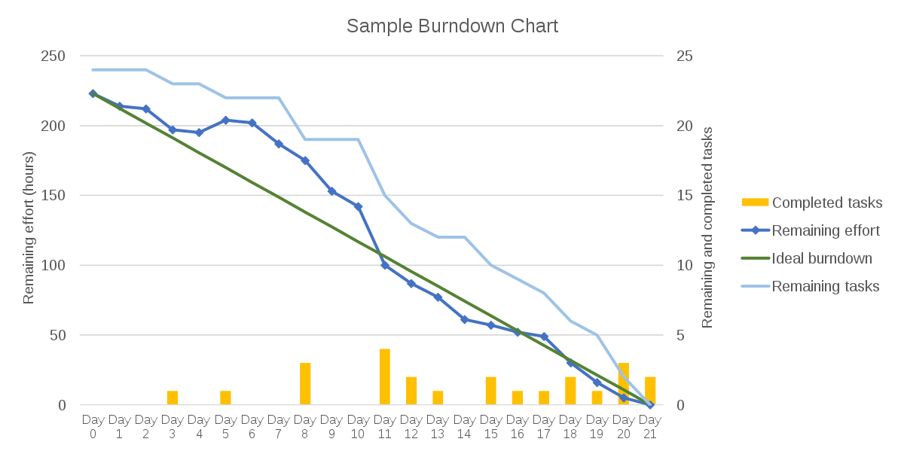
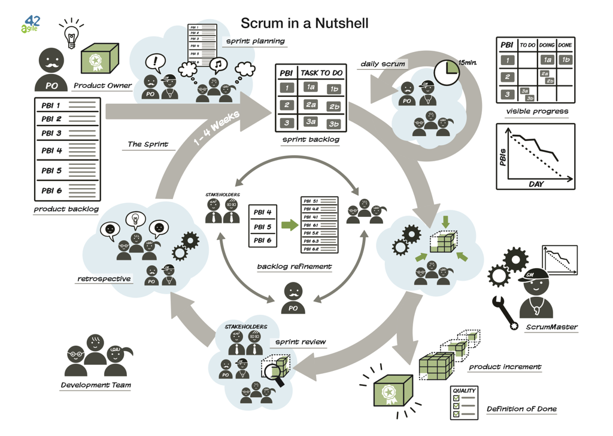

# Metodologia Scrum

---

## Desenvolupament de software

- **El desenvolupament de software** és la **programació**, la **documentació**, les **proves** (_tests_) i la **correcció d'errors** informàtiques necessàries per crear i mantenir aplicacions.
  - Això dona com a resultat un producte de software.
- Es refereix al procés **estructurat** i **planificat** d'escriure i mantenir el codi font, però en un sentit més ampli del terme.
- Les **metodologies de desenvolupament** més importants són:
  - Metodologia **"Waterfall"**
  - Metodologia **"Agile"**, per exemple, **Scrum**.

---

## Fases del procés de desenvolupament de software

- La majoria de metodologies comparteixen alguna combinació de les fases següents del desenvolupament de software:
  - **Anàlisi de requisits**: documentació de les necessitats del client
  - **Disseny**: elecció de la tecnologia, disseny de l'arquitectura del projecte i dels seus components
  - **Implementació/codificació**: programació del codi del projecte
  - **Proves**: tests, intentar detectar imperfeccions per tal de corregir-les
  - **Desplegament**: instal·lació, o totes les activitats que fan que un sistema de software estigui disponible per al seu ús
  - **Manteniment**: ajuda, servei tècnic, millora del software

---

## Model _Waterfall_ (cascada)

---

## Exemple de metodologia àgil: SCRUM

- Les **metodologies** de desenvolupament de software **àgil** es basen en l'**adaptabilitat** a qualsevol **canvi** per augmentar les possibilitats d'èxit d'un projecte.
- **Scrum** és un marc de treball àgil per desenvolupar, lliurar i mantenir productes complexos.
  - L'objectiu és desenvolupar i crear un producte en un període determinat, on un equip format per persones diferents treballa junt per assolir un objectiu comú.
  - Es basa en la premissa que, durant el desenvolupament del producte, els clients canviaran d'opinió sobre allò que volen i necessiten.
  - Accepta que el problema no està completament comprès ni definit.
  - Se centra a maximitzar la capacitat de l'equip per lliurar ràpidament en el temps previst i respondre a necessitats d'última hora.

---

## Introducció a Scrum

<!-- markdownlint-disable MD033 -->
<iframe width="560" height="315" src="https://www.youtube.com/embed/9TycLR0TqFA?si=23BW6jMyI44x22eq" title="YouTube video player" frameborder="0" allow="accelerometer; autoplay; clipboard-write; encrypted-media; gyroscope; picture-in-picture; web-share" referrerpolicy="strict-origin-when-cross-origin" allowfullscreen></iframe>
<!-- markdownlint-enable MD033 -->

---

## SCRUM, una metodologia àgil

Fases, documents i rols de la metodologia Scrum

---

## Scrum: sprint

- Un **Sprint** (o **iteració**) és la **unitat bàsica de desenvolupament** en Scrum
  - La durada és d'entre una setmana i un mes
  - **Comença** amb un esdeveniment de **planificació de l'sprint** (**_sprint planning_**) que estableix un objectiu d'sprint
  - **Acaba** amb una **revisió de l'sprint** (**_sprint review_**) i una **retrospectiva de l'sprint** (**_sprint retrospective_**), on es revisa el progrés per mostrar-lo als interessats i s'identifiquen lliçons i millores.

---

## Scrum: rols

- **Product Owner**
  - Representa les parts interessades (_stakeholders_) i la veu del client
  - És responsable de maximitzar el valor del producte resultant del treball de l'Equip de Desenvolupament
- **Scrum Team** (equip de desenvolupament)
  - Responsable de lliurar les diferents parts del producte dins els períodes establerts (Sprint)
- **Scrum Master**
  - Elimina els obstacles que impedeixen que l'equip assoleixi l'objectiu de cada sprint
  - No és el líder de l'equip (ja que aquest és autoorganitzat), però actua com a protecció entre l'equip i qualsevol influència que el distregui

---

## Rols d'Scrum

---

## Scrum: reunions

- **Daily Scrum**
  - **Cada dia de l'Sprint** es fa una reunió sobre l'estat del projecte, normalment a primera hora del dia.
  - Esdeveniment limitat a 15 minuts
  - Es responen tres preguntes: "Què vaig fer ahir?", "Què faré avui?", "Hi ha algun impediment que m'impedeixi assolir l'objectiu de l'Sprint?"
- **Reunió de Planificació de l'Sprint** (**Sprint Planning**)
  - A l'**inici de l'Sprint**, aquesta reunió planifica la feina que s'ha de dur a terme
- **Reunió de Revisió de l'Sprint** (**Sprint Review**)
  - Al **final de l'Sprint**, per revisar la feina que s'ha completat i la que no
- **Retrospectiva de l'Sprint** (**Sprint Retrospective**)
  - Al **final de l'Sprint**, per identificar els aspectes positius i aquells que cal millorar per optimitzar el rendiment de l'equip

---

## Estimació i planificació àgil

<!-- markdownlint-disable MD033 -->
<iframe width="560" height="315" src="https://www.youtube.com/embed/gE7srp2BzoM?si=QWUp0FxcKBICWav8" title="YouTube video player" frameborder="0" allow="accelerometer; autoplay; clipboard-write; encrypted-media; gyroscope; picture-in-picture; web-share" referrerpolicy="strict-origin-when-cross-origin" allowfullscreen></iframe>
<!-- markdownlint-enable MD033 -->

---

## Scrum: documents

- **Product backlog**
  - Conté descripcions genèriques dels requisits, de les funcionalitats desitjables, dels errors existents a resoldre, etc.
  - Es prioritza segons els criteris del Product Owner
- **Sprint backlog**
  - Defineix les tasques necessàries per dur a terme els requisits assignats a l'Sprint actual
  - Les tasques han de ser prou detallades perquè la seva durada sigui curta (p. ex., menys de 2 dies)
- **Sprint burn-down chart**
  - Mesura el nombre de requisits del Product Backlog assignats a l'Sprint actual que encara estan pendents de finalitzar

---v

---

## El Backlog i les User Stories

- El **Product Backlog** és una **llista ordenada** de **tot el que pot ser necessari** per al producte. És l'única font de requisits per a qualsevol canvi que es vulgui fer al producte.
  - El manté i li assigna prioritats el **Product Owner**
  - Pot contenir funcionalitats, millores, errors a corregir, tasques tècniques, etc.
- Els elements del backlog solen escriure's com a **User Stories** (històries d'usuari), una manera concisa de descriure una funcionalitat des del punt de vista de l'usuari.

---v

### Format típic d'una User Story

> "**Com a** [tipus d'usuari], **vull** [una acció], **per tal de** [un benefici]"

📌 Exemple:

> "Com a **usuari registrat**, vull **poder restablir la meva contrasenya**, per tal de **recuperar l'accés si l'oblid**."

---v

### Bones pràctiques per escriure User Stories (INVEST)

- **(I)ndependent**: que no depengui d'altres stories
- **(N)egociable**: pot canviar-se abans de ser desenvolupada
- **(V)aluable**: aporta valor a l'usuari
- **(E)stimable**: es pot estimar l'esforç que comporta
- **(S)mall**: prou petita per ser desenvolupada dins un Sprint
- **(T)estable**: es pot comprovar si s'ha completat correctament

---

## Avantatges de Scrum

- Flexibilitat per al canvi
- Reducció del temps per poder veure el producte, fins i tot sense estar acabat
- Millor qualitat del software
- Millor productivitat
- Millors estimacions de temps
- Reducció de riscos

---

---

## 🔗 Enllaços

- [Scrum: The Art of Doing Twice the Work in Half the Time (Jeff Sutherland)](https://amzn.eu/d/fBbLyZd)
- [Mastering Professional Scrum (Ockerman Stephanie, Reindl Simon)](https://amzn.eu/d/781dVum)
- [Essential Scrum: A Practical Guide to the Most Popular Agile Process (Kenneth S. Rubin)](https://amzn.eu/d/aFBOZ14)
