# Programació en C i vulnerabilitats de baix nivell

---

## Requisits per programar en C

- [Visual Studio Code](https://code.visualstudio.com/)
- [C/C++ Extension Pack](https://marketplace.visualstudio.com/items?itemName=ms-vscode.cpptools-extension-pack)
- Compilador de C (`gcc`):
  - [Linux](https://code.visualstudio.com/docs/cpp/config-linux)
  - [Windows](https://code.visualstudio.com/docs/cpp/config-mingw)
  - [Mac OSX](https://code.visualstudio.com/docs/cpp/config-clang-mac)


---

## Funció main

Fitxer `test.c`

```c
#include <stdio.h>

int main() {
  printf("Hello, World!\n");
  return 0;
}
```

---

## Compilar i executar

- Instrucció per compilar:

```sh
gcc test.c -o test
```

- Instrucció per executar:

```sh
./test
```

- Resultat:

```sh
Hello, World!
```

---

## Introducció a la seguretat de baix nivell

> C i l'atac de buffer overflow

---

## Què es un _buffer overflow_?

- Un **_buffer overflow_** (desbordament de memòria intermèdia) és un **_bug_** que afecta el codi de baix nivell, normalment en **C** i **C++**, amb importants implicacions de seguretat
- **Normalment**, un programa amb aquest error simplement **fallarà**
- Però un **atacant** pot alterar les situacions que fan que el programa faci coses pitjors:
  - **Robar** informació privada
  - **Corrompre** informació valuosa
  - **Executar** codi de l'atacant

---

## Per què estudiar-lo?

- Els **_buffer overflows_** encara són **rellevants** avui dia
  - C i C++ encara són populars
  - Els _buffer overflows_ encara es produeixen amb regularitat
- Tenen una **llarga història**
  - S'han desenvolupat molts enfocaments diferents per defensar-se contra ells, i errors com ells
- Comparteixen **característiques comunes amb altres _bugs_** que estudiarem
  - En **com funciona l'atac**
  - En **com defensar-s'hi**

---

## C i C++ són encara molt populars

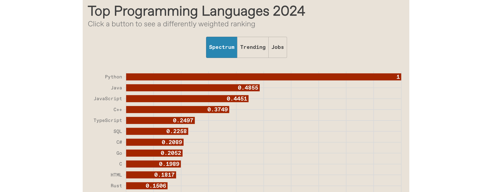

- [https://spectrum.ieee.org/top-programming-languages-2024](https://spectrum.ieee.org/top-programming-languages-2024)

---

## Sistemes crítics en C/C++

- La majoria dels **nuclis (_kernels_)** i utilitats del sistema operatiu
  - fingerd, X windows server, shell
- Molts **servidors d'alt rendiment**
  - Microsoft IIS, Apache httpd, nginx
  - Servidor Microsoft SQL, MySQL, redis, memcached
- Molts **sistemes encastats** (_embedded systems_)
  - Rover de Mart, sistemes de control industrial, automòbils

**Un atac a aquests sistemes és especialment perillós!**

---

## Història dels _buffer_ overflows

- 1988: **_Morris worm_** (cuc de Morris)
  - Propagat entre màquines (massa agressiu, gràcies a un bug)
  - Una manera de propagar-se va ser un atac de buffer overflow contra una versió vulnerable de fingerd als VAX
    - Va enviar una cadena especial al _daemon_ finger (fingerd), que va fer que executés codi que creava una nova còpia del cuc
  - Resultat final: 10-100 milions de dòlars en danys


---v

- 2001: CodeRed
  - Va provocar un desbordament (_overflow_) al servidor MS-IIS
  - 300.000 màquines infectades en 14 hores
- 2003: SQL Slammer
  - Va provocar un desbordament al servidor MS-SQL
  - 75.000 màquines infectades en 10 minuts

---

## Vulnerabilitats de Buffer Overflow


Vulnerabilitats de Buffer Overflow trobades des de 1999 a 2021
segons Common Vulnerabilities and Exposures (CVE)
[http://dx.doi.org/10.3390/app12136702](http://dx.doi.org/10.3390/app12136702)

---

## Disposició de la memòria

> Memory layout

---

## Disposició de la memòria: introducció

- Com es disposen les dades del programa a la memòria?
- Com és la pila (_stack_)?
- Quin efecte té en la memòria cridar (i tornar de) una funció?
- Ens centrarem en el model de procés de Linux
  - Similar a altres sistemes operatius

---

## Tots els programes s'emmagatzemen a la memòria

- Un **programa**, quan comença a executar-se, s'anomena **procés**
  - Aquest procés rep memòria del sistema operatiu per tal que s'executi
- Aquí representem l'espai dels processos.
  - A la part inferior hi ha l'adreça zero, l'adreça més baixa
  - A la part superior hi ha l'adreça més alta, que en un sistema de 32 bits seria de quatre gigabytes (2^32)
- El procés veu la memòria com si fos tota seva
- En realitat, **aquestes són adreces virtuals**, que el sistema operatiu i el processador assignen a adreces físiques reals per a la memòria de la màquina

---

## Gràfic de la disposició de la memòria

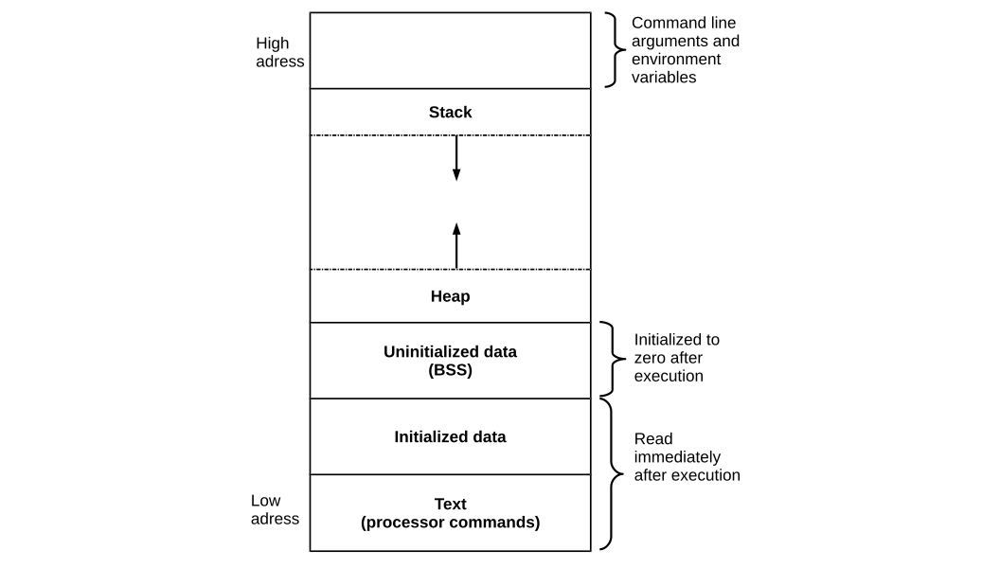

---

## Disposició de la memòria: segment de text

- A la part inferior de l'espai d'adreces hi ha el **segment de text** (o codi de text)
  - _Text segment_, on s'emmagatzema el codi executable del programa (instruccions x86 en llenguatge màquina)

```text
...
0x4c2 sub $0x224, 8esp
0x4cl push %ex
Ox4bf mov %esp, &ebp
Ox4be push %ebp
...
```

---

## Disposició de la memòria: segment de dades

- Just a sobre del segment de text hi ha el **segment de dades**, on s'hi guarden les variables estàtiques (**_static_**):
  - El seu temps de vida s'extèn durant tota l'execució del programa
- Té dues parts
  - **Àrea de dades inicialitzada**. Dades estàtiques inicialitzades:
    - `static const int a = 5;`
  - **Àrea de dades no inicialitzades**. Dades estàtiques no inicialitzades
    - `static int b;`
- El model de procés garanteix que les **variables globals** no inicialitzades pel programa són zero
  - Això no és cert amb les **variables locals** no inicialitzades

---

## Disposició de la memòria en temps de compilació

- El **segment de text** i el **segment de dades** es coneixen en temps de compilació
- Així, el compilador pot determinar on va  aquesta informació i pot especificar-ho el màxim possible a l'executable.

---

## Disposició de la memòria: arguments i variables d'entorn

- A la part superior de l'espai d'adreces apareixen els **arguments de la línia d'ordres** i les **variables d'entorn**
- Aquests s'estableixen quan comença el procés.

```sh
GIT_AUTHOR_NAME="Miquel"
git commit -m "Primera versió"
```

---

## Disposició de la memòria: stack

- Just a sota d'ells, hi ha la **pila** (_stack_)
- La **pila** és el que conté les **variables locals**, juntament amb les **metadades** que el programa utilitza per cridar i tornar de funcions.

```c
int a = 5;
int b = 10;
int c = a + b;
```

---

## Disposició de la memòria: heap

- A sobre del segment de dades hi ha el _heap_ (**emmagatzematge dinàmic**). Aquesta és la zona que gestiona _malloc_
  - **_Memory allocation_**: assignació dinàmica de memòria
- Totes aquestes dades, tant de l'stack com del heap, s'organitzen i es gestionen en **temps d'execució**
  - És a dir, com es comporta depèn del que faci el programa. Amb què interactua, quines dades i fitxers d'entrada llegeix o escriu, etc.

---

## Memory allocation: assignació dinàmica de memòria

```c
/* Assignar espai per una matriu de 10 elements de tipus int (4 bytes) */
int *array = malloc(10 * sizeof(int));

/* Comprova que la memòria s'ha assignat correctament, en cas contrari es gestiona l'error. */
if (array == NULL) {
  /* gestió de l'error en l'assignació ... */
}

/* Si arribam a aquest punt significa que la memòria ha estat assignada correctament */

/* Una vegada hem finalitzat l'ús de la memòria hem d'alliberar la mateixa per futurs usos */
free(array);

/* Ens asseguram que el punter ja no s'utilitza assignant-lo a NULL */
array = NULL;
```

---

## Punter d'stack

- Ara la imatge està girada al costat de manera que l'adreça més baixa està a l'esquerra i l'adreça més alta a la dreta
- Mentre el programa s'executa, manté un punter d'_stack_ (**_stack pointer_** o **_%esp_**) que indica la part superior de l'_stack_
  - Quan el programa emet una instrucció **_push_**, mourà el punter d'_stack_ després de guardar el valor

```text
Low address                                                         High address
0x00000000                                                            0xffffffff
--------------------------------------------------------------------------------
  |  Heap   | -->                                  <-- | 3 | 2 | 1 |  Stack  |
--------------------------------------------------------------------------------
                       push 1                          ^ Stack pointer (%esp)
                       push 2
                       push 3
```

---v

- Ara, suposem que després d'executar-se durant un temps, la funció que havia guardat aquests valors retorna (fa **_return_**)
  - En aquest cas, la funció eliminarà (farà **_pop_**) d'una gran part de la pila eliminant totes les seves variables i arguments locals

```text
--------------------------------------------------------------------------------
  |  Heap   | -->                                  <-- | 3 | 2 | 1 |  Stack  |
--------------------------------------------------------------------------------
                       push 1                 Stack pointer (%esp) ^
                       push 2
                       push 3
                       return
```

---v

- El **compilador emet les instruccions que ajusten l'_stack_ en temps d'execució**
- La memòria que utilitza el _heap_ la distribueix el sistema operatiu, però les dades individuals que s'emmagatzemen dins del _heap_ són gestionades per **_malloc_**
- De moment ens centrarem en l'**_stack_** perquè aquest és el nostre objectiu del primer atac que tindrem en compte.

```text
--------------------------------------------------------------------------------
  |  Heap   | -->                                  <-- | 3 | 2 | 1 |  Stack  |
--------------------------------------------------------------------------------
   Managed             push 1                 Stack pointer (%esp) ^
   in-process          push 2
   by malloc           push 3
                       return
```

---

## Cridades de pila i funcions

- Què passa quan **cridam** una funció (**_call_**)?
  - Quines dades s'han d'emmagatzemar?
  - On va?
- Què passa quan **tornam** d'una funció (**_return_**)?
  - Quines dades s'han de restaurar?
  - D'on ve?

---

## Disseny bàsic de la pila

- Veiem una representació de les dades del **_caller_**, que és qui crida aquesta funció
- Quan el _caller_ crida aquesta funció, **guardarà els arguments en ordre invers al codi**
  - La pila creix de dreta a esquerra, és a dir, de les adreces superiors a les adreces inferiors
  - `arg3` arriba primer, després `arg2`, després `arg1`, és a dir, l'ordre contrari del programa
- Després guarda a la pila les **variables locals** de la funció, i emmagatzemant-les en l'**ordre en què apareixen al codi** del programa
  - És a dir, primer `loc1`, i després `loc2`
- També hi ha informació que s'emmagatzema entremig

---v

```c
void func(char *arg1, int arg2, int arg3) {
  char loc1[4];
  int loc2;
  // ...
}
```

- Com es guardaria a la pila?

```text
--------------------------------------------------------------------------------
  ... | loc2 | loc1 | ??? | ??? | arg1 | arg2 | arg3 | caller's data |
--------------------------------------------------------------------------------
  Local variables pushed             Arguments pushed
  in the same order as they          in reverse order
  appear in the code                 of code
```

---

## Accés a variables

- Com pot el programa saber on estàn les variables locals?
  - Per exemple volem accedir a `loc2`
  - Suposem per exemple que està a `0xbffff323`
  - Com que aquesta funció es pot cridar des de diferent llocs, `loc2` pot estar a diferents adreces depenent de qui ha cridat la funció
- El compilador no pot saber l'adreça en temps de compilació
  - Però sempre sap l'adreça relativa: sempre 8 bytes abans del signes d'interrogació

---v

```c
void func(char *arg1, int arg2, int arg3) {
  // ...
  loc2++; // Question: Where is (this) loc2?
  // ...
}
```

- No es pot saber l'adreça absoluta en temps de compilació

```text
--------------------------------------------------------------------------------
  ... | loc2 | loc1 | ??? | ??? | arg1 | arg2 | arg3 | caller's data |
--------------------------------------------------------------------------------
      ^ 0xbffff323
```

---v

- Necessitem un punt de referència dins del **marc de la pila** (**_stack frame_**)
  - L'anomenam **punter de marc** (**_frame pointer_**)
  - Normalment, els compiladors emmagatzemen el **_frame pointer_** (o **_base pointer_**) al registre **EBP**
- Per tant, el compilador sap que des d'on es crida aquesta funció, la variable `loc2` sempre estarà a vuit bytes de distància del valor actual del **_frame pointer_**

```text
      < ----------- Stack frame for func ------------>
--------------------------------------------------------------------------------
  ... | loc2 | loc1 | ??? | ??? | arg1 | arg2 | arg3 | caller's data |
--------------------------------------------------------------------------------
      ^ 0xbffff323  ^ %ebp
```

---

## Retornant de funcions

- Ara, si cridam a `func` des de `main`, `main` està utilitzant el punter de marc (**_stack frame_**) de la mateixa manera que `func` ho fa per accedir a les seves pròpies variables locals
- Quan tornem de `func`, `main` voldrà utilitzar el mateix **_stack frame_** que tenia abans
  - De manera que quan accedeixi a les seves variables, va a les adreces correctes

---v

```c
int main () {
  // ...
  func("Hey", 10, -3); // Question: How do we restore %ebp?
  // ...
}
```

- La pregunta és: com desam i restauram el punter de marc perquè funcioni correctament?

```text
      < ----------- Stack frame for func ------------>
--------------------------------------------------------------------------------
  ... | loc2 | loc1 | ??? | ??? | arg1 | arg2 | arg3 | caller's data |
--------------------------------------------------------------------------------
                    ^ %ebp                                  ^ %ebp main
```

---v

- Pensem en com `main` cridarà a `func`:
  - El que farà és que guardarà els seus tres arguments, `arg3`, `arg2`, `arg1`: `"Hey"`, `10`, `i –3`
  - I algunes altres dades que veurem més endavant
- Ara, l'**_stack frame_** està a `%esp`
- Després, el que fa és guardar el **_stack frame_** de main (`%ebp`)
- En aquest punt, podem actualitzar l'stack frame (`%ebp`) perquè sigui l'**_stack frame_** actual (`%esp`)

---v

```text
                          v %esp
--------------------------------------------------------------------------------
                          | ??? | arg1 | arg2 | arg3 | caller's data |
--------------------------------------------------------------------------------
                                                            ^ (%ebp) main
```

- Push de _(%ebp)_ abans de les variables locals
- Actualitzam _%ebp_ al valor actual de _%esp_
- Establirem _%ebp_ al valor de _(%ebp)_ que hem guardat a la pila al retornar a _main_

```text
                v %esp
--------------------------------------------------------------------------------
                | (%ebp) | ??? | arg1 | arg2 | arg3 | caller's data |
--------------------------------------------------------------------------------
                ^ %ebp                                      ^ (%ebp) main
```

---v

```c
int main () {
  // ...
  func("Hey", 10, -3); // Question: How do we restore %ebp?
  // ...
}
```

- Ara, quan la funció `func` comenci a executar-se, guardarà les seves variables locals després de l'**_stack frame_** actual
- La següent pregunta és: com reprendrem al mateix lloc del codi on estàvem, a `main`, quan vàrem cridar a `func`?

```text
  v %esp
--------------------------------------------------------------------------------
  | loc2 | loc1 | (%ebp) | ??? | arg1 | arg2 | arg3 | caller's data |
--------------------------------------------------------------------------------
                ^ %ebp                                      ^ (%ebp) main
```

---

## Instruccions a la memòria

- A mesura que `main` s'executa, el **punter d'instruccions** (**_instruction pointer_**), `eip`, es mou per les diferents instruccions que implementen `main`
- Quan crida a `func`, `eip` es mourà cap amunt i començarà a executar aquestes altres instruccions

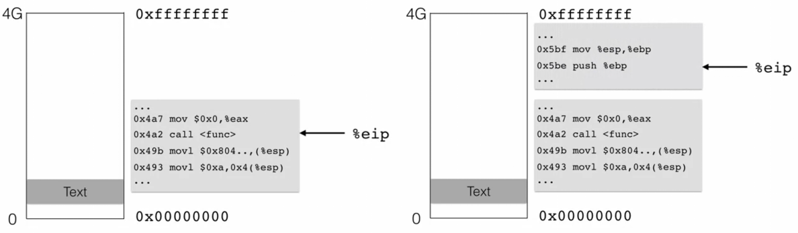

---v

- El que volem és tornar a on estàvem quan vam cridar la funció
- Podem fer el mateix truc que vam fer amb el _frame pointer_
  - Podem emmagatzemar el punter d'instrucció _eip_ just abans de cridar la funció a la pila
- Ara, quan anem a tornar, només hem de posar el punter d'instruccions _eip_ al valor que està a 4 bytes després del _frame pointer_ actual

```text
  v %esp
--------------------------------------------------------------------------------
  | loc2 | loc1 | (%ebp) | (%eip) | arg1 | arg2 | arg3 | caller's data |
--------------------------------------------------------------------------------
                ^ %ebp                                        ^ (%ebp) main
```

---

## `ebp` (base pointer) i `esp` (stack pointer)

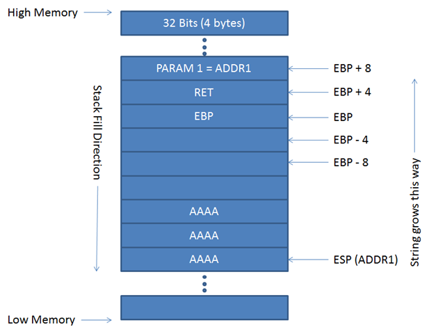

---

## Resum de la disposició de la memòria

- **Cridant una funció**:
  - **Introduïm els arguments** a l'_stack_ (al revés)
  - **Feim push del l'adreça de retor**n _(%eip)_, és a dir, l'adreça de la instrucció que volem executar després que ens torni el control
  - **Saltam a l'adreça de la funció**
- **A la funció cridada**:
  - **Feim push de l'anterior _frame pointer_** a l'stack (%ebp)
  - **Establim el _frame pointer_** (%ebp) a on es troba el final de la pila ara mateix (%esp)
  - **Feim push de les variables locals** a la pila
- **Tornant (return) a la funció de cridada**:
  - **Restablim el _stack pointer_ anterior**: %esp = %ebp, %ebp = (%ebp)
  - **Tornam a l'adreça de retorn**: %eip = 4(%esp)

---

## Buffer overflow

> Com executam un buffer overflow?

---

## L'error _buffer overflow_

- Buffer =
  - Memòria contigua associada a una variable o camp
  - Comú a C
  - Tots els strings són matrius (arrays) de caràcters (acabats en NUL)
- Overflow (desbordament) =
  - Posar més al buffer del que pot contenir
  - On van les dades desbordades?

---

## Resultat benigne

- Dins la funció func s'intenta copiar l'string "AuthMe!" dins un buffer
  - Però l'string té 7 caràcters més  el caràcter d'acabament NUL, mentre que el buffer només permet 4 caràcters
- Així desbordarem el buffer quan cridem _strcpy_
- En aquest cas, el _frame pointer_ està corromput
  - Donarà un error de _segmentation fault_

---v

```c
void func(char *arg1) {
  char buffer[4];
  strcpy(buffer, arg1);
  // ...
}

int main() {
  char *mystr = "AuthMe!";
  func(mystr);
  // ...
}
```


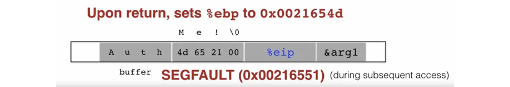

---

## Resultat rellevant per a la seguretat

- Aquesta vegada, en lloc de sobreescriure el _frame pointer_, es sobreescriu el contingut de la variable _authenticated_
  - Ara això és un problema, perquè cada vegada que anem a comprovar _authenticated_, el valor és diferent de zero i la comprovació tindrà èxit
- Per tant, aquest error tendria un resultat rellevant per a la seguretat en permetre que el programa fes coses que probablement no teníem intenció

---v

```c
void func(char *arg1) {
  int authenticated = 0;
  char buffer[4];
  strcpy(buffer, arg1);
  if (authenticated) { //... }
}

int main() {
  char *mystr = "AuthMe!";
  func(mystr);
  // ...
}
```


---

## Podria ser pitjor?

- _strcpy_ ens dóna la possibilitat de copiar qualsevol quantitat de dades en un buffer que no tingui la mida adequada.
- Així, podríem sobreescriure molta memòria a la pila
- Un atacant podria sobreescriure el buffer amb codi
  - El programa executaria aquest codi quan torni de la funció

---v

```c
void func(char *arg1) {
  char buffer[4];
  strcpy(buffer, arg1);
  // ...
}
```


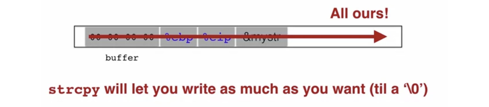

---

## Strings subministrats per l'usuari

- Aquests exemples proporcionen els seus propis strings
- En realitat, els **strings** provenen **d'usuaris** en una infinitat de llocs:
  - Entrada de **text**
  - **Paquets**
  - **Variables d'environment**
  - Entrada de **fitxers**...
- **Validar** l'**entrada de l'usuari** és extremadament **important**

---

## Injecció de codi

> Code injection

---

## Code injection: idea principal

- Dos reptes principals de la injecció de codi mitjançant un  _buffer overflow_:
  - Carregar el nostre propi codi a la memòria
  - Aconseguir que el punter d'instruccions apunti cap a ell, de manera que aquest codi es pugui executar

---v

```c
void func(char *arg1) {
  char buffer[4];
  sprintf(buffer, arg1);
  // ...
}
```

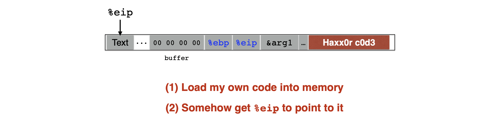

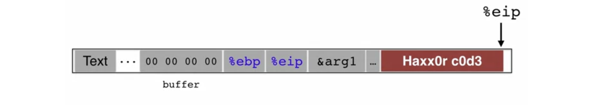

---

## Carregar codi a la memòria

- Han de ser **instruccions del codi màquina** (és a dir, ja compilades i llestes per executar-se)
  - No codi C --> Ha de ser codi ensamblador
- Hem de tenir cura de com el construïm:
  - **No pot contenir** cap byte a zero (_**all-zero byte**_)
    - En cas contrari, _sprintf_ / _gets_ / _scanf_ / ... deixaran de copiar
    - Com podríeu escriure un assemblatge per no contenir mai un byte zero complet?
  - El codi ha de ser **complet**
    - **No pot utilitzar el carregador o _loader_**(estam injectant) per resoldre adreces dins la memòria

---

## Quin codi executar?

- Objectiu: _**shell**_ d'ús general
  - Línia d'ordres que dóna a l'atacant **accés general al sistema**
- El codi per llançar un _**shell**_ s'anomena _**shellcode**_
- Aquí tenim un exemple de com podria semblar el codi de _shellcode_ que mos agradaria escriure
  - És una funció que crida a _**execve**_, que transforma el programa actual en el donat com a argument
  - En aquest cas, l'argument és _**/bin/sh**_, un _**shell**_

```c
#include <stdio.h>
int main() {
  char *name[2];
  name[0] = "/bin/sh";
  name[1] = NULL;
  execve(name[0], name, NULL);
}
```

---

## Shellcode

- Aquí teniu el codi ensamblador d'aquest codi de shell
- Si mirem la primera instrucció, aquest és el que podria semblar com un string
- Aquest seria l'string que proporcioneu com a part de la vostra entrada.

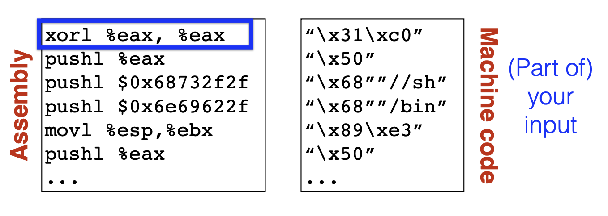

---

## Exectuar l'_injected code_

- Només per haver carregat el codi no vol dir que el poguem executar
  - Necessitam una instrucció per "saltar al nostre codi"
- A més, no sabem exactament on està el codi
  - Necessitam que el punter d'instrucció %eip hi apunti


---

## Segrestant el punter %eip

- La clau està en el punter %eip desat, per quan retornem a la funció que ha cridat una funció
  - Podem emmagatzemar l'adreça del nostre codi en aquesta ubicació
- Així, quan la funció torni, el programa anirà al nostre codi i aquest s'executarà
- Ara la pregunta és: **com sabem quina adreça hi hem de posar?**

---v

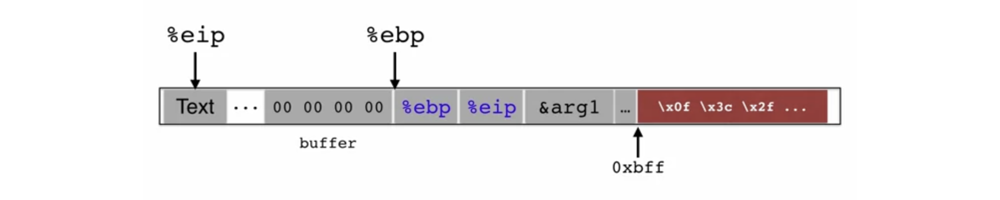

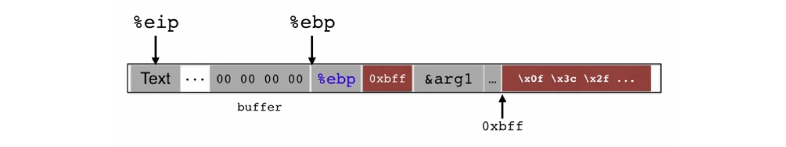

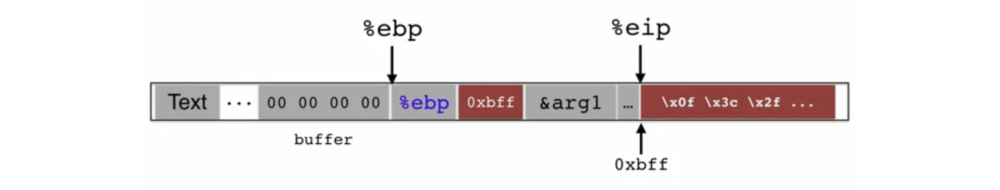

---

## Trobar l'adreça de retorn

- Si no tenim accés al codi, no sabem a quina distància està el buffer del %ebp desat
- Un enfocament: provar molts valors diferents!
  - "prova-error"
  - El pitjor dels casos: és un espai de memòria de 32 (o 64) bits, el que significa 232 (264) respostes possibles
- Sense aleatorització d'adreces
  - La **pila sempre comença** des de la mateixa **adreça fixa**
  - La pila creixerà, però normalment no creix molt profundament (tret que el codi sigui molt recursiu)

---

## Millorant les nostres possibilitats: nop sleds o slides

- _**nop**_: és una instrucció d'un sol byte que només passa a la següent instrucció.
- Si l'adversari enganxa molts de _nops_ com a farciment abans del seu propi codi, funcionarà saltant a qualsevol part d'aquest trineu _nop_ sled o slide
  - Així podem millorar les nostres possibilitats


---

## Resum de la injecció de codi

- A continuació, es mostra com seria tot el codi adversari injectat
- Aquesta part anomenada "padding" ha de ser alguna cosa, perquè hem de començar a escriure allà on comenci l'entrada a _gets_, o _sprintf_ o _strcpy_ comenci
- Però, quan el programa torni a la ubicació escollida, apuntarà al _nop sled_ i començarà a executar el nostre codi maliciós

---v

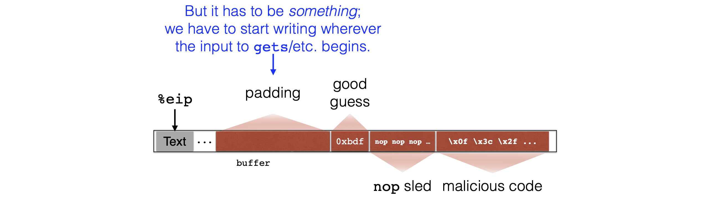

---

## Running a Buffer Overflow Attack

<!-- markdownlint-disable MD033 -->
<iframe width="560" height="315" src="https://www.youtube.com/embed/1S0aBV-Waeo?si=Ub1oqC4LVRFtY8vT" title="YouTube video player" frameborder="0" allow="accelerometer; autoplay; clipboard-write; encrypted-media; gyroscope; picture-in-picture; web-share" referrerpolicy="strict-origin-when-cross-origin" allowfullscreen></iframe>
<!-- markdownlint-enable MD033 -->

---

## Altres exploits de memòria

> Memory exploits

---

## Altres atacs

- L'atac d'injecció de codi que acabem de veure s'anomena _**stack smashing**_
  - El terme va ser encunyat pel hacker Aleph One l'any 1996
- Constitueix una violació de la **integritat**, i possiblement una violació de la **disponibilitat**
- Altres atacs també exploten errors amb buffers

---

## _Heap overflow_ (1)

- Un _**stack smashing**_ desborda un buffer assignat al _stack_
  - També podeu desbordar un buffer assignat per _**malloc**_, que resideix al _**heap**_

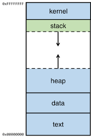

---

## _Heap overflow_ (i 2)

- Definim una estructura, _vulnerable_struct_, que té dos camps, el primer és _buff_, un punter de caràcter, el segon és el punter de la funció _compare_
- A continuació, veiem una funció, _foo_, que pren una _vulnerable_struct_ com a argument juntament amb dos arguments de punter de caràcters.
  - Per començar, la primera línia de la funció copia el paràmetre _one_ a _buff_, la segona línia copia _two_ més un a _buff_. Finalment, la tercera línia crida al punter de la funció de comparació, passant _buff_ com a argument i comparant-lo amb el punter del fitxer foobar


---v

- Aquest codi només funcionarà correctament si la longitud de la cadena de _one_ i _two_ és inferior a la longitud màxima de la memòria intermèdia on es copiaran (MAX_LEN). En cas contrari, sobreescriurem el punter de la funció de comparació
  - Igual que a un _stack smashing_, l'adversari pot ser capaç de controlar com es produeix aquesta sobreescritura i aconseguir que el programa executi el codi de la seva elecció.


---

## Variants de _heap overflow_

- **Desbordament a la _vtable_ de C++**
  - La _vtable_ conté punters als mètodes de l'objecte.
  - Es pot atacar de manera similar a _s->cmp_ en exemples anteriors.

- **Desbordament cap a objectes adjacents**
  - Especialment si contenen punters a funcions.
  - Pot afectar un _buffer_ assignat a prop d'un altre objecte al _heap_.

---

## _Integer overflow_

- A C, una variable té un valor màxim i, quan se supera aquest valor, el valor de la variable s'ajustarà
- En aquest cas, estem llegint des de la xarxa mitjançant la funció _packet_get_int_
  - Suposem que l'adversari té el control de l'altra banda de la xarxa i envia un nombre molt gran
- Suposem que el nombre és 1.073.741.824 i que la mida d'un punter de caràcter a la nostra arquitectura és 4, és a dir, és una arquitectura de 32 bits
  - _nresp_ és més gran que zero i, per tant, emmagatzemarem amb _malloc_ un buffer on emmagatzemarem una resposta
  - Aquest nombre molt gran multiplicat per 4, s'ajusta al 0
- _malloc_ assignarà un buffer de mida zero i, aleshores, les escriptures posteriors a aquesta memòria intermèdia l'estan desbordant

---v

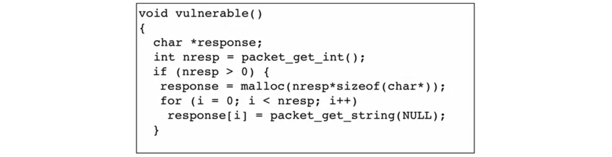

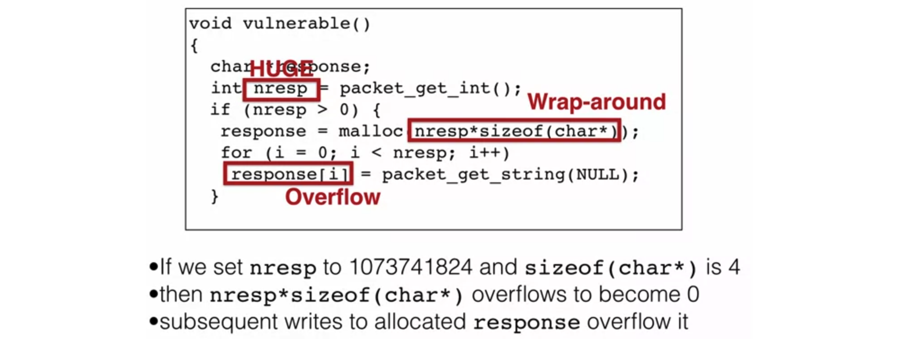

---

## Corrompre dades

-  Els atacs que hem mostrat fins ara **afecten el codi**
  - Adreces de retorn i punters de funció
- Però els atacants també poden **desbordar les dades**
  - **Modificar una clau secreta** perquè sigui coneguda per l'atacant, per poder desxifrar futurs missatges interceptats
  - **Modificar les variables d'estat** per evitar les comprovacions d'autorització
  - **Modificar les cadenes interpretades** utilitzades com a part de les ordres
    - Per exemple, per facilitar la injecció SQL

---

## _Read overflow_

- En lloc de permetre escriure més enllà del final d'un buffer, un error podria permetre llegir **més enllà del final _del buffer_**
  - Pot filtrar informació secreta
- En aquest exemple, la longitud que s'especifica a la primera lectura pot superar la longitud del missatge proporcionat a la segona lectura
  - Si ho fa, imprimirà caràcters més enllà del que es va llegir

---v

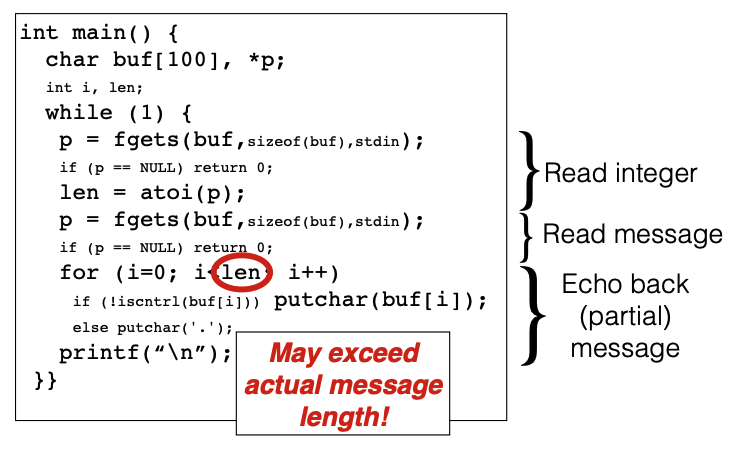

---

## Memòria obsoleta (_stale memory_)

- Es produeix un _**dangling pointer bug**_ quan s'allibera un punter, però el programa continua usant-lo
- Un atacant pot fer que **la memòria alliberada sigui reassignada** i sota el seu control

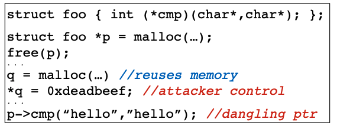

---

## Vulnerabilitats de format de string

> Format string vulnerabilities

---

## E/S formatades (Formatted I/O)

- La família _printf_ de C admet E/S formatades

```c
void print_record(int age, char *name) {
  printf("Name: %s, Age: %d\n", name, age);
}
```

- Especificadors de format
  - La posició a l'string indica l'argument de l'stack a imprimir
  - El tipus d'especificador indica el tipus d'argument
    - %s = string
    - %d = nombre sencer
    - etc.

---

## Quina és la diferència?

- En aquest exemple s'assigna un buffer de caràcters a la pila
- I cridam a _fgets_ per llegir-lo
- La diferència està a la tercera línia.
  - La primera funció crida a %s com a cadena de format abans d'imprimir buf
  - La segona funció renuncia a utilitzar una cadena de format per complet i només hi col·loca buf
- _buf_ pot contenir especificadors de format
  - En el primer cas, si ho fa, aquests especificadors només s'imprimiran a la pantalla
  - En el segon, s'interpretaran

---v

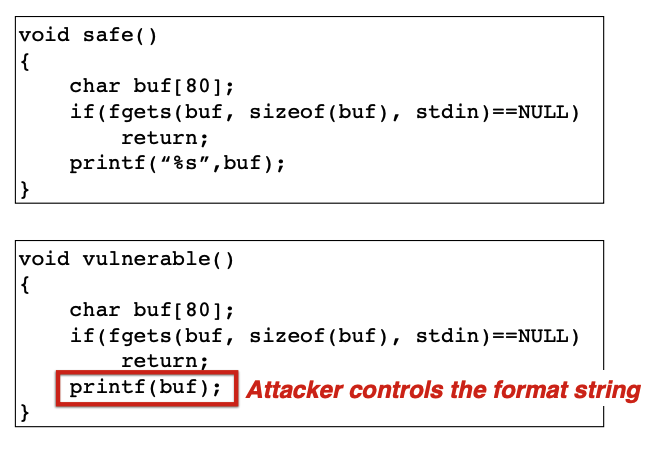

---

## Vulnerabilitats de format d'string

- `printf("100% dave");`
  - Imprimeix l'entrada del stack 4 bytes per sobre del %eip guardat
- `printf("%s");`
  - Imprimeix els bytes als quals apunta aquesta entrada de pila
- `printf("%d %d %d %d ...");`
  - Imprimeix una sèrie d'entrades de l'stack com a nombres enters
- `printf("%08x %08x %08x %08x ...");`
  - El mateix, però en hexadecimal
- `printf("100% no way!");`
  - Escriu el número 3 a l'adreça indicada per l'entrada de l'stack

---

## Per què això és un stack overflow?

- Hauríem de pensar en això com un stack overflow en el sentit que
  - L'stack mateix es pot veure com una mena de buffer
  - La mida d'aquest buffer ve determinada pel nombre i la mida dels arguments passats a una funció
- Proporcionar una cadena de format falsa indueix el programa a desbordar aquest "buffer"

---

## Format string vulnerabilities

<!-- markdownlint-disable MD033 -->
<iframe width="560" height="315" src="https://www.youtube.com/embed/DhVRI33s-D0?si=yl4nffjpWgeyPFMv" title="YouTube video player" frameborder="0" allow="accelerometer; autoplay; clipboard-write; encrypted-media; gyroscope; picture-in-picture; web-share" referrerpolicy="strict-origin-when-cross-origin" allowfullscreen></iframe>
<!-- markdownlint-enable MD033 -->
