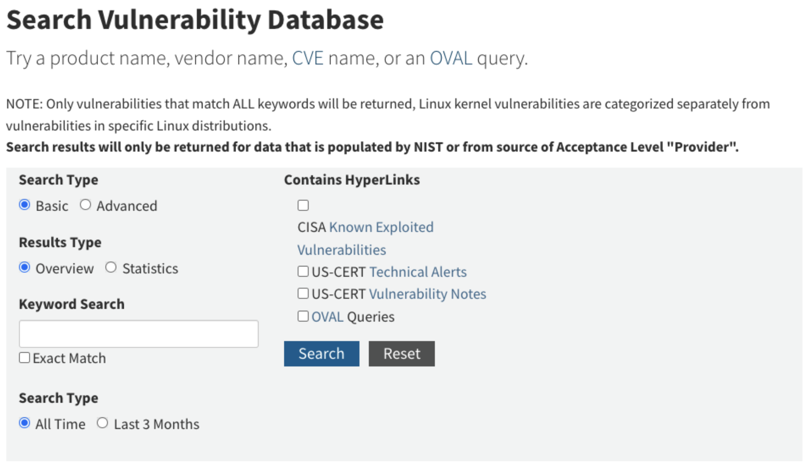
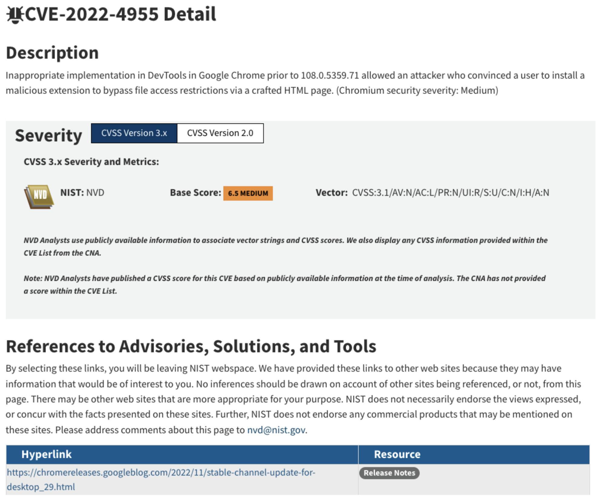
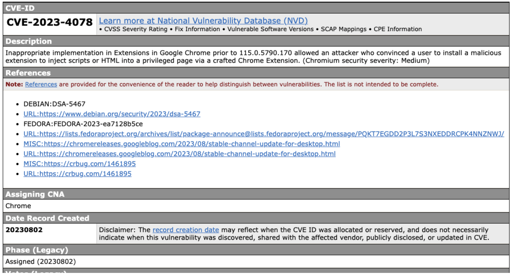

# Seguretat de baix nivell: atacs i exploits

---

## Introducció

- Els **sistemes d'informació i comunicació** i el **programari** són **susceptibles** de **contenir errors**
  - Errors en el seu **disseny** (**_flaw_**) o **desenvolupament** (**_bug_**)
- Un programari que **funciona correctament** és aquell que fa exactament tot allò pel que va ser creat i dissenyat.
  - Pot ser **correcte** des del punt de vista **funcional** però a la vegada pot ser **insegur**

---v

- Els errors en el programari poden ser utilitzats:
  - per a atacar el sistema i posar-ne en perill el bon funcionament
  - posar en perill la **confidencialitat** i l'ús de les dades que hi ha emmagatzemades
  - com a porta d'entrada per a executar **codi maliciós**

---

## Bugs

- **_Bug_**: és un error, un defecte o fallada en un programa o sistema informàtic, que fa que es produeixi un resultat incorrecte o inesperat o que es comporti de forma no prevista
- La majoria dels errors es deuen als errors comesos per les **persones**:
  - en el **desenvolupament** del codi
  - en el **disseny**
- Quan es produeix un error en el programari, aquest error pot ser utilitzat per un **_hacker_** o un **atacant** com a **porta d'entrada**

---

## Bases de dades de vulnerabilitats

- **Vulnerabilitat**: **debilitat** de qualsevol tipus que compromet la seguretat del sistema informàtic
- Hi ha diversos organismes, fundacions i empreses que es dediquen a recollir, catalogar i **enregistrar les vulnerabilitats conegudes**
- La informació sobre les vulnerabilitats es poden trobar en diverses bases de dades, repositoris i llistes de distribució públiques _open source_ o d’iniciativa privada a través de la xarxa
- La informació és recopilada gràcies a les aportacions de:
  - la comunitat
  - els fabricants
  - els organismes governamentals
  - institucions i empreses públiques i privades

---v

- Aquestes bases de dades aporten informació addicional de gran interès, com ara:
  - tipus de vulnerabilitat
  - descripció
  - conseqüències
  - entorns i programaris afectats
  - solucions (_patches_)
  - prevencions
  - dates de descoberta de la vulnerabilitat
  - i altra informació d’interès.

---

## National Vulnerability Database

- [https://nvd.nist.gov/](https://nvd.nist.gov/)
- NVD és un repositori del govern dels EUA
  - Pertany al National Institute of Standards and Technology (NIST)
- És una base de dades pública
- Manté informació estandarditzada sobre vulnerabilitats
- Aquesta gestió permet l'automatització de les mesures i gestió de vulnerabilitats

---

## Cercador de vulnerabilitats d’NVD

---

## Informació d’una vulnerabilitat a NVD que afecta a Google Chrome

---

## Common Vulnerabilities and Exposures (CVE)

- [https://cve.mitre.org](https://cve.mitre.org)
- CVE és un diccionari de coneixement públic sobre les vulnerabilitats de seguretat
- Cada referència te un número d’identificació únic, d’aquesta forma proveeix una nomenclatura comú per al coneixement públic, que permet l'intercanvi de dades entre els productes de seguretat.

---

## Informació d’una vulnerabilitat a CVE que afecta a Google Chrome

---

## Exploit

- **_Exploit_**: codi que permet a un atacant / testejador aprofitar una vulnerabilitat del sistema i comprometre la seva seguretat, o causar un comportament no desitjat o imprevist del sistema
- Es tracta d’un programa que aconsegueix **provocar l’error** aprofitant la vulnerabilitat d’un altre **programa**
- Un cop ha provocat l’error, aprofita aquest error per a **injectar un codi** o un **_payload_** per tal que sigui executat i així obtenir el control del sistema atacat, o realitzar algun altre tipus d’atac amb altres finalitats

---

## Payload

- **_Payload_**: codi que s’executa en el destí atacat en executar-se un exploit
  - L’exploit provoca l’error del sistema aprofitant una vulnerabilitat i injecta un payload amb el codi que es vol que s’executi en la màquina atacada
- Normalment es tracta d’una seqüència d’instruccions en llenguatge assemblador amb l’objectiu d’executar-se en el sistema de destí per a crear accions, com per exemple:
  - crear un usuari en el sistema remot
  - executar alguna línia de comandes i enllaçar-ho a un port local, etc.
- Un payload pot ser utilitzat per diversos exploits i que un mateix exploit pot utilitzar diversos payloads.

---

## Exploits remots

- Un atac remot és un atac que pot ser iniciat des d’una ubicació diferent de la de l’equip de la víctima
- Funciona en una xarxa o a través d’Internet i explota la vulnerabilitat de seguretat sense accés previ al sistema vulnerable de la víctima

---v

- La gran extensió d’Internet facilita la difusió del programari maliciós a través de la xarxa
- Exemples de cucs (_worms_) que es difon per la xarxa: Sasser, Blaster o Code Red
  - Aprofitaven serveis de xarxa vulnerables explotables en remot per copiar-se d'una màquina a una altra
- En general, consisteix en servidors que intenten accedir a una aplicació client i un cop ho aconsegueixen, envien un exploit per a ser executat

---

## The Code Red Worm Documentary - Hacking the White House

---

## Exploits locals

- Un exploit local requereix accés previ al sistema vulnerable
- S’executa localment en l’equip
- En general eleva els privilegis al nivell de l'administrador o de root per tal que l’exploit pugui tenir un control total del sistema
  - També és possible usar diversos exploits, primer per a obtenir accés de baix nivell, i després escalar privilegis diverses vegades fins arribar a l'arrel (root) o a nivell d’administrador.
- Alguns exploits també es poden distribuir localment a través de dispositius d’emmagatzematge USB
- Per exemple: el cuc Conficker (o W32.Downadup), W32.Spybot, W32.Randex i W32.Mytob
