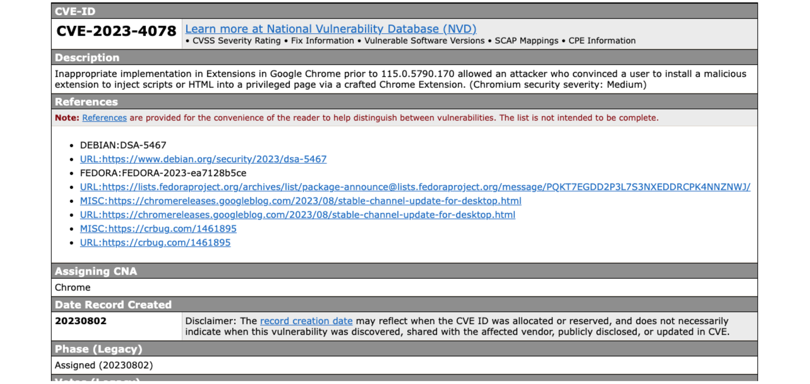
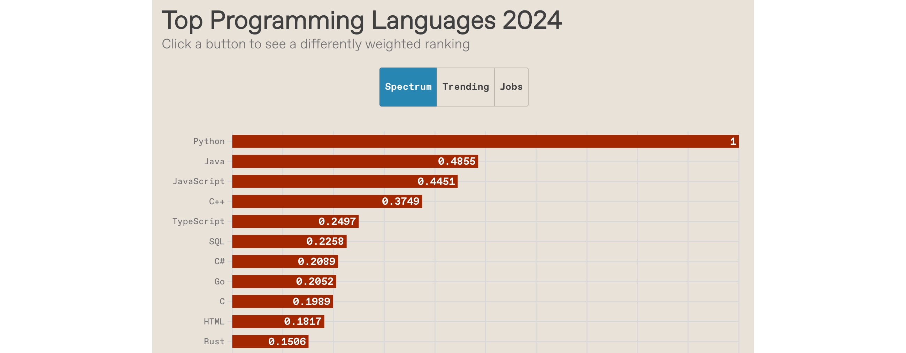

# Seguretat de baix nivell: atacs i exploits

---

## Introducció

- Els **sistemes d'informació i comunicació** i el **programari** són **susceptibles** de **contenir errors**
  - Errors en el seu **disseny** (**_flaw_**) o **desenvolupament** (**_bug_**)
- Un programari que **funciona correctament** és aquell que fa exactament tot allò pel que va ser creat i dissenyat.
  - Pot ser **correcte** des del punt de vista **funcional** però a la vegada pot ser **insegur**

---v

- Els errors en el programari poden ser utilitzats:
  - per a atacar el sistema i posar-ne en perill el bon funcionament
  - posar en perill la **confidencialitat** i l'ús de les dades que hi ha emmagatzemades
  - com a porta d'entrada per a executar **codi maliciós**

---

## Bugs

- **_Bug_**: és un error, un defecte o fallada en un programa o sistema informàtic, que fa que es produeixi un resultat incorrecte o inesperat o que es comporti de forma no prevista
- La majoria dels errors es deuen als errors comesos per les **persones**:
  - en el **desenvolupament** del codi
  - en el **disseny**
- Quan es produeix un error en el programari, aquest error pot ser utilitzat per un **_hacker_** o un **atacant** com a **porta d'entrada**

---

## Bases de dades de vulnerabilitats

- **Vulnerabilitat**: **debilitat** de qualsevol tipus que compromet la seguretat del sistema informàtic
- Hi ha diversos organismes, fundacions i empreses que es dediquen a recollir, catalogar i **enregistrar les vulnerabilitats conegudes**
- La informació sobre les vulnerabilitats es poden trobar en diverses bases de dades, repositoris i llistes de distribució públiques _open source_ o d'iniciativa privada a través de la xarxa
- La informació és recopilada gràcies a les aportacions de:
  - la comunitat
  - els fabricants
  - els organismes governamentals
  - institucions i empreses públiques i privades

---v

- Aquestes bases de dades aporten informació addicional de gran interès, com ara:
  - tipus de vulnerabilitat
  - descripció
  - conseqüències
  - entorns i programaris afectats
  - solucions (_patches_)
  - prevencions
  - dates de descoberta de la vulnerabilitat
  - i altra informació d'interès.

---

## National Vulnerability Database

- [https://nvd.nist.gov/](https://nvd.nist.gov/)
- NVD és un repositori del govern dels EUA
  - Pertany al National Institute of Standards and Technology (NIST)
- És una base de dades pública
- Manté informació estandarditzada sobre vulnerabilitats
- Aquesta gestió permet l'automatització de les mesures i gestió de vulnerabilitats

---

## Cercador de vulnerabilitats d'NVD

---

## Informació d'una vulnerabilitat a NVD que afecta a Google Chrome

---

## Common Vulnerabilities and Exposures (CVE)

- [https://cve.mitre.org](https://cve.mitre.org)
- CVE és un diccionari de coneixement públic sobre les vulnerabilitats de seguretat
- Cada referència te un número d'identificació únic, d'aquesta forma proveeix una nomenclatura comú per al coneixement públic, que permet l'intercanvi de dades entre els productes de seguretat.

---

## Informació d'una vulnerabilitat a CVE que afecta a Google Chrome

---

## Exploit

- **_Exploit_**: codi que permet a un atacant / testejador aprofitar una vulnerabilitat del sistema i comprometre la seva seguretat, o causar un comportament no desitjat o imprevist del sistema
- Es tracta d'un programa que aconsegueix **provocar l'error** aprofitant la vulnerabilitat d'un altre **programa**
- Un cop ha provocat l'error, aprofita aquest error per a **injectar un codi** o un **_payload_** per tal que sigui executat i així obtenir el control del sistema atacat, o realitzar algun altre tipus d'atac amb altres finalitats

---

## Payload

- **_Payload_**: codi que s'executa en el destí atacat en executar-se un exploit
  - L'exploit provoca l'error del sistema aprofitant una vulnerabilitat i injecta un payload amb el codi que es vol que s'executi en la màquina atacada
- Normalment es tracta d'una seqüència d'instruccions en llenguatge assemblador amb l'objectiu d'executar-se en el sistema de destí per a crear accions, com per exemple:
  - crear un usuari en el sistema remot
  - executar alguna línia de comandes i enllaçar-ho a un port local, etc.
- Un payload pot ser utilitzat per diversos exploits i que un mateix exploit pot utilitzar diversos payloads.

---

## Exploits remots

- Un atac remot és un atac que pot ser iniciat des d'una ubicació diferent de la de l'equip de la víctima
- Funciona en una xarxa o a través d'Internet i explota la vulnerabilitat de seguretat sense accés previ al sistema vulnerable de la víctima

---v

- La gran extensió d'Internet facilita la difusió del programari maliciós a través de la xarxa
- Exemples de cucs (_worms_) que es difon per la xarxa: Sasser, Blaster o Code Red
  - Aprofitaven serveis de xarxa vulnerables explotables en remot per copiar-se d'una màquina a una altra
- En general, consisteix en servidors que intenten accedir a una aplicació client i un cop ho aconsegueixen, envien un exploit per a ser executat

---

## The Code Red Worm Documentary - Hacking the White House

---

## Exploits locals

- Un exploit local requereix accés previ al sistema vulnerable
- S'executa localment en l'equip
- En general eleva els privilegis al nivell de l'administrador o de root per tal que l'exploit pugui tenir un control total del sistema
  - També és possible usar diversos exploits, primer per a obtenir accés de baix nivell, i després escalar privilegis diverses vegades fins arribar a l'arrel (root) o a nivell d'administrador.
- Alguns exploits també es poden distribuir localment a través de dispositius d'emmagatzematge USB
- Per exemple: el cuc Conficker (o W32.Downadup), W32.Spybot, W32.Randex i W32.Mytob

---

## Conficker worm

---

## Client Side

- Els atacs Client Side busquen aprofitar-se de vulnerabilitats que típicament es troben en les **aplicacions client**, instal·lades en gran part de les estacions de treball
  - Aplicacions d'ofimàtica, com Microsoft Office o Open Office, lectors de PDF, com Adobe Acrobat Reader, navegadors d'Internet, com Internet Explorer, Firefox, Chrome o Safari...
- L'exploit està dins d'un arxiu amb un format suportat per alguna d'aquestes aplicacions i que arriba a la màquina objectiu per mitjans com email o USB
- Es necessita que l'usuari obri l'arxiu, cliqui algun enllaç o realitzi alguna acció en concret.

---v

- Es tracta de programari maliciós que apareix com a fitxer o programari aparentment fiable
  - Es tracta de fitxers amb un format conegut com ara ZIP, RAR, MPEG, MP3, JPG, etc., però que en realitat incorporen codi maliciós de forma intencionada
- Per exemple: desbordament de memòria provocat en un fitxer JPEG que permet a atacants remots executar codi arbitrari a través d'una imatge JPEG
  - CVE-2004-0200 (CVE = Common Vulnerabilities and Exposures)
- Poden ser utilitzats en combinació amb el mètode d'**enginyeria social**

---

## Social Engineering - How Bad Guys Hack Users

---

## Malware vs Exploits: What's the Difference?

---

## Tipus d'exploits

- Zero-day
- Full disclosure
- Responsible disclosure

---

## Zero-day

- Forat o vulnerabilitat en el programari que és desconegut per al fabricant o desenvolupador
- Pot ser explotat pels hackers abans que el venedor ho descobreixi i creï un _patch_ per tal d’eliminar-ne la vulnerabilitat
- Són els més perillosos

---

## Full disclosure

- Full disclosure és la pràctica de publicar la informació de les vulnerabilitats al mateix moment que es descobreix, de forma que sigui accessible per a tothom
  - Per tant, les víctimes potencials estan informades de com poden ser atacades i els fabricants poden desenvolupar el _patch_
- També s'anomenen **exploits de dia 1**, ja que es coneix l'error però encara no hi ha un _patch_

---

## Responsible disclosure

- El fabricant descobreix o és informat de l’error però no es fa públic
- Quan el fabricant té disponible el _patch_ i el posa a disposició dels clients és quan es dóna a conèixer i es fa públic
- Sistema molt comú en les grans empreses de programari com Microsoft
  - S'aplica el principi de no publicar res que pugui afectar la seguretat dels seus clients.

---

## Introducció a la seguretat de baix nivell

> C i l'atac de buffer overflow

---

## Què es un _buffer overflow_?

- Un **_buffer overflow_** (desbordament de memòria intermèdia) és un **_bug_** que afecta el codi de baix nivell, normalment en **C** i **C++**, amb importants implicacions de seguretat
- **Normalment**, un programa amb aquest error simplement **fallarà**
- Però un **atacant** pot alterar les situacions que fan que el programa faci coses pitjors:
  - **Robar** informació privada
  - **Corrompre** informació valuosa
  - **Executar** codi de l'atacant

---

## Per què estudiar-lo?

- Els **_buffer overflows_** encara són **rellevants** avui dia
  - C i C++ encara són populars
  - Els _buffer overflows_ encara es produeixen amb regularitat
- Tenen una **llarga història**
  - S'han desenvolupat molts enfocaments diferents per defensar-se contra ells, i errors com ells
- Comparteixen **característiques comunes amb altres _bugs_** que estudiarem
  - En **com funciona l'atac**
  - En **com defensar-s'hi**

---

## C i C++ són encara molt populars

- [https://spectrum.ieee.org/top-programming-languages-2024](https://spectrum.ieee.org/top-programming-languages-2024)

---

## Sistemes crítics en C/C++

- La majoria dels **nuclis (_kernels_)** i utilitats del sistema operatiu
  - fingerd, X windows server, shell
- Molts **servidors d'alt rendiment**
  - Microsoft IIS, Apache httpd, nginx
  - Servidor Microsoft SQL, MySQL, redis, memcached
- Molts **sistemes encastats** (_embedded systems_)
  - Rover de Mart, sistemes de control industrial, automòbils
**Un atac a aquests sistemes és especialment perillós!**

---

## Història dels _buffer_ overflows (1)

- 1988: **_Morris worm_** (cuc de Morris)
  - Propagat entre màquines (massa agressiu, gràcies a un bug)
  - Una manera de propagar-se va ser un atac de buffer overflow contra una versió vulnerable de fingerd als VAX
    - Va enviar una cadena especial al _daemon_ finger (fingerd), que va fer que executés codi que creava una nova còpia del cuc
    - No s'ha comprovat el sistema operatiu: ha provocat que Suns executant BSD es bloquegin
  - Resultat final: 10-100 milions de dòlars en danys

---

## Història dels _buffer_ overflows (i 2)

- 2001: CodeRed
  - Va provocar un desbordament (_overflow_) al servidor MS-IIS
  - 300.000 màquines infectades en 14 hores
- 2003: SQL Slammer
  - Va provocar un desbordament al servidor MS-SQL
  - 75.000 màquines infectades en 10 minuts

---

## Vulnerabilitats de Buffer Overflow

Vulnerabilitats de Buffer Overflow trobades des de 1999 a 2021
segons Common Vulnerabilities and Exposures (CVE)
[http://dx.doi.org/10.3390/app12136702](http://dx.doi.org/10.3390/app12136702)

---

## Disposició de la memòria

> Memory layout

---

## Disposició de la memòria

- Com es disposen les dades del programa a la memòria?
- Com és la pila (_stack_)?
- Quin efecte té en la memòria cridar (i tornar de) una funció?
- Ens centrarem en el model de procés de Linux
  - Similar a altres sistemes operatius

---

## Tots els programes s'emmagatzemen a la memòria

- Un **programa**, quan comença a executar-se, s'anomena **procés**
  - Aquest procés rep memòria del sistema operatiu per tal que s'executi
- Aquí representem l'espai dels processos.
  - A la part inferior hi ha l'adreça zero, l'adreça més baixa
  - A la part superior hi ha l'adreça de quatre gigabytes, que és l'adreça més alta d'un sistema de 32 bits
- El procés veu la memòria com si fos tota seva
- En realitat, aquestes són adreces virtuals, que el sistema operatiu i el processador assignen a adreces físiques reals per a la memòria de la màquina

---v

---

## Disposició de la memòria

- A la part inferior de l'espai d'adreces hi ha el **segment de text** (o codi de text)
  - _Text segment_
- Aquí veiem algunes instruccions x86 que podrien constituir el codi del nostre programa

---v

---

## Disposició de la memòria

- Just a sobre del segment de text hi ha el **segment de dades**, on s'hi guarden les variables estàtiques (**_static_**):
  - El seu temps de vida s'extèn durant tota l'execució del programa
Té dues parts
  - **Àrea de dades inicialitzada**. Dades estàtiques inicialitzades
  - **Àrea de dades no inicialitzades**. Dades estàtiques no inicialitzades
- El model de procés garanteix que les **variables globals** no inicialitzades pel programa són zero
  - Això no és cert amb les **variables locals** no inicialitzades

---v

---

## Disposició de la memòria

- Totes aquestes dades es coneixen en el moment de la compilació
- Així, el compilador pot determinar on va  aquesta informació i pot especificar-ho el màxim possible a l'executable.

---v

---

## Disposició de la memòria

- A la part superior de l'espai d'adreces apareixen els arguments de la línia d'ordres i les variables d'entorn
- Aquests s'estableixen quan comença el procés.

---v

---

## Disposició de la memòria

- Just a sota d'ells, hi ha la **pila** (_stack_)
- La **pila** és el que conté les variables locals, juntament amb les metadades que el programa utilitza per cridar i tornar de funcions.

---v

