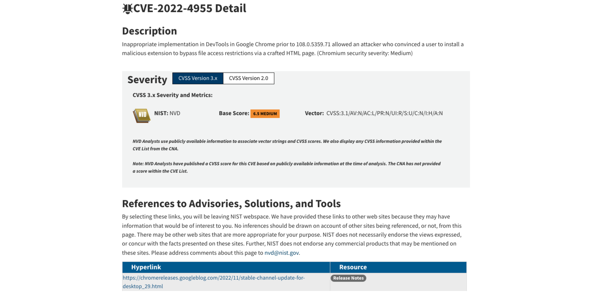
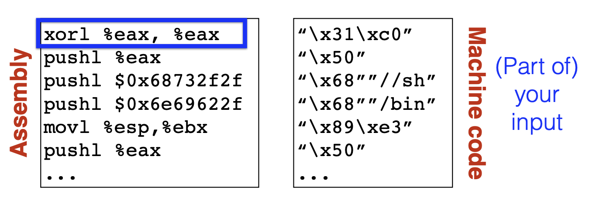

# Seguretat de baix nivell: atacs i exploits

---

## Introducció

- Els **sistemes d'informació i comunicació** i el **programari** són **susceptibles** de **contenir errors**
  - Errors en el seu **disseny** (**_flaw_**) o **desenvolupament** (**_bug_**)
- Un programari que **funciona correctament** és aquell que fa exactament tot allò pel que va ser creat i dissenyat.
  - Pot ser **correcte** des del punt de vista **funcional** però a la vegada pot ser **insegur**

---v

- Els errors en el programari poden ser utilitzats:
  - per a atacar el sistema i posar-ne en perill el bon funcionament
  - posar en perill la **confidencialitat** i l'ús de les dades que hi ha emmagatzemades
  - com a porta d'entrada per a executar **codi maliciós**

---

## Bugs

- **_Bug_**: és un error, un defecte o fallada en un programa o sistema informàtic, que fa que es produeixi un resultat incorrecte o inesperat o que es comporti de forma no prevista
- La majoria dels errors es deuen als errors comesos per les **persones**:
  - en el **desenvolupament** del codi
  - en el **disseny**
- Quan es produeix un error en el programari, aquest error pot ser utilitzat per un **_hacker_** o un **atacant** com a **porta d'entrada**


---

## Bases de dades de vulnerabilitats

- **Vulnerabilitat**: **debilitat** de qualsevol tipus que compromet la seguretat del sistema informàtic
- Hi ha diversos organismes, fundacions i empreses que es dediquen a recollir, catalogar i **enregistrar les vulnerabilitats conegudes**
- La informació sobre les vulnerabilitats es poden trobar en diverses bases de dades, repositoris i llistes de distribució públiques _open source_ o d'iniciativa privada a través de la xarxa
- La informació és recopilada gràcies a les aportacions de:
  - la comunitat
  - els fabricants
  - els organismes governamentals
  - institucions i empreses públiques i privades

---v

- Aquestes bases de dades aporten informació addicional de gran interès, com ara:
  - tipus de vulnerabilitat
  - descripció
  - conseqüències
  - entorns i programaris afectats
  - solucions (_patches_)
  - prevencions
  - dates de descoberta de la vulnerabilitat
  - i altra informació d'interès.

---

## National Vulnerability Database

- [https://nvd.nist.gov/](https://nvd.nist.gov/)
- NVD és un repositori del govern dels EUA
  - Pertany al National Institute of Standards and Technology (NIST)
- És una base de dades pública
- Manté informació estandarditzada sobre vulnerabilitats
- Aquesta gestió permet l'automatització de les mesures i gestió de vulnerabilitats

---

## Cercador de vulnerabilitats d'NVD


---

## Informació d'una vulnerabilitat a NVD que afecta a Google Chrome



---

## Common Vulnerabilities and Exposures (CVE)

- [https://cve.mitre.org](https://cve.mitre.org)
- CVE és un diccionari de coneixement públic sobre les vulnerabilitats de seguretat
- Cada referència te un número d'identificació únic, d'aquesta forma proveeix una nomenclatura comú per al coneixement públic, que permet l'intercanvi de dades entre els productes de seguretat.

---

## Informació d'una vulnerabilitat a CVE que afecta a Google Chrome


---

## Exploit

- **_Exploit_**: codi que permet a un atacant / testejador aprofitar una vulnerabilitat del sistema i comprometre la seva seguretat, o causar un comportament no desitjat o imprevist del sistema
- Es tracta d'un programa que aconsegueix **provocar l'error** aprofitant la vulnerabilitat d'un altre **programa**
- Un cop ha provocat l'error, aprofita aquest error per a **injectar un codi** o un **_payload_** per tal que sigui executat i així obtenir el control del sistema atacat, o realitzar algun altre tipus d'atac amb altres finalitats

---

## Payload

- **_Payload_**: codi que s'executa en el destí atacat en executar-se un exploit
  - L'exploit provoca l'error del sistema aprofitant una vulnerabilitat i injecta un payload amb el codi que es vol que s'executi en la màquina atacada
- Normalment es tracta d'una seqüència d'instruccions en llenguatge assemblador amb l'objectiu d'executar-se en el sistema de destí per a crear accions, com per exemple:
  - crear un usuari en el sistema remot
  - executar alguna línia de comandes i enllaçar-ho a un port local, etc.
- Un payload pot ser utilitzat per diversos exploits i que un mateix exploit pot utilitzar diversos payloads.

---

## Exploits remots

- Un atac remot és un atac que pot ser iniciat des d'una ubicació diferent de la de l'equip de la víctima
- Funciona en una xarxa o a través d'Internet i explota la vulnerabilitat de seguretat sense accés previ al sistema vulnerable de la víctima

---v

- La gran extensió d'Internet facilita la difusió del programari maliciós a través de la xarxa
- Exemples de cucs (_worms_) que es difon per la xarxa: Sasser, Blaster o Code Red
  - Aprofitaven serveis de xarxa vulnerables explotables en remot per copiar-se d'una màquina a una altra
- En general, consisteix en servidors que intenten accedir a una aplicació client i un cop ho aconsegueixen, envien un exploit per a ser executat

---

## Code Red Worm

<iframe width="560" height="315" src="https://www.youtube.com/embed/_pMF_3vDO4k?si=5BShYynR0Ez2niQq" title="YouTube video player" frameborder="0" allow="accelerometer; autoplay; clipboard-write; encrypted-media; gyroscope; picture-in-picture; web-share" referrerpolicy="strict-origin-when-cross-origin" allowfullscreen></iframe>

---

## Exploits locals

- Un exploit local requereix accés previ al sistema vulnerable
- S'executa localment en l'equip
- En general eleva els privilegis al nivell de l'administrador o de root per tal que l'exploit pugui tenir un control total del sistema
  - També és possible usar diversos exploits, primer per a obtenir accés de baix nivell, i després escalar privilegis diverses vegades fins arribar a l'arrel (root) o a nivell d'administrador.
- Alguns exploits també es poden distribuir localment a través de dispositius d'emmagatzematge USB
- Per exemple: el cuc Conficker (o W32.Downadup), W32.Spybot, W32.Randex i W32.Mytob

---

## Conficker Worm

<iframe width="560" height="315" src="https://www.youtube.com/embed/5FuQ9aRZL3E?si=UHIekCxYkN27cQJq" title="YouTube video player" frameborder="0" allow="accelerometer; autoplay; clipboard-write; encrypted-media; gyroscope; picture-in-picture; web-share" referrerpolicy="strict-origin-when-cross-origin" allowfullscreen></iframe>

---

## Client Side

- Els atacs Client Side busquen aprofitar-se de vulnerabilitats que típicament es troben en les **aplicacions client**, instal·lades en gran part de les estacions de treball
  - Aplicacions d'ofimàtica, com Microsoft Office o Open Office, lectors de PDF, com Adobe Acrobat Reader, navegadors d'Internet, com Internet Explorer, Firefox, Chrome o Safari...
- L'exploit està dins d'un arxiu amb un format suportat per alguna d'aquestes aplicacions i que arriba a la màquina objectiu per mitjans com email o USB
- Es necessita que l'usuari obri l'arxiu, cliqui algun enllaç o realitzi alguna acció en concret.

---v

- Es tracta de programari maliciós que apareix com a fitxer o programari aparentment fiable
  - Es tracta de fitxers amb un format conegut com ara ZIP, RAR, MPEG, MP3, JPG, etc., però que en realitat incorporen codi maliciós de forma intencionada
- Per exemple: desbordament de memòria provocat en un fitxer JPEG que permet a atacants remots executar codi arbitrari a través d'una imatge JPEG
  - CVE-2004-0200 (CVE = Common Vulnerabilities and Exposures)
- Poden ser utilitzats en combinació amb el mètode d'**enginyeria social**

---

## Social Engineering - How Bad Guys Hack Users

<iframe width="560" height="315" src="https://www.youtube.com/embed/uMkOphesrqI?si=RPJYUOWN8PIvjiFl" title="YouTube video player" frameborder="0" allow="accelerometer; autoplay; clipboard-write; encrypted-media; gyroscope; picture-in-picture; web-share" referrerpolicy="strict-origin-when-cross-origin" allowfullscreen></iframe>

---

## Malware vs Exploits: What's the Difference?

<iframe width="560" height="315" src="https://www.youtube.com/embed/a9u8-rNCHUs?si=idB-mc2qgZRZFaM4" title="YouTube video player" frameborder="0" allow="accelerometer; autoplay; clipboard-write; encrypted-media; gyroscope; picture-in-picture; web-share" referrerpolicy="strict-origin-when-cross-origin" allowfullscreen></iframe>

---

## Tipus d'exploits

- Zero-day
- Full disclosure
- Responsible disclosure

---

## Zero-day

- Forat o vulnerabilitat en el programari que és desconegut per al fabricant o desenvolupador
- Pot ser explotat pels hackers abans que el venedor ho descobreixi i creï un _patch_ per tal d’eliminar-ne la vulnerabilitat
- Són els més perillosos

---

## Full disclosure

- Full disclosure és la pràctica de publicar la informació de les vulnerabilitats al mateix moment que es descobreix, de forma que sigui accessible per a tothom
  - Per tant, les víctimes potencials estan informades de com poden ser atacades i els fabricants poden desenvolupar el _patch_
- També s'anomenen **exploits de dia 1**, ja que es coneix l'error però encara no hi ha un _patch_

---

## Responsible disclosure

- El fabricant descobreix o és informat de l’error però no es fa públic
- Quan el fabricant té disponible el _patch_ i el posa a disposició dels clients és quan es dóna a conèixer i es fa públic
- Sistema molt comú en les grans empreses de programari com Microsoft
  - S'aplica el principi de no publicar res que pugui afectar la seguretat dels seus clients.

---

## Introducció a la seguretat de baix nivell

> C i l'atac de buffer overflow

---

## Què es un _buffer overflow_?

- Un **_buffer overflow_** (desbordament de memòria intermèdia) és un **_bug_** que afecta el codi de baix nivell, normalment en **C** i **C++**, amb importants implicacions de seguretat
- **Normalment**, un programa amb aquest error simplement **fallarà**
- Però un **atacant** pot alterar les situacions que fan que el programa faci coses pitjors:
  - **Robar** informació privada
  - **Corrompre** informació valuosa
  - **Executar** codi de l'atacant

---

## Per què estudiar-lo?

- Els **_buffer overflows_** encara són **rellevants** avui dia
  - C i C++ encara són populars
  - Els _buffer overflows_ encara es produeixen amb regularitat
- Tenen una **llarga història**
  - S'han desenvolupat molts enfocaments diferents per defensar-se contra ells, i errors com ells
- Comparteixen **característiques comunes amb altres _bugs_** que estudiarem
  - En **com funciona l'atac**
  - En **com defensar-s'hi**

---

## C i C++ són encara molt populars


- [https://spectrum.ieee.org/top-programming-languages-2024](https://spectrum.ieee.org/top-programming-languages-2024)

---

## Sistemes crítics en C/C++

- La majoria dels **nuclis (_kernels_)** i utilitats del sistema operatiu
  - fingerd, X windows server, shell
- Molts **servidors d'alt rendiment**
  - Microsoft IIS, Apache httpd, nginx
  - Servidor Microsoft SQL, MySQL, redis, memcached
- Molts **sistemes encastats** (_embedded systems_)
  - Rover de Mart, sistemes de control industrial, automòbils
**Un atac a aquests sistemes és especialment perillós!**

---

## Història dels _buffer_ overflows (1)

- 1988: **_Morris worm_** (cuc de Morris)
  - Propagat entre màquines (massa agressiu, gràcies a un bug)
  - Una manera de propagar-se va ser un atac de buffer overflow contra una versió vulnerable de fingerd als VAX
    - Va enviar una cadena especial al _daemon_ finger (fingerd), que va fer que executés codi que creava una nova còpia del cuc
  - Resultat final: 10-100 milions de dòlars en danys


---

## Història dels _buffer_ overflows (i 2)

- 2001: CodeRed
  - Va provocar un desbordament (_overflow_) al servidor MS-IIS
  - 300.000 màquines infectades en 14 hores
- 2003: SQL Slammer
  - Va provocar un desbordament al servidor MS-SQL
  - 75.000 màquines infectades en 10 minuts

---

## Vulnerabilitats de Buffer Overflow


Vulnerabilitats de Buffer Overflow trobades des de 1999 a 2021
segons Common Vulnerabilities and Exposures (CVE)
[http://dx.doi.org/10.3390/app12136702](http://dx.doi.org/10.3390/app12136702)

---

## Disposició de la memòria

> Memory layout

---

## Disposició de la memòria (1)

- Com es disposen les dades del programa a la memòria?
- Com és la pila (_stack_)?
- Quin efecte té en la memòria cridar (i tornar de) una funció?
- Ens centrarem en el model de procés de Linux
  - Similar a altres sistemes operatius

---

## Tots els programes s'emmagatzemen a la memòria

- Un **programa**, quan comença a executar-se, s'anomena **procés**
  - Aquest procés rep memòria del sistema operatiu per tal que s'executi
- Aquí representem l'espai dels processos.
  - A la part inferior hi ha l'adreça zero, l'adreça més baixa
  - A la part superior hi ha l'adreça de quatre gigabytes, que és l'adreça més alta d'un sistema de 32 bits
- El procés veu la memòria com si fos tota seva
- En realitat, aquestes són adreces virtuals, que el sistema operatiu i el processador assignen a adreces físiques reals per a la memòria de la màquina

---v


---

## Disposició de la memòria (2)

- A la part inferior de l'espai d'adreces hi ha el **segment de text** (o codi de text)
  - _Text segment_
- Aquí veiem algunes instruccions x86 que podrien constituir el codi del nostre programa

---v


---

## Disposició de la memòria (3)

- Just a sobre del segment de text hi ha el **segment de dades**, on s'hi guarden les variables estàtiques (**_static_**):
  - El seu temps de vida s'extèn durant tota l'execució del programa
Té dues parts
  - **Àrea de dades inicialitzada**. Dades estàtiques inicialitzades
  - **Àrea de dades no inicialitzades**. Dades estàtiques no inicialitzades
- El model de procés garanteix que les **variables globals** no inicialitzades pel programa són zero
  - Això no és cert amb les **variables locals** no inicialitzades

---v


---

## Disposició de la memòria (4)

- Totes aquestes dades es coneixen en el moment de la compilació
- Així, el compilador pot determinar on va  aquesta informació i pot especificar-ho el màxim possible a l'executable.

---v


---

## Disposició de la memòria (5)

- A la part superior de l'espai d'adreces apareixen els arguments de la línia d'ordres i les variables d'entorn
- Aquests s'estableixen quan comença el procés.

---v


---

## Disposició de la memòria (6)

- Just a sota d'ells, hi ha la **pila** (_stack_)
- La **pila** és el que conté les variables locals, juntament amb les metadades que el programa utilitza per cridar i tornar de funcions.

---v


---

## Disposició de la memòria (7)

- A sobre del segment de dades hi ha el _heap_ (**emmagatzematge dinàmic**). Aquesta és la zona que gestiona _malloc_
  - **_Memory allocation_**: assignació dinàmica de memòria
- Totes aquestes dades s'organitzen i es gestionen en temps d'execució
- És a dir, com es comporta depèn del que faci el programa. Amb què interactua, quines dades i fitxers d'entrada llegeix o escriu, etc.

---v


---

## Memory allocation: assignació dinàmica de memòria

```c
/* Assignar espai per una matriu de 10 elements de tipus int */
int *array = malloc(10 * sizeof(int));

/* Comprova que la memòria s'ha assignat correctament, en cas contrari es gestiona l'error. */
if (array == NULL) {
  /* gestió de l'error en l'assignació ... */
}

/* Si arribam a aquest punt significa que la memòria ha estat assignada correctament */

/* Una vegada hem finalitzat l'ús de la memòria hem d'alliberar la mateixa per futurs usos */
free(array);

/* Ens asseguram que el punter ja no s'utilitza assignant-lo a NULL */
array = NULL;
```

---

## Disposició de la memòria (8)

- Ara la imatge està girada al costat de manera que l'adreça més baixa està a l'esquerra i l'adreça més alta a la dreta
- Veiem l'_stack_ i el _heap_ representats i també mostrem la direcció en què creixen
  - A mesura que es necessita més memòria al _heap_, creix cap a les adreces més altes
  - Quan es necessita més memòria per a l'_stack_, creix cap a la baixa cap a l'adreça inferior.


---

## Disposició de la memòria (9)

- Mentre el programa s'executa, manté un punter d'_stack que indica la part superior de l'_stack_
  - Quan el programa emet una instrucció **_push_**, mourà el punter d'_stack_ després de guardar el valor
- Ara, suposem que després d'executar-se durant un temps, la funció que havia guardat aquests valors retorna (fa **_return_**)
  - En aquest cas, la funció eliminarà (farà **_pop_**) d'una gran part de la pila eliminant totes les seves variables i arguments locals

---v


---

## Disposició de la memòria (i 10)

- El compilador emet les instruccions que ajusten l'_stack_ en temps d'execució.
- La memòria que utilitza el _heap_ la distribueix el sistema operatiu, però les dades individuals que s'emmagatzemen dins del _heap_ són gestionades per **_malloc_**
De moment ens centrarem en l'**_stack_** perquè aquest és el nostre objectiu del primer atac que tindrem en compte.

---v


---

## Cridades de pila i funcions

- Què passa quan **cridam** una funció (**_call_**)?
  - Quines dades s'han d'emmagatzemar?
  - On va?
- Què passa quan **tornam** d'una funció (**_return_**)?
  - Quines dades s'han de restaurar?
  - D'on ve?

---

## Disseny bàsic de la pila

- Veiem una representació de les dades del **_caller_**, que és qui crida aquesta funció
- Quan el _caller_ crida aquesta funció, **guardarà els arguments en ordre invers al codi**
  - La pila creix de dreta a esquerra, és a dir, de les adreces superiors a les adreces inferiors
  - `arg3` arriba primer, després `arg2`, després `arg1`, és a dir, l'ordre contrari del programa
- Després guarda a la pila les **variables locals** de la funció, i emmagatzemant-les en l'**ordre en què apareixen al codi** del programa
  - És a dir, primer `loc1`, i després `loc2`
- També hi ha informació que s'emmagatzema entremig

---v

```c
void func(char *arg1, int arg2, int arg3) {
  char loc1[4];
  int loc2;
  // ...
}
```


---

## Accés a variables (1)

- Com pot el programa saber on estàn les variables locals?
  - Per exemple volem accedir a `loc2`
  - Suposem per exemple que està a `0xbffff323`
  - Com que aquesta funció es pot cridar des de diferent llocs, `loc2` pot estar a diferents adreces depenent de qui ha cridat la funció
- El compilador no pot saber l'adreça en temps de compilació
  - Però sempre sap l'adreça relativa: sempre 8 bytes abans del signes d'interrogació

---v

```c
void func(char *arg1, int arg2, int arg3) {
  // ...
  loc2++; // Question: Where is (this) loc2?
  // ...
}
```


---

## Accés a variables (i 2)

- Necessitem un punt de referència dins del **marc de la pila** (**_stack frame_**)
  - L'anomenam **punter de marc** (**_frame pointer_**)
  - Normalment, els compiladors emmagatzemen el **_frame pointer_** (o **_base pointer_**) al registre **EBP**
- Per tant, el compilador sap que des d'on es crida aquesta funció, la variable `loc2` sempre estarà a vuit bytes de distància del valor actual del **_frame pointer_**


---

## Retornant de funcions (1)

- Ara, si cridam a `func` des de `main`, `main` està utilitzant el punter de marc (**_stack frame_**) de la mateixa manera que `func` ho fa per accedir a les seves pròpies variables locals
- Quan tornem de `func`, `main` voldrà utilitzar el mateix **_stack frame_** que tenia abans
  - De manera que quan accedeixi a les seves variables, va a les adreces correctes
- La pregunta és: com desam i restauram el punter de marc perquè funcioni correctament?

---v

```c
int main () {
  // ...
  func("Hey", 10, -3); // Question: How do we restore %ebp?
  // ...
}
```


---

## Retornant de funcions (2)

- Pensem en com `main` cridarà a `func`:
  - El que farà és que guardarà els seus tres arguments, `arg3`, `arg2`, `arg1`: `"Hey"`, `10`, `i –3`
  - I algunes altres dades que veurem més endavant
- Ara, l'**_stack frame_** està a `%esp`
- Després, el que fa és guardar el **_stack frame_** de main (`%ebp`)
- En aquest punt, podem actualitzar l'stack frame (`%ebp`) perquè sigui l'**_stack frame_** actual (`%esp`)

---v


---

## Retornant de funcions (3)

- Ara, quan la funció `func` comenci a executar-se, guardarà les seves variables locals després de l'**_stack frame_** actual
- La següent pregunta és: com reprendrem al mateix lloc on estàvem, a `main`, quan vàrem cridar a `func`

---v

```c
int main () {
  // ...
  func("Hey", 10, -3); // Question: How do we restore %ebp?
  // ...
}
```


---

## Instruccions a la memòria

- A mesura que `main` s'executa, el **punter d'instruccions** (**_instruction pointer_**), `eip`, es mou per les diferents instruccions que implementen `main`
- Quan crida a `func`, `eip` es mourà cap amunt i començarà a executar aquestes altres instruccions


---

## Retornant de funcions (i 4)

- El que volem és tornar a on estàvem quan vam cridar la funció
- Podem fer el mateix truc que vam fer amb el _frame pointer_
  - Podem emmagatzemar el punter d'instrucció _eip_ just abans de cridar la funció a la pila
- Ara, quan anem a tornar, només hem de posar el punter d'instruccions al valor que està a 4 bytes després del _frame pointer_ actual


---

## `ebp` (base pointer) i `esp` (stack pointer)


---

## Resum

- **Cridant una funció**:
  - **Introduïm els arguments** a l'_stack_ (al revés)
  - **Feim push del l'adreça de retor**n _(%eip)_, és a dir, l'adreça de la instrucció que volem executar després que ens torni el control
  - **Saltam a l'adreça de la funció**
- **A la funció cridada**:
  - **Feim push de l'anterior _frame pointer_** a l'stack (%ebp)
  - **Establim el _frame pointer_** (%ebp) a on es troba el final de la pila ara mateix (%esp)
  - **Feim push de les variables locals** a la pila
- **Tornant (return) a la funció de cridada**:
  - **Restablim el _stack pointer_ anterior**: %esp = %ebp, %ebp = (%ebp)
  - **Tornam a l'adreça de retorn**: %eip = 4(%esp)

---

## Buffer overflow

> Com executam un buffer overflow?

---

## L'error _buffer overflow_

- Buffer =
  - Memòria contigua associada a una variable o camp
  - Comú a C
  - Tots els strings són matrius (arrays) de caràcters (acabats en NUL)
- Overflow (desbordament) =
  - Posar més al buffer del que pot contenir
  - On van les dades desbordades?

---

## Resultat benigne

- Dins la funció func s'intenta copiar l'string "AuthMe!" dins un buffer
  - Però l'string té 7 caràcters més  el caràcter d'acabament NUL, mentre que el buffer només permet 4 caràcters
- Així desbordarem el buffer quan cridem _strcpy_
- En aquest cas, el _frame pointer_ està corromput
  - Donarà un error de _segmentation fault_

---v


---

## Resultat rellevant per a la seguretat

- Aquesta vegada, en lloc de sobreescriure el _frame pointer_, es sobreescriu el contingut de la variable _authenticated_
  - Ara això és un problema, perquè cada vegada que anem a comprovar _authenticated_, el valor és diferent de zero i la comprovació tindrà èxit
- Per tant, aquest error tendria un resultat rellevant per a la seguretat en permetre que el programa fes coses que probablement no teníem intenció

---v


---

## Podria ser pitjor?

- _strcpy_ ens dóna la possibilitat de copiar qualsevol quantitat de dades en un buffer que no tingui la mida adequada.
- Així, podríem sobreescriure molta memòria a la pila
- Un atacant podria sobreescriure el buffer amb codi
  - El programa executaria aquest codi quan torni de la funció

---v


---

## Strings subministrats per l'usuari

- Aquests exemples proporcionen els seus propis strings
- En realitat, els **strings** provenen **d'usuaris** en una infinitat de llocs:
  - Entrada de **text**
  - **Paquets**
  - **Variables d'environment**
  - Entrada de **fitxers**...
- **Validar** l'**entrada de l'usuari** és extremadament **important**

---

## Injecció de codi

> Code injection

---

## Code injection: idea principal

- Dos reptes principals de la injecció de codi mitjançant un  _buffer overflow_:
  - Carregar el nostre propi codi a la memòria
  - Aconseguir que el punter d'instruccions apunti cap a ell, de manera que aquest codi es pugui executar

---v


---

## Carregar codi a la memòria

- Han de ser **instruccions del codi màquina** (és a dir, ja compilades i llestes per executar-se)
  - No codi C --> Ha de ser codi ensamblador
- Hem de tenir cura de com el construïm:
  - **No pot contenir** cap byte a zero (_**all-zero byte**_)
    - En cas contrari, _sprintf_ / _gets_ / _scanf_ / ... deixaran de copiar
    - Com podríeu escriure un assemblatge per no contenir mai un byte zero complet?
  - El codi ha de ser **complet**
    - **No pot utilitzar el carregador o _loader_**(estam injectant) per resoldre adreces dins la memòria

---

## Quin codi executar?

- Objectiu: _**shell**_ d'ús general
  - Línia d'ordres que dóna a l'atacant **accés general al sistema**
- El codi per llançar un _**shell**_ s'anomena _**shellcode**_
- Aquí tenim un exemple de com podria semblar el codi de _shellcode_ que mos agradaria escriure
  - És una funció que crida a _**execve**_, que transforma el programa actual en el donat com a argument
  - En aquest cas, l'argument és _**/bin/sh**_, un _**shell**_

---v


---

## Shellcode

- Aquí teniu el codi ensamblador d'aquest codi de shell
- Si mirem la primera instrucció, aquest és el que podria semblar com un string
- Aquest seria l'string que proporcioneu com a part de la vostra entrada.

---v



---

## Exectuar l'_injected code_

- Només per haver carregat el codi no vol dir que el poguem executar
  - Necessitam una instrucció per "saltar al nostre codi"
- A més, no sabem exactament on està el codi
  - Necessitam que el punter d'instrucció %eip hi apunti


---

## Segrestant el punter %eip

- La clau està en el punter %eip desat, per quan retornem a la funció que ha cridat una funció
  - Podem emmagatzemar l'adreça del nostre codi en aquesta ubicació
- Així, quan la funció torni, el programa anirà al nostre codi i aquest s'executarà
- Ara la pregunta és: **com sabem quina adreça hi hem de posar?**

---v


---

## Trobar l'adreça de retorn

- Si no tenim accés al codi, no sabem a quina distància està el buffer del %ebp desat
- Un enfocament: provar molts valors diferents!
  - "prova-error"
  - El pitjor dels casos: és un espai de memòria de 32 (o 64) bits, el que significa 232 (264) respostes possibles
- Sense aleatorització d'adreces
  - La **pila sempre comença** des de la mateixa **adreça fixa**
  - La pila creixerà, però normalment no creix molt profundament (tret que el codi sigui molt recursiu)

---

## Millorant les nostres possibilitats: nop sleds o slides

- _**nop**_: és una instrucció d'un sol byte que només passa a la següent instrucció.
- Si l'adversari enganxa molts de _nops_ com a farciment abans del seu propi codi, funcionarà saltant a qualsevol part d'aquest trineu _nop_ sled o slide
  - Així podem millorar les nostres possibilitats


## Resum

- A continuació, es mostra com seria tot el codi adversari injectat
- Aquesta part anomenada "padding" ha de ser alguna cosa, perquè hem de començar a escriure allà on comenci l'entrada a _gets_, o _sprintf_ o _strcpy_ comenci
- Però, quan el programa torni a la ubicació escollida, apuntarà al _nop sled_ i començarà a executar el nostre codi maliciós

---v


---

## Running a Buffer Overflow Attack_

[](https://www.youtube.com/watch?v=1S0aBV-Waeo)


---

## Altres exploits de memòria

> Memory exploits

---

## Altres atacs

- L'atac d'injecció de codi que acabem de veure s'anomena _**stack smashing**_
  - El terme va ser encunyat pel hacker Aleph One l'any 1996
- Constitueix una violació de la **integritat**, i possiblement una violació de la **disponibilitat**
- Altres atacs també exploten errors amb buffers

---

## _Heap overflow_ (1)

- Un _**stack smashing**_ desborda un buffer assignat al _stack_
  - També podeu desbordar un buffer assignat per _**malloc**_, que resideix al _**heap**_


---

## _Heap overflow_ (i 2)

- Definim una estructura, _vulnerable_struct_, que té dos camps, el primer és _buff_, un punter de caràcter, el segon és el punter de la funció _compare_
- A continuació, veiem una funció, _foo_, que pren una _vulnerable_struct _com a argument juntament amb dos arguments de punter de caràcters.
  - Per començar, la primera línia de la funció copia l'un en buff, la segona línia copia el dos més un en buff. Finalment, la tercera línia crida al punter de la funció de comparació, passant buff com a argument i comparant-lo amb el punter del fitxer foobar
- Aquest codi només funcionarà correctament si la longitud de la cadena de _one_ i _two_ és inferior a la longitud màxima de la memòria intermèdia on es copiaran (MAX_LEN). En cas contrari, sobreescriurem el punter de la funció de comparació
  - Igual que a un _stack smashing_, l'adversari pot ser capaç de controlar com es produeix aquesta sobreescritura i aconseguir que el programa executi el codi de la seva elecció.

---v


---

## Variants de _heap overflow_


- Desbordament a l'objecte C++ _vtable_
  - Els objectes C++ (que contenen funcions virtuals) es representen mitjançant una _vtable_, que conté punters als mètodes de l'objecte.
  - Aquesta taula és anàloga a _s->cmp_ del nostre exemple anterior, i un tipus d'atac similar funcionarà
- Desbordament cap als objectes adjacents
  - Per exemple, un que contengui un punter a una funció
  - On el buff no es col·loca amb un punter de funció, sinó que s'assigna a prop d'un del _heap_
- Desbordament de metadades del heap
  - Capçalera oculta just abans del punter retornat per _malloc_
  - Fluxe cap a aquesta capçalera per corrompre el propi _heap_

---

## _Integer overflow_

- A C, una variable té un valor màxim i, quan se supera aquest valor, el valor de la variable s'ajustarà
- En aquest cas, estem llegint des de la xarxa mitjançant la funció _packet\_get\_int_
  - Suposem que l'adversari té el control de l'altra banda de la xarxa i envia un nombre molt gran
- Suposem que el nombre és 1.073.741.824 i que la mida d'un punter de caràcter a la nostra arquitectura és 4, és a dir, és una arquitectura de 32 bits
  - _nresp_ és més gran que zero i, per tant, emmagatzemarem amb _malloc_ un buffer on emmagatzemarem una resposta
  - Aquest nombre molt gran multiplicat per 4, s'ajusta al 0
- _malloc_ assignarà un buffer de mida zero i, aleshores, les escriptures posteriors a aquesta memòria intermèdia l'estan desbordant

---v


---

## Corrompre dades

-  Els atacs que hem mostrat fins ara **afecten el codi**
  - Adreces de retorn i punters de funció
- Però els atacants també poden **desbordar les dades**
  - **Modificar una clau secreta** perquè sigui coneguda per l'atacant, per poder desxifrar futurs missatges interceptats
  - **Modificar les variables d'estat** per evitar les comprovacions d'autorització
  - **Modificar les cadenes interpretades*- utilitzades com a part de les ordres
    - Per exemple, per facilitar la injecció SQL

---

## _Read overflow_

- En lloc de permetre escriure més enllà del final d'un buffer, un error podria permetre llegir **més enllà del final _del buffer_**
  - Pot filtrar informació secreta
- En aquest exemple, la longitud que s'especifica a la primera lectura pot superar la longitud del missatge proporcionat a la segona lectura
  - Si ho fa, imprimirà caràcters més enllà del que es va llegir

---v


---

## Memòria obsoleta (_stale memory_)

- Es produeix un _**dangling pointer bug**_ quan s'allibera un punter, però el programa continua usant-lo
- Un atacant pot fer que **la memòria alliberada sigui reassignada*- i sota el seu control


---

## Vulnerabilitats de format d'string

> Format string vulnerabilities

---

## E/S formatades (Formatted I/O)

- La família _printf_ de C admet E/S formatades


- Especificadors de format
  - La posició a l'string indica l'argument de l'stack a imprimir
  - El tipus d'especificador indica el tipus d'argument
    - %s = string
    - %d = nombre sencer
    - etc.

---

## Quina és la diferència?

- En aquest exemple s'assigna un buffer de caràcters a la pila
- I cridam a _fgets_ per llegir-lo
- La diferència està a la tercera línia.
  - La primera funció crida a %s com a cadena de format abans d'imprimir buf
  - La segona funció renuncia a utilitzar una cadena de format per complet i només hi col·loca buf
- _buf_ pot contenir especificadors de format
  - En el primer cas, si ho fa, aquests especificadors només s'imprimiran a la pantalla
  - En el segon, s'interpretaran

---v


---

## Vulnerabilitats de format d'string

- `printf("100% dave");`
  - Imprimeix l'entrada del stack 4 bytes per sobre del %eip guardat
- `printf("%s");`
  - Imprimeix els bytes als quals apunta aquesta entrada de pila
- `printf("%d %d %d %d ...");`
  - Imprimeix una sèrie d'entrades de l'stack com a nombres enters
- `printf("%08x %08x %08x %08x ...");`
  - El mateix, però en hexadecimal
- `printf("100% no way!");`
  - Escriu el número 3 a l'adreça indicada per l'entrada de l'stack

---

## Per què això és un stack overflow?

- Hauríem de pensar en això com un stack overflow en el sentit que
  - L'stack mateix es pot veure com una mena de buffer
  - La mida d'aquest buffer ve determinada pel nombre i la mida dels arguments passats a una funció
- Proporcionar una cadena de format falsa indueix el programa a desbordar aquest "buffer"

---

## Format string vulnerabilities

[](https://www.youtube.com/watch?v=DhVRI33s-D0)

---

## Depurant el codi amb _GDB_

> _GDB_ debugger

---

## Debugging - GDB Tutorial

[](https://www.youtube.com/watch?v=bWH-nL7v5F4)

---

## GDB is REALLY easy! Find Bugs in Your Code with Only A Few Commands

[](https://www.youtube.com/watch?v=Dq8l1_-QgAc)
