# Defensa contra exploits de baix nivell

---

## Un pas enrere

- Què tenen en comú els atacs que hem vist?
  - L'**atacant** és capaç de **controlar algunes dades** que utilitza el programa
  - L'ús d'aquestes dades **permet l'accés no intencionat a alguna àrea de memòria** del programa
    - a posicions de fora del buffer
    - a posicions arbitràries de la pila (_stack_)

---

## Què veurem en aquest tema?

- **Seguretat de memòria** i **seguretat de tipus**
  - Propietats que, si es compleixen, garanteixen que una aplicació sigui immune als atacs de memòria
- Defenses automàtiques
  - _**Stack canaries**_
  - Aleatorització del disseny de l'espai d'adreces (**ASLR**)
- Atac de programació orientada al retorn (_Return-Oriented Programming_ - **ROP**)
  - Com aturar l'atac amb _Control Flow Integrity_ (**CFI**)
- Codificació segura: regles per escriure programes més segurs
  - Ho veurem a un altre tema

---

## Seguretat de la memòria

> Memory safety

---

## Atacs de baix nivell activats per a manca de seguretat de la memòria

- Seguretat de la memòria (_memory safety_) és una propietat de l'execució dels programes
- Execució d'un programa amb seguretat de memòria:
  - Només **crea punters** mitjançant **mitjans estàndard**
    - `p = malloc(...)`, o `p = &x`, o `p = &buf[5]`, etc.
  - Només utilitza un punter per **accedir a la memòria** que **"pertany" a aquest punter**
- Combina dues idees: **seguretat temporal** (1) i **seguretat espacial** (2)

---

## Seguretat espacial

- La **seguretat espacial** vol dir que els accessos d'un punter només han de ser a la memòria que té el punter, és a dir, que li pertany
- Podem veure els punters com a triples (**p**, **b**, **e**)
  - **p** és l'adreça de la memòria on apunta el punter
  - **b** és la base de la regió de memòria a la qual pot accedir (que poseeix el punter)
  - **e** és l'extensió (límits) d'aquesta regió, determinades per l'argument a malloc o per la mida de l'objecte al que apunta sizeof(typeof(**p**))
- **Accés permès** si **b ≤ p ≤ e – sizeof(typeof(p))**
- Operacions:
  - L'aritmètica del punter només afecta **p**, però no a **b** i **e**
  - Utilitzar **&: e** determinat per la mida del tipus d'original

---

## Exemple (1)

- Declaram una variable x, de mida 4 bytes
  - y guarda l'adreça de x
  - z guarda l'adreça de x més 1. L'aritmètica del punter incrementa l'adreça 1 vegades la mida de l'adreça de la memòria (4 bytes)
- Assignam el valor 3 a y (desreferenciam y)
  - És legal, perquè el punter actual p es troba dins de la base, que també és la mateixa adreça que p, i els límits menys la mida.
- Desreferenciar z és una violació de la seguretat de la memòria:
  - p està fora dels límits. Ara no és menor o igual que el límit superior, x més 4 menys 4

---v

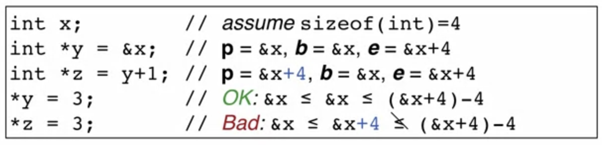

---

## Exemple (2)

- Declaram un struct foo, amb dos camps, un buffer de caràcters de mida 4 i un integer
- Assignam a f de tipus foo els valors "cat" i 5
  - buf serà igual a "C-A-T-\0". `\0` = NULL terminator
- Guardam l'adreça d'aquest primer campal punter de caràcter y
- Si guardam 's' a y+3, està dins els límits
- Si guardam 'y' a y+4, augmentam més enllà de la regió de memòria associada a buf
  - Així, modificaríem el valor de x

---v

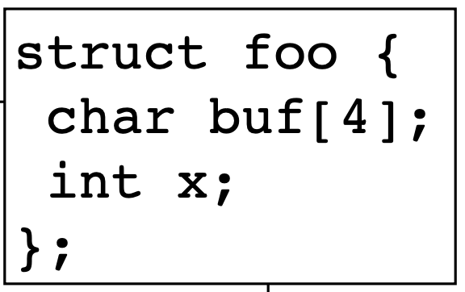

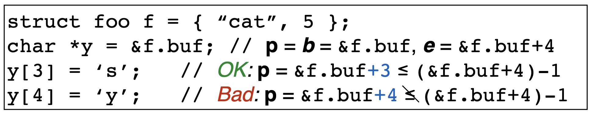

---

## Sense buffer overflows

- Un **desbordament de la memòria intermèdia** viola la **seguretat espacial**
- Aquesta funció, per exemple, necessita dos punters src i dst i la suposada longitud d'aquests dos punters, len
- Es produirà un desbordament de memòria intermèdia si len més gran que src o dst
- Traspassar els límits de la font (src) i/o els buffers de destinació (dst) implica que src o dst són il·legals, o len és il·legal (és massa llarg)

---v

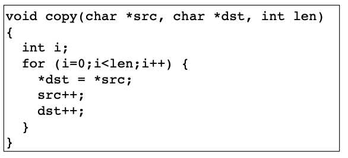

---

## Sense atacs de cadenes de format

- Els **atacs de cadenes de format** també exploten una violació de la **seguretat espacial**

```c
char *buf = "%d %d %d\n";
printf(buf);
```

- La crida a `printf` desreferencia punters il·legals, ja que espera tres nombres sencers com a arguments, i no en proporcionam cap:
  - `printf` accedirà més enllà dels límits del seu marc de pila
  - Podem veure la pila com un buffer definit pel nombre i tipus d'arguments que proporciona
  - Els especificadors de format addicional construeixen punters més enllà del final d'aquesta memòria intermèdia i els desferencien
- Essencialment és una mena de desbordament del buffer

---

## Seguretat temporal

- Es produeix una **infracció temporal de seguretat** quan s'intenta **accedir a memòria que està no definida (_undefined_)**
  - La seguretat espacial assegura que era a una regió legal
  - La seguretat temporal assegura que la regió encara està assignada i activa
- Regions de memòria **definides** o **no definides**
  - Definida significa assignada (i activa)
  - No definida significa no assignada, no inicialitzada o desassignada (alliberada)
- Fingir que la memòria és infinitament gran (mai la reutilitzem)
  - Una vegada allliberada, esdevé permanentment inaccessible

---

## Sense punters penjants (_dangling pointers_)

- L'**accés a un punter alliberat** viola la **seguretat temporal**
  - La memòria a la que apuntava p està desreferenciada, i per tant ja no és legal

```c
int *p = malloc(sizeof(int));
*p = 5;
free(p);
printf("%d\n", *p); // violation
```

- L'accés a punters no inicialitzats tampoc és legal

```c
int *p;
*p = 5; // violation
```

---

## Desbordament de nombres enters? (_integer overflows_)

- Es permeten desbordaments de nombres sencers sempre que no s'utilitzin per crear un punter il·legal

```c
int f() {
  unsigned short x = 65535;
  x++;                 // overflows to become 0
  printf("%d\n", x);   // memory safe
  char *p = malloc(x); // size-0 buffer!
  p[1] = 'a';          // violation
}
```

- Els desbordaments d'enters sovint permeten desbordaments de memòria intermèdia
  - Si els números enters es desborden no són necessàriament vulnerabilitats, però s'utilitzen habitualment per explotar altres vulnerabilitats del programa.

---

## La majoria dels llenguatges són segurs per a la memòria

- La manera més senzilla d'evitar totes aquestes vulnerabilitats és utilitzar un **llenguatge segur de memòria** (**memory safe language**)
- Els llenguatges moderns són segurs per a la memòria:
  - Java, Python, C#, Ruby
  - Haskell, Scala, Go, Objective Caml, Rust
- De fet, aquests llenguates són **amb seguretat de tipus**, que és encara millor (més sobre això en breu)


---

## Seguretat de la memòria per a C

- **C/C++ està aquí per quedar-se**
  - Tot i que no és segur per a la memòria, podeu escriure programes segurs amb la memòria amb ells
  - El problema és que no hi ha cap garantia
- Els compiladors podrien afegir **codi per comprovar si hi ha infraccions**
  - Un accés fora dels límits (_out-of-bounds_) provocaria un error immediat, com ara una _ArrayBoundsException_ a Java
- Aquesta idea fa més de 20 anys que existeix
  - **El rendiment ha estat el factor limitant**
  - El treball de Jones i Kelly el 1997 afegeix 12 vegades de sobrecàrrega
  - `memcheck` de Valgrind afegeix 17 vegades de sobrecàrrega

---

## Progrés

- La investigació ha fet algunes millores
  - **CCured** (2004), desacceleració 1,5x
    - Però sense consultar a les biblioteques
    - El compilador rebutja molts programes segurs
  - **Softbound/CETS** (2010): desacceleració de 2,16x
    - Comprovació completa
    - Molt flexible
  - Properament: maquinari **Intel MPX**
    - Suport de hardware per fer la comprovació més ràpida

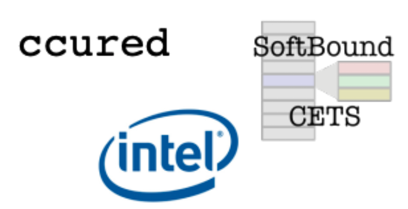

---

## Type Safety

> Seguretat de tipus

---

## Seguretat de tipus

- En un llenguatge amb seguretat de tipus, a cada objecte se li atribueix un **tipus** (int, punter a int, punter a funció)
- Les operacions sobre l'objecte sempre són _compatibles_ amb el tipus d'objecte
  - Els programes segurs no "van malament" en temps d'execució
- La **seguretat de tipus** és **més forta** que la seguretat de la memòria

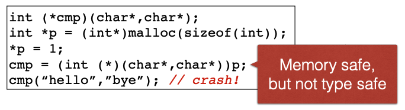

---

## Llenguatges "tipats" dinàmicament

- Els **llenguatges "tipats" dinàmicament**, com Ruby o Python, també ténen seguretat de tipus (_type safe_)
  - No requereixen declaracions que identifiquin tipus
- Hi ha essencialment un **únic tipus**: **Dinàmic**
  - Cada operació en un objecte dinàmic està permesa, però **pot estar no implementada**
  - En aquest cas, **llança una excepció**

---

## Perquè no seguretat de tipus (_type safety_)?

- **C/C++** sovint es tria **per raons de rendiment**
  - Gestió manual de la memòria
  - Control estricte de la disposició dels objectes
  - Interacció amb maquinari de baix nivell
- L'**aplicació típica** de la seguretat de tipus (_type safety_) és **cara**
  - El _garbage colletor_ evita infraccions temporals
    - Pot ser tan ràpid com _malloc_/_free_, però sovint utilitza molta més memòria
  - Els **límits** i les **comprovacions de punter nul** eviten violacions espacials

---

## No és el final de la història

- **Nous llenguatges** amb l'objectiu de **proporcionar característiques similars** a C/C++ mentre **proporcionen tipat segur** (_type safe_) i bon rendiment:
  - **Go** de Google
  - **Rust** de Mozilla
  - **Swift** d'Apple
- **La majoria de les aplicacions no necessiten C/C++**
  - O els riscos que comporta

> **Aquests llenguatges poden ser el futur de la programació de baix nivell**

---

## Evitant els exploits

> Avoiding exploitation

---

## Altres estratègies defensives

- **Feu que l'error sigui més difícil d'explotar**
  - Examinar els passos necessaris per a l'explotació. Fer que o més d'ells sigui difícil o impossible
- **Eviteu completament l'error**
  - Pràctiques de codificació segura
  - Revisió i prova de codi avançada
    - Per exemple, anàlisi de programes, _penetration testing_ (_fuzzing_)
- Les estratègies són **complementàries**: intenteu **evitar els errors**, _però_ **afegiu protecció** si alguns d'ells es produeixen

---

## Evitar els exploits**

- **Recordeu els passos** d'un atac _**stack smashing**_:
  - Posar codi de l'atacant a la memòria (sense zeros)
  - Aconseguint que %eip apunti (i executi) el codi d'atacant
  - Trobar l'adreça de retorn
- Com podem **dificultar aquests passos d'atac**?
  - **Millor cas**: Complicar l'explotació canviant les biblioteques, el compilador i/o el sistema operatiu
    - Aleshores no hem de canviar el codi de l'aplicació
    - La correcció (fix) està en el disseny arquitectònic, no en el codi

---

## Detectant _overflows_ amb canaris (_canaries_) (1)

- Integritat de les mines de carbó del segle XIX
  - La mina és segura?
  - No ho sabem: portar un **canari**
  - Si mor, avortam!
- Podem fer el mateix per comprovar si la pila s'ha trencat o no
  - _Stack integrity_


---

## Detectant _overflows_ amb canaris (_canaries_) (i 2)

- No posar totes les variables locals al costat del punter del marc %ebp (frame pointer) guardat, que és l'adreça de retorn
- Podem fer espai per al que s'anomena un canari de pila, que és un nombre que emmagatzemem allà.
- Aleshores, si l'atacant sobrepassa un buffer, l'atacant també sobreescriurà el canari.
- Ara la pregunta és, quin valor hauria de tenir el canari?
  - Volem triar-ne un que sigui difícil per a l'atacant d'endevinar o utilitzar.

---v

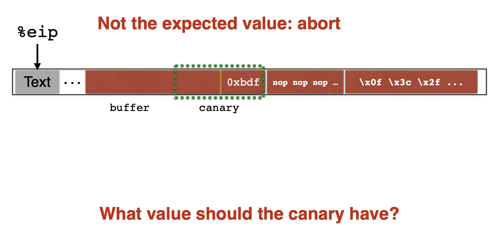

---

## Valors dels canaris

- Canaris _Terminator_ (CR, LF, NUL (és a dir, 0), -1)
  - Aprofita el fet que scanf, etc., no els permeten
- Canaris aleatoris
  - Escriu un nou valor aleatori a cada inici del procés
  - Guardar el valor real en algun lloc de la memòria • Cal protegir contra escriptura el valor emmagatzemat
- Canaris XOR aleatoris
  - Igual que els canaris aleatoris
  - En canvi, emmagatzema Canary XOR alguna informació de control

---

## Fer que l'_stack_ (i el _heap_) no siguin executables

- Així, si es poguessin passar per alt els canaris, no es podria executar cap codi carregat per l'atacant
- És a dir, si el programa s'executa amb normalitat, el **segment de text**, el codi, és immutable i totes les altres parts de memòria del programa no es poden executar
- Per tant, si carreguam codi dins d'una memòria intermèdia _malloc_ o a la pila, l'arquitectura us impediria executar-lo perquè no estava designat com a regió de codi i, per tant, no es permetria executar-lo.
  - Malauradament, aquest enfocament també es pot evitar mitjançant un atac anomenat _**return-to-libc**_

---

## _Return-to-libc_

- El que fem és sobreescriure l'adreça de retorn per apuntar a alguna ubicació que ja està a la memòria, que tingui el codi que volem
- A més, sobreescrivim el següent perquè sigui l'argument d'aquesta memòria
- Per exemple aquí, hem apuntat el punter de retorn a _exec_ per crear un nou procés, i hem apuntat el següent a la pila a _/bin/sh_ la cadena constant
  - I d'aquesta manera, quan tornem de la funció d'overrun, convertirem el nostre procés actual en un shell.

---v

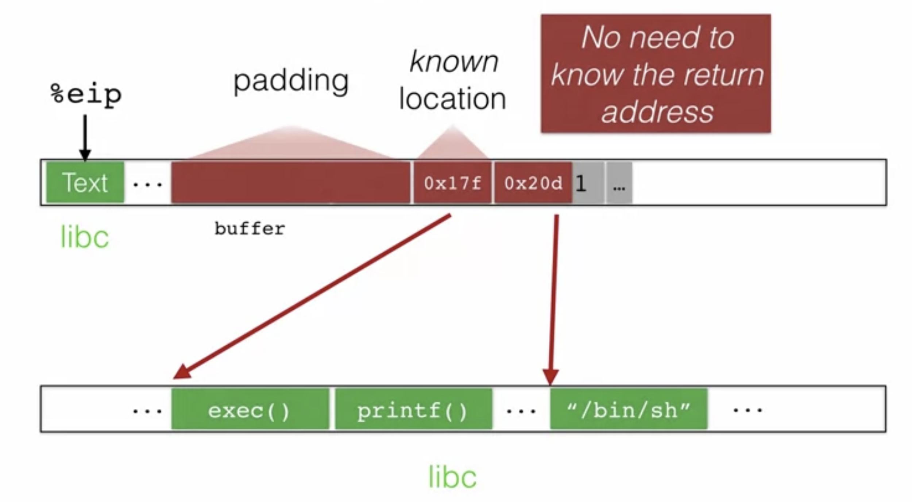

---

## _Return-to-libc attack_

<!-- markdownlint-disable MD033 -->
<iframe width="560" height="315" src="https://www.youtube.com/embed/FvQYGAM1X9U?si=qC44eiqWL8a44nhH" title="YouTube video player" frameborder="0" allow="accelerometer; autoplay; clipboard-write; encrypted-media; gyroscope; picture-in-picture; web-share" referrerpolicy="strict-origin-when-cross-origin" allowfullscreen></iframe>
<!-- markdownlint-enable MD033 -->

---

## Utilitzar Address-space Layout Randomization - ASLR (1)

- L'aleatorització del disseny de l'espai d'adreces (_**Address-space Layout Randomization**_ **- ASLR**) permet derrotar l'atac de **Return-to-libc**
- La idea és **col·locar aleatòriament les biblioteques** estàndard i altres elements de memòria del sistema com la pila en ubicacions aleatòries i, per tant, fer-los més difícils d'endevinar
  - Per tant, l'atacant no pot crear una explotació única que sàpiga exactament on és l'executiu per a cada programa que s'executa.
- Això també fa que sigui **difícil trobar el punter de retorn**.  És a dir, la pila s'ha aleatoritzat i, per tant, la seva ubicació no és la mateixa cada vegada.

---

## Utilitzar Address-space Layout Randomization - ASLR (i 2)

- Per tant, si tornem a l'exemple anterior, ara no sabem on són _exec_ i _bin/sh_ perquè la ubicació de les biblioteques estàndard s'ha aleatoritzat.

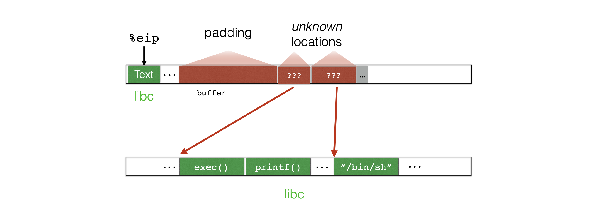

---

## Recordeu els nostres reptes

- Posar codi a la memòria (sense zeros)
  - Defensa: fer-ho detectable amb canaris
- Aconseguint que %eip apunti (i executi) codi de l'atacant
  - Defensa: fes que l'_stack_ (i el _heap_) no siguin executables
  - Defensa: utilitzar l'aleatorització del disseny de l'espai d'adreces (_Address-space Layout Randomization_ - ASLR)
- Trobar l'adreça de retorn
  - Defensa: utilitzar l'aleatorització del disseny de l'espai d'adreces (Address-space Layout Randomization - ASLR)

---

## Programació Orientada a Retorn - ROP

> Return Oriented Programming

---

## Introduction to return oriented programming (ROP)

<!-- markdownlint-disable MD033 -->
<iframe width="560" height="315" src="https://www.youtube.com/embed/yS9pGmY_xuo?si=u0CP769N7UYPzWVS" title="YouTube video player" frameborder="0" allow="accelerometer; autoplay; clipboard-write; encrypted-media; gyroscope; picture-in-picture; web-share" referrerpolicy="strict-origin-when-cross-origin" allowfullscreen></iframe>
<!-- markdownlint-enable MD033 -->

---

## Exploiting Return Oriented Programming (ROP) tutorial

<!-- markdownlint-disable MD033 -->
<iframe width="560" height="315" src="https://www.youtube.com/embed/8zRoMAkGYQE?si=gzimRUyLTZLvQCQA" title="YouTube video player" frameborder="0" allow="accelerometer; autoplay; clipboard-write; encrypted-media; gyroscope; picture-in-picture; web-share" referrerpolicy="strict-origin-when-cross-origin" allowfullscreen></iframe>
<!-- markdownlint-enable MD033 -->

---

## Control de la integritat del flux - CFI

> Control Flow Integrity

---

## Understanding Control Flow Integrity

<!-- markdownlint-disable MD033 -->
<iframe width="560" height="315" src="https://www.youtube.com/embed/mDeOJmUkXOQ?si=p3cRbQTq0leZ4-Xu" title="YouTube video player" frameborder="0" allow="accelerometer; autoplay; clipboard-write; encrypted-media; gyroscope; picture-in-picture; web-share" referrerpolicy="strict-origin-when-cross-origin" allowfullscreen></iframe>
<!-- markdownlint-enable MD033 -->

---

## Codificació segura

> Secure coding

---

## Codificació segura en C

- Com que el llenguatge ofereix poques **garanties**, els desenvolupadors han de
  - Emprar **disciplina**, limitant-se a **patrons de codificació** que eviten vulnerabilitats
    - Bona **guia de referència**: _**CERT C Coding Standard**_:
      - [https://wiki.sei.cmu.edu/confluence/display/c/SEI+CERT+C+Coding+Standard](https://wiki.sei.cmu.edu/confluence/display/c/SEI+CERT+C+Coding+Standard)
    - David Wheeler: [https://dwheeler.com/secure-programs/Secure-Programs-HOWTO/internals.html](https://dwheeler.com/secure-programs/Secure-Programs-HOWTO/internals.html)
    - Matt Bishop: [http://nob.cs.ucdavis.edu/bishop/](http://nob.cs.ucdavis.edu/bishop/)
  - Revisar i fer proves de codi avançades
    - Es consideraran en profunditat més endavant al curs

---

## Pràctiques de seguretat

- En general, ens esforcem per seguir **principis** i **normes** (o **regla**)
  - Un **principi** és un objectiu de disseny amb moltes manifestacions possibles.
  - Una **norma** és una pràctica específica que està en consonància amb els principis de disseny sòlid.
    - La diferència entre aquests de vegades pot ser difusa
- Mirarem les **normes** per a una **bona codificació C**
  - En particular, per **evitar errors d'implementació** que podrien comportar violacions de la seguretat de la memòria
- En un **futur** mòdul del curs **considerem principis i regles de manera més àmplia**

---

## Regla: comprovar les entrades (1)

```c
char digit_to_char(int i) {
  char convert[] = "0123456789";
  return convert[i];
}
```

```c
char digit_to_char(int i) {
  char convert[] = "0123456789";
  if (i < 0 || i > 9) {
    return '?';
  }
  return convert[i];
}
```

---

## Regla: comprovar les entrades (i 2)

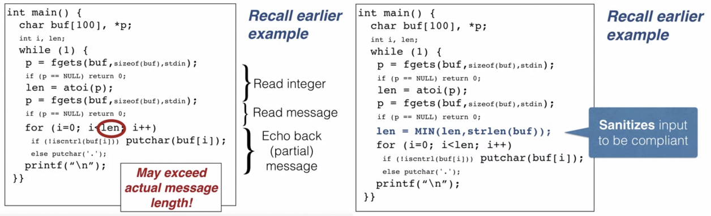

---

## Principi general: codificació robusta

- Com la "_conducció_ defensiva"
  - Eviteu dependre de qualsevol altra persona al vostre voltant
  - Si algú fa alguna cosa inesperada, no estavellaràs (o pitjor)
  - Es tracta de **minimitzar la confiança**
- Cada mòdul **verifica de manera pessimista les seves suposades precondicions** (als _callers_ externs)
  - Encara que "sàpigues" que els clients no t'enviaran un punter NULL
  - ... És millor llançar una excepció (o fins i tot sortir) que executar codi maliciós
- _**Robust Programming**_:
  - [http://nob.cs.ucdavis.edu/bishop/secprog/robust.html](http://nob.cs.ucdavis.edu/bishop/secprog/robust.html)

---

## Regla: utilitzeu funcions de cadena segures (1)

- Les rutines tradicionals de la biblioteca d'strings assumeixen que els buffers de destinació tenen una longitud suficient

```c
char str[4];
char buf[10] = "fine";
strcpy(str, "hello");      // overflows str
strcat(buf, "day to you"); // overflows buf
```

- Les versions segures comproven la longitud de destinació

```c
char str[4];
char buf[10] = "fine";
strlcpy(str, "hello", sizeof(str));      // fails
strlcat(buf, "day to you", sizeof(buf)); // fails
```

---

## Regla: utilitzeu funcions de cadena segures (i 2)

- Reemplaçaments de funcions orientades a strings:
  - `strcat` ==> `strlcat`
  - `strcpy` ==> `strlcpy`
  - `strncat` ==> `strlcat`
  - `strncpy` ==> `strlcpy`
  - `sprintf` ==> `snprintf`
  - `vsprintf` ==> `vsnprintf`
  - `gets` ==> `fgets`

---

## Regla: no oblideu l'acabament NUL

- Els strings requereixen un caràcter addicional per emmagatzemar l'acabament NUL
  - Oblidar-ho podria provocar desbordaments

```c
char str[3];
strcpy(str, "bye");  // write overflow
int x = strlen(str); // read overflow
```

- L'ús de cridades a les funcions de cadena segures detectarà aquest error
  - Ara la cadena str contindrà "by"

```c
char str[3];
strlcpy(str, "bye", 3); // blocked
int x = strlen(str);    // returns 2
```

---

## Regla: entendre l'aritmètica del punter

- `sizeof()` retorna el nombre de _bytes_, però l'aritmètica del punter el multiplica pel syzeof del tipus
- A aquest exemple, s'afegirà quadre vegades més del que realment es requereix (mida del buffer x 4 (mida de int = 4)

```c
int buf[SIZE] = {...};
int *buf_ptr = buf;

while (!done() && buf_ptr < (buf + sizeof(buf))) {
  *buf_ptr++ = gennext(); // will overflow
}
```

- Per tant, cal utilitzar les unitats adequades

```c
while (!done() && buf_ptr < (buf + SIZE)) {
  *buf_ptr++ = gennext(); // stays in bounds
}
```

---

## Dangling pointers (punters penjants)

<!-- markdownlint-disable MD033 -->
<iframe width="560" height="315" src="https://www.youtube.com/embed/qNgV7oAHElk?si=2TRqpApHVMuCeDe5" title="YouTube video player" frameborder="0" allow="accelerometer; autoplay; clipboard-write; encrypted-media; gyroscope; picture-in-picture; web-share" referrerpolicy="strict-origin-when-cross-origin" allowfullscreen></iframe>
<!-- markdownlint-enable MD033 -->

---

## Defensa els punters penjants (_dangling pointers_)

- Hem d'evitar els **punters penjants** (**explicat abans**)
- Ho podem arreglar **assignant NULL al punter després d'alliberar-lo**

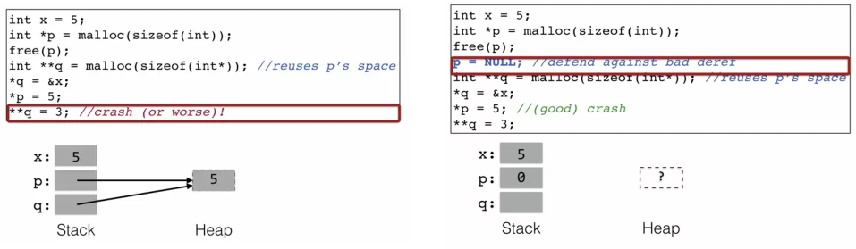
