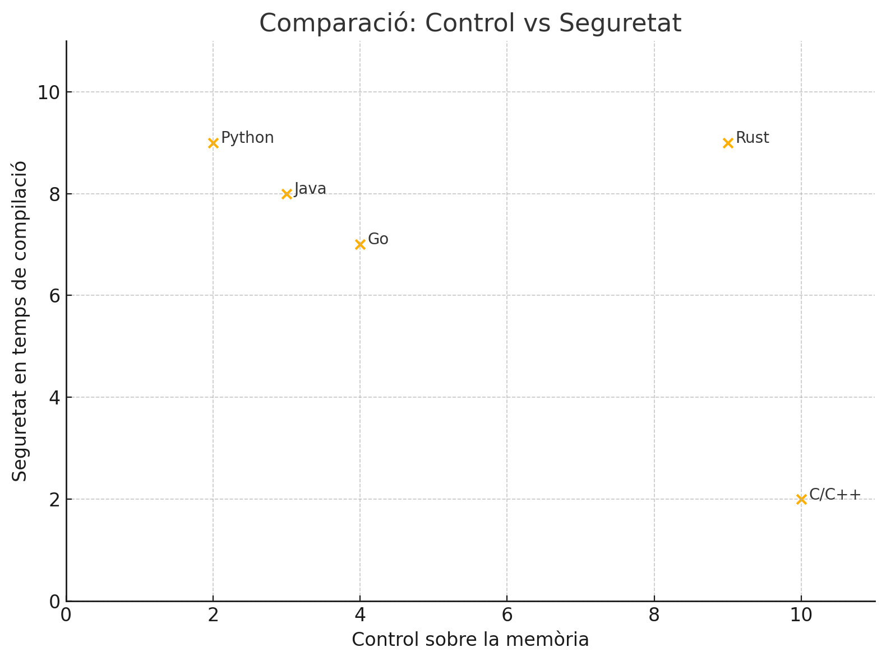
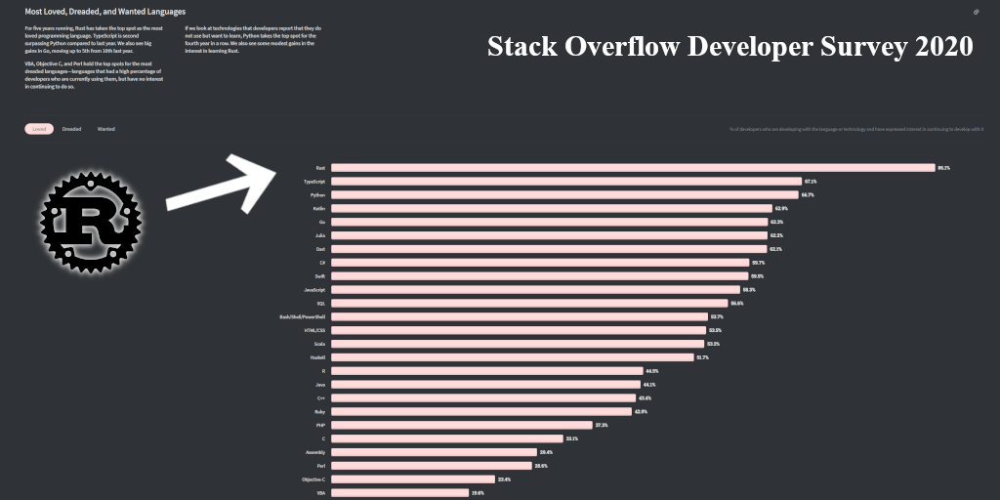
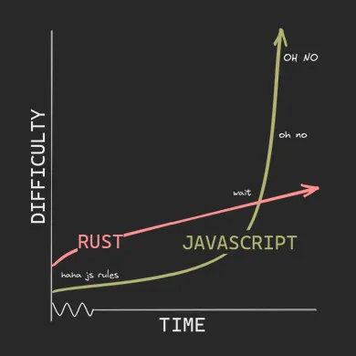
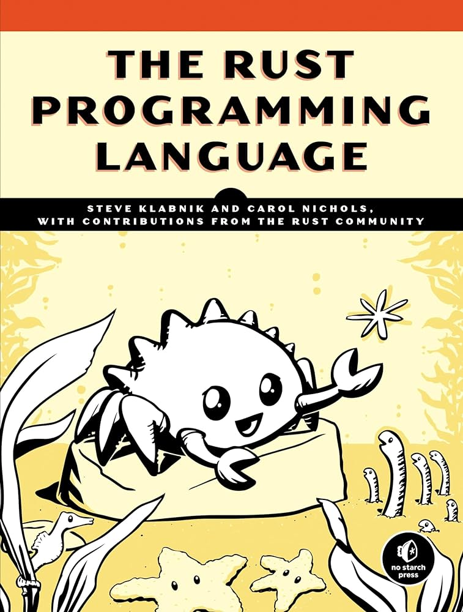
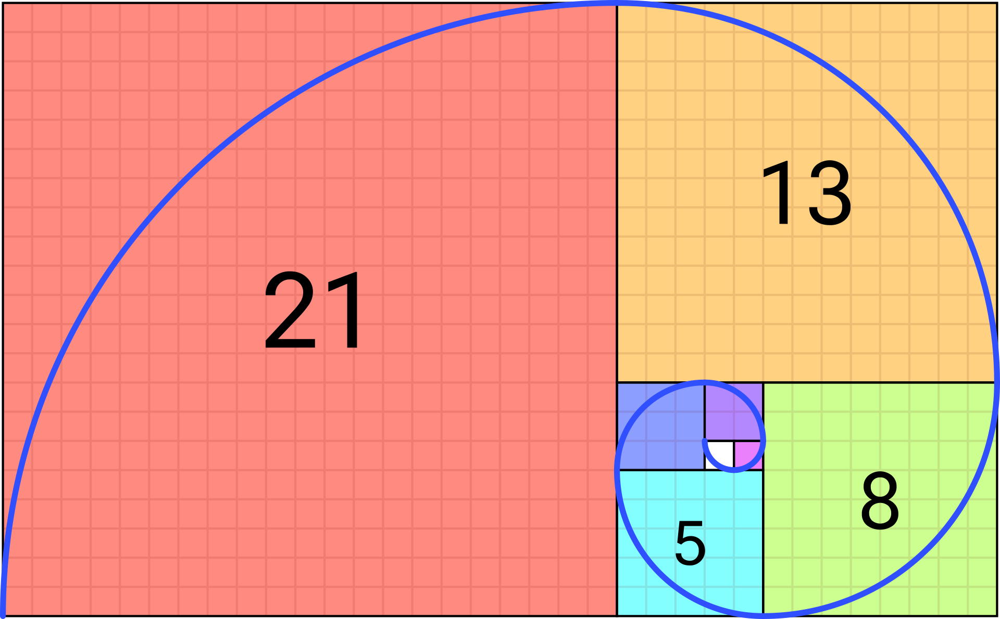
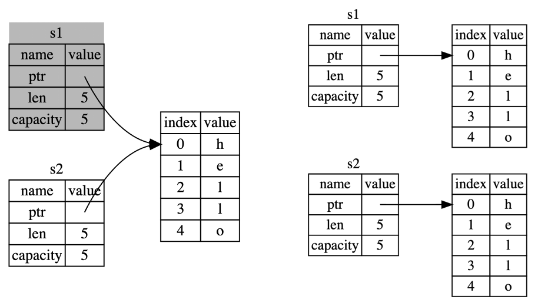
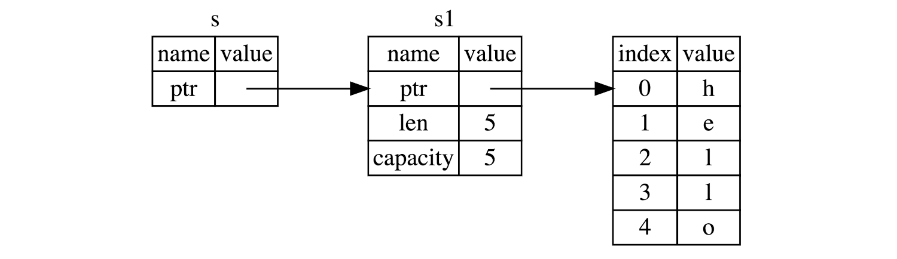
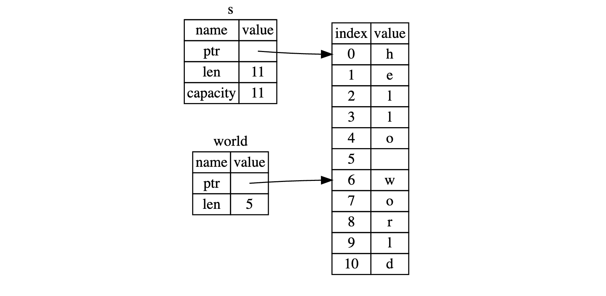
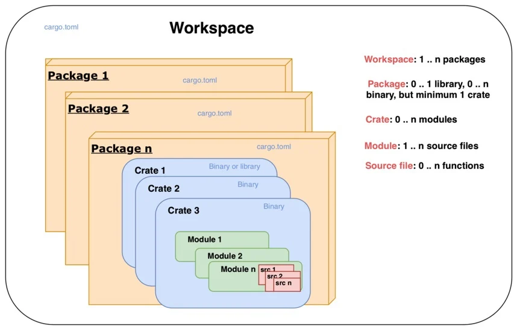

# Programació en Rust

---

## Importància de Rust

- En un món cada vegada més connectat i dependent de la tecnologia, la **seguretat del software** és crítica.
- **Rust** és un llenguatge de programació modern que es destaca per la seva **seguretat**, **rendiment** i **concisió**.
- La seva combinació única de característiques el fa ideal per a aplicacions on la **seguretat** i el **rendiment** són prioritats, com ara sistemes operatius, aplicacions de seguretat, motors de jocs i molts altres

---

## Per què aprendre Rust?

- Llenguatge més ràpid després de C
- Sense _garbage collector_ (temps d'execució més ràpid)
- Sistema de tipus molt extens
- Output útil del compilador
- Llenguatge segur (Seguretat de la memòria)
- Ràpida adopció en diversos sectors

---

## Vulnerabilitats de seguretat en C/C++

- Una [anàlisi de Microsoft](http://mng.bz/yZKy) va revelar que el **70% de les vulnerabilitats de seguretat** als seus productes estaven relacionades amb errors de seguretat de memòria en codi C i C++


---v

- Exemples típics d'aquests errors:
  - Lectura o escriptura **fora dels límits d'un array**
  - **Desreferenciació de punters invàlids**, com punters nuls
  - Ús de **memòria ja alliberada**
  - Intentar **alliberar memòria dues vegades** (double-free)
  - **No gestionar correctament els errors**

> 🔐 Aquests problemes es poden evitar amb llenguatges que garanteixen la seguretat de la memòria, com **Rust**

---

## L'alternativa entre dos mons

- **C i C++** ofereixen un control total sobre la memòria, però aquest control comporta un risc elevat d'errors de seguretat.
- **Llenguatges amb _garbage collector_** (com Java, Go o Python) gestionen automàticament la memòria, però sovint amb penalitzacions de rendiment i menys control sobre els recursos.
- **Rust** és l'única alternativa que ofereix:
  - **Control total com C/C++**
  - **Seguretat i gestió automàtica de recursos sense garbage collector**
  - **Compilador intel·ligent que garanteix la seguretat de la memòria en temps de compilació**

---v



---

## Llenguatge més estimat des del 2016 (Stack Overflow)



[Llenguatge de programació més estimat des del 2016 (Stack Overflow)](https://survey.stackoverflow.co/2023/#section-admired-and-desired-programming-scripting-and-markup-languages)

---

## Corva d'aprenentatge de Rust



---

## Recursos

- Web oficial:
  - [https://www.rust-lang.org/](https://www.rust-lang.org/)
- Llibre "_The Rust Programming Language_"
  - [https://doc.rust-lang.org/stable/book/](https://doc.rust-lang.org/stable/book/)
- Effective Rust
  - [https://effective-rust.com/title-page.html](https://effective-rust.com/title-page.html)
- Rust by example:
  - [https://doc.rust-lang.org/rust-by-example/](https://doc.rust-lang.org/rust-by-example/)
- Rustlings:
  - [https://github.com/rust-lang/rustlings](https://github.com/rust-lang/rustlings)



---

## Instal·lació

- Linux/MacOS:
  - [https://rustup.rs/](https://rustup.rs/)

```sh
curl --proto '=https' --tlsv1.2 -sSf https://sh.rustup.rs | sh
```

- Windows:
  - [https://forge.rust-lang.org/infra/other-installation-methods.html](https://forge.rust-lang.org/infra/other-installation-methods.html)
- Comprovar instal·lació: **rustc --version**
- Comprovar instal·lació: **cargo --version**
- Documentació: **rustup doc**
- Actualitzar: **rustup update**

---

## VS Code

- Extensió rust-analyzer:
  - [https://marketplace.visualstudio.com/items?itemName=rust-lang.rust-analyzer](https://marketplace.visualstudio.com/items?itemName=rust-lang.rust-analyzer)


---

## Programa "Hello World"

- Programa "Hello World":

```rust
fn main() {
  println!("Hello, world!");
}
```

- Compilar:`rustc <file.rs>`
- Donar format: `rustfmt <file.rs>`

---

## Cargo: build i package manager

- `cargo new <project_name>`: crea un nou projecte
- `cargo init`: crea un nou projecte al directori actual
- `cargo build`: compila el projecte a `./target/debug`
- `cargo build --release`: compila el projecte per publicar (_release_) a `./target/release`
- `cargo run`: compila i executa
- `cargo check`: comprova el codi per assegurar-se que es compila (no produeix un executable)
- `cargo fmt`: dona format a tots els fitxers del projecte

---

## Comentaris

```rust
// Line comment

/*
 * Block comment
 */
```

---

## Variables

```rust
let x: i32; // Not initialized
x = 0;
let y: i32 = 0; // Initialized
let mut x: i32; // Mutable Not initialized
x = 0;
let mut x: i32 = 0; // Mutable Initialized
let (name, age) = ("Bob", 33); // assign multiple variables

// compiler is able to infer the type based on the value**
let x = 0;
```

- **Shadowing**: les variables poden ser redeclarades dins del mateix àmbit

---

## Constants

```rust
// constants
// can be declared global, outside the functions
// type of the value must be annotated

const THREE_HOURS_IN_SECONDS: u32 = 60 * 60 * 3;
```

---

## Print

```rust
println!("a = {} and b = {}", a, b);
println!("a = {0} and b = {1}", a, b);
println!("a = {a} and b = {b}");
println!("a = {a} and b = {b}", a = 1, b = 4);

println!("Binary: {:b} Hex: {:x} Octal: {:o}", 10, 10, 10);
println!("{:?}", (name, age)); // for debug
```

---

## Tipus de dades: sencers (1)

| **Signed**      | **Unsigned** | **Length**      |
| --------------- | ------------ | --------------- |
| `i8`            | `u8`         | 8-bit           |
| `i16`           | `u16`        | 16-bit          |
| `i32` (default) | `u32`        | 32-bit          |
| `i64`           | `u64`        | 64-bit          |
| `i128`          | `u128`       | 128-bit         |
| `isize`         | `usize`      | arch (32 or 64) |

---

## Tipus de dades: sencers (i 2)

| **Number literals** | **Example**   |
| ------------------- | ------------- |
| Decimal             | `98_222`      |
| Hex                 | `0xff`        |
| Octal               | `0o77`        |
| Binary              | `0b1111_0000` |
| Byte (u8 only)      | `b'A'`        |

---

## Tipus de dades: nombres reals

- Floating point:

| **Signed** | **Length** | **Description**            |
| ---------- | ---------- | -------------------------- |
| `f32`      | 32-bit     | single-precision           |
| `f64`      | 64-bit     | double-precision (default) |

---

## Operacions numèriques

- `+`
- `-`
- `*`
- `/`
- `%` (mòdul)

---

## Tipus de dades: boolean i char

- Boolean:

| **Type** | **Values**      |
| -------- | --------------- |
| `bool`   | `true`, `false` |

- Char:

| **Signed** | **Length** | **Values**                                                |
| ---------- | ---------- | --------------------------------------------------------- |
| `char`     | 4 bytes    | `U+0000` to `U+D7FF` and `U+E000` to `U+10FFFF` inclusive |
|            |            | `'a'`, `'b'`...                                           |

---

## Tipus de dades: String (1)

- `String` és un tipus de cadena codificada en UTF-8 que pot créixer, i és mutable
- És el tipus de cadena més comú per modificar o tenir dades de text
- Creació d'una cadena nova
  - `String::new()` per crear una cadena buida.
    - Exemple: `let mut s = String::new();`
  - `String::from()` o el mètode `to_string()` poden crear una cadena a partir d'un literal de cadena.
    - Exemple: `let s = String::from("hola");`
    - Exemple: `let s = "hola".to_string();`

---

## Tipus de dades: String (i 2)

- Afegiu una cadena al final d'una cadena utilitzant `push_str()`
  - Exemple: `s.push_str("món"); // esdevé "hola món"`
- Afegeix un sol caràcter amb `push()`
  - Exemple: `s.push('!'); // esdevé "hola món!`
- `String` augmenta automàticament la seva capacitat segons calgui, però també podeu especificar-la amb `with_capacity`
  - Exemple: `let mut s = String::with_capacity(10);`
- Comproveu la capacitat actual mitjançant el mètode de `capacity()`.`
  - Exemple: `println!("Capacitat: {}", s.capacity());`

---

## Tuples

- (type1, type2, ... typeN)

```rust
let tup: (i32, f64, u8) == (500, 6.4, 1);
// or let tup = (500, 6.4, 1);

let (x, y, z) = tup;
let five_hundred = tup.0;
let six_point_four = tup.1;
let one = tup.2;
```

---

## Arrays

- array: [type; length]

```rust
let a = [1, 2, 3, 4, 5];
let a: [i32; 5] = [1, 2, 3, 4, 5];
let a = [3; 5]; // let a = [3, 3, 3, 3, 3];
let first = a[0];
let second = a[1];
```

---

## Funcions

```rust
fn function_name(param1: type1, param2: type2... ) -> returnType {
  // ...
}
```

Example:

```rust
fn five() -> i32 {
  return 5;
}

fn five() -> i32 {
 5
}
```

---

## if expression

```rust
 if x == 4 {
   println!("x is four");
} else if x == 3 {
   println!("x is three");
} else {
   println!("x is something else");
}

let number = if condition { 5 } else { 6 };
```

---

## loop bucle

```rust
loop {
  break;
  continue;
}

// Returning Values from Loops
let result = loop {
  counter += 1;
  if counter == 10 {
    break counter * 2;
  }
};
```

---

## while bucle

```rust
let mut i = 0;

while i < 10 {
  println!("hello");
  i = i + 1;
}
```

---

## for bucle

```rust
let a = [10, 20, 30, 40, 50];
for element in a {
  println!("the value is: {element}");
}

let mut sum = 0;

for n in 1..11 {
  sum += n;
}
```

---

## Proposta (1)

> Fer un programa que calculi els nombres primers entre 1 i 50.000


---

## Proposta (2)

> Fer un programa que calculi els primers 100 nombres de la successió de Fibonacci



---

## Ownership i borrowing (1)

- **Ownership**: cada valor té només un únic propietari
  - Quan una variable queda fora de l'abast (out of scope), es crida automàticament la funció "**drop**" per alliberar els recursos associats
- **Moving**: quan assignes una variable a una altra, la propietat (ownership) és transferida
- **Cloning**: quan es necessita una còpia de les dades, es pot utilitzar el mètode "**clone**"

---

## Ownership i borrowing (i 2)

Exemple de `move`:

```rust
let name1 = String::from("Bob");
let name2 = name1; // name1 is moved to name2
println!("Hello, {}", name1); // Error: value used here after move
println!("Hello, {}", name2); // OK
```

Exemple de `clone`:

```rust
let name1 = String::from("Bob");
let name2 = name1.clone(); // Creates a copy of the value
println!("Hello, {}", name1); // OK
println!("Hello, {}", name2); // OK
```

---

## Drop / Copy traits



---

## Borrowing

```rust
fn modify_name(name: &mut String) {
   name.push_str(" Doe");
}

fn main() {
   let mut full_name = String::from("John");
   modify_name(&mut full_name); // Passing a mutable reference to 'full _name'.
   println!("Hello, f", full_name); // 'full _name' is still valid and modified.
}
```

---

## Ownership

<!-- markdownlint-disable MD033 -->
<iframe width="560" height="315" src="https://www.youtube.com/embed/DJdUjjOmyx8?si=RFc_3PIgnLssEiul" title="YouTube video player" frameborder="0" allow="accelerometer; autoplay; clipboard-write; encrypted-media; gyroscope; picture-in-picture; web-share" referrerpolicy="strict-origin-when-cross-origin" allowfullscreen></iframe>
<!-- markdownlint-enable MD033 -->

---

## Referències

```rust
fn main() {
   let s1 = String::from("hello");

   let len = calculate_length(&s1);

   println!("The length of '{}' is {}.", s1, len);
}

fn calculate_length(s: &String) -> usize {
   s.len()
}
```



---

## Slices. Tipus str

Slice de `String` (`str`):

```rust
let s = String::from("hello world");

let hello = &s[0..5];
let world = &s[6..11];
```

Slice de array:

```rust
let a = [1, 2, 3, 4, 5];

let slice = &a[1..3];
```

---v



---

## Structs

- Un _**struct**_ és un tipus de dades personalitzat que us permet empaquetar i anomenar diversos valors relacionats que formen un grup significatiu
- És com els atributs de dades d'un objecte

```rust
struct User {
   active: bool,
   username: String,
   email: String,
   sign_in_count: u64,
}

let user1 = User {
   active: true,
   username: String::from("someusername123"),
   email: String::from("someone@example.com"),
   sign_in_count: 1,
};

let user2 = User {
   email: String::from("another@example.com"),
   ..user1 // remaining fields of user1
};
```

---

## Implementació d'structs

```rust
#[derive(Debug)]
struct Rectangle {
   width: u32,
   height: u32,
}

impl Rectangle {
   fn area(&self) -> u32 {
       self.width * self.height
   }
}
```

```rust
fn main() {
   let rect1 = Rectangle {
       width: 30,
       height: 50,
   };

   println!(
       "The area of the rectangle is {} square pixels.",
       rect1.area()
   );
}
```

---

## Enums (1)

- Els _**enum**_ us permeten definir un tipus enumerant les seves possibles variants

```rust
enum IpAddrKind {
   V4,
   V6,
}

let four = IpAddrKind::V4;
let six = IpAddrKind::V6;
```

---

## Enums (i 2)

- Els _**enum**_ també poden incloure dades

```rust
enum IpAddr {
   V4(u8, u8, u8, u8),
   V6(String),
}

let home = IpAddr::V4(127, 0, 0, 1);
let loopback = IpAddr::V6(String::from("::1"));
```

---

## Option enum

```rust
enum Option<T> {
 None,
 Some(T),
}

let some_number = Some(5);
let some_char = Some('e');

let absent_number: Option<i32> = None;
```

---

## Instrucció match

```rust
enum Coin {
 Penny,
 Nickel,
 Dime,
 Quarter,
}

fn value_in_cents(coin: Coin) -> u8 {
 match coin {
     Coin::Penny => 1,
     Coin::Nickel => 5,
     Coin::Dime => 10,
     Coin::Quarter => 25,
 }
}
```

---

## Matching amb `Option<T>`

```rust
fn plus_one(x: Option<i32>) -> Option<i32> {
 match x {
     None => None,
     Some(i) => Some(i + 1),
 }
}

let five = Some(5);
let six = plus_one(five);
let none = plus_one(None);
```

---

## Packages

- Un conjunt d'un o més _crates_
- Conté un fitxer `cargo.toml` (com construir _crates_)
  - Conté 0...n _crates_ binaris (`src/main.rs` i directori `src/bin`)
  - Conté 0...1 _crates_ de biblioteca (`src/lib.rs`)

---

## Crates

- És la menor quantitat de codi que el compilador Rust considera
- N'hi ha de dos tipus:
  - _**Crates**_ **binaris (_binary crate_)**
    - _Crate_ root: `src/main.rs`
  - _**Crates**_ **de biblioteca (_library crate_)**
    - _Crate_ root: `src/lib.rs`
- Els _crates_ poden contenir **mòduls**

---

## Mòduls (1)

- Els mòduls de Rust ajuden a dividir un programa en unitats lògiques per a una millor la llegibilitat i organització
- **Declaració de mòduls**: al fitxer root del _crate_: `mod garden;`
  - El compilador cercarà el codi del mòdul en aquests llocs:
    - `mod garden{...}`
    - Fitxer `src/garden.rs`
    - Fitxer `src/garden/mod.rs`
- **Declaració de submòduls**: en qualsevol fitxer que no sigui l'arrel del _crate_: `mod vegetables;`
  - El compilador cercarà el codi del mòdul en aquests llocs:
    - `mod vegetables{...}`
    - Fitxer `src/garden/vegetables.rs`
    - Fitxer `src/garden/vegetables/mod.rs`
- Camí (path) al codi dels mòduls: `crate::garden::vegetables::Sparagus`

---

## Mòduls (i 2)

- **Privat** (`mod`) vs **públic** (`pub mod`). I elements dins del mòdul: `pub ...`
  - Els elements d'un mòdul **pare** no poden utilitzar els elements privats dels mòduls **fill**
  - Els elements dels mòduls **fill** poden utilitzar els elements dels seus mòduls **avantpassats**
  - Podem accedir a **germans** (dins mateix mòdul)
- **Dreceres** (_shortcuts_):
  - amb `use crate::garden::vegetables::Sparagus;`
  - a partir de llavors només cal escriure `Sparagus`
- Path absolut: `crate::garden...` (`crate` és l'arrel del _crate_)
- Path relatiu:
  - `garden::...`
  - `super::...`

---

## Packages, crates i mòduls



---

## Utilitzant paquets externs

- Llista de paquets a [https://crates.io/](https://crates.io/)
- Afegir a `cargo.toml`:

```toml
[dependencies]
rand = "0.8.5"
```

- Tambe ho podeu fer executant `cargo add rand`
- Executar `cargo build`
- A partir d'aquell moment podem utilitzar el paquet al nostre codi:

```rust
use rand::Rng;

fn main() {
  let secret_number = rand::thread_rng().gen_range(1..=100);
}
```

---

## Biblioteca estàndard std

- La biblioteca estàndard `std` també és un crate extern al nostre paquet
  - No cal que canviem `cargo.toml` per incloure std
- Però sí que hem de referir-nos-hi amb use per introduir elements d'allà a l'abast del nostre paquet
- Per exemple, amb HashMap utilitzaríem aquesta línia:
  - `use std::collections::HashMap;`

---

## Col·leccions

- La biblioteca estàndard de Rust `std` inclou una sèrie d'estructures de dades molt útils anomenades **col·leccions**
- Les col·leccions poden contenir **diversos valors**
- Les dades a les quals apunten s'emmagatzemen a l'emmagatzematge **dinàmic** (al _**heap**_)
  - Poden créixer o reduir-se a mesura que s'executa el programa
- Tres col·leccions que s'utilitzen molt sovint als programes Rust:
  - **Vector**: permet emmagatzemar un nombre variable de valors
    - `let mut v: Vec<i32> = Vec::new();`
  - **String**: és una col·lecció de caràcters
    - `let mut s = String::new();`
  - **Hash map**: permet associar un valor amb una clau determinada

---

## Hash map

- Exemple de hash map:

```rust
use std::collections::HashMap;

fn main() {
 let mut scores = HashMap::new();

 scores.insert(String::from("Blue"), 10);
 scores.insert(String::from("Yellow"), 50);
 println!("{:?}", scores);
}
```

---

## Tractament d'errors

- Rust agrupa els errors en dues categories:
  - **Errors recuperables**.
    - Per exemple, un error de fitxer no trobat
    - El més probable és que només volem informar del problema a l'usuari i tornar a intentar l'operació
    - Gestionat amb el tipus enum Result<T, E>
  - **Errors irrecuperables**.
    - Són símptomes d'errors, com ara intentar accedir a una ubicació més enllà del final d'una matriu
    - Per tant, volem aturar el programa immediatament
    - Gestionat amb el macro panic!

---

## Result enum

- Rust té un tipus integrat per a la gestió d'errors anomenat `Result``
- És un `enum` que té dues variants:
  - `Ok`, que indica que l'operació ha estat correcte
  - `Err`, que indica que l'operació ha fallat

```rust
enum Result<T, E> {
 Ok(T),
 Err(E),
}
```

---v

```rust
use std::fs::File;
use std::io::{self, Read};

fn read_file_contents(path: &str) -> Result<String, io::Error> {
   let mut file = match File::open(path) {
       Ok(file) => file,
       Err(e) => return Err(e),
   };

   let mut contents = String::new();
   match file.read_to_string(&mut contents) {
       Ok(_) => Ok(contents),
       Err(e) => Err(e),
   }
}

fn main() {
   let path = "example.txt";
   match read_file_contents(path) {
       Ok(contents) => println!("File contents: {}", contents),
       Err(e) => println!("Failed to read from file: {}", e),
   }
}
```

---

## Errors irrecuperables amb `panic!`

- Els errors irrecuperables són situacions on el programa no es pot recuperar i s'ha d'acabar abruptament
- Aquests errors es gestionen mitjançant el macro `panic!`
- Exemple:

```rust
use std::fs::File;

fn main() {
   let greeting_file_result = File::open("hello.txt");

   let greeting_file = match greeting_file_result {
       Ok(file) => file,
       Err(error) => panic!("Problem opening the file: {:?}", error),
   };
}
```

---

## Overflow de nombres sencers

- Debug mode: panic at runtime
- Release mode (`--release`): wrapping (u8 255+1=0, 255+2=1...). Solution:
  - Wrap in all modes with the `wrapping_*` methods, such as `wrapping_add`.
  - Return the `None` value if there is overflow with the `checked_*` methods.
  - Return the value and a boolean indicating whether there was overflow with the `overflowing_*` methods.
  - Saturate at the value's minimum or maximum values with the `saturating_*` methods

---

## Genèrics i traits

<!-- markdownlint-disable MD033 -->
<iframe width="560" height="315" src="https://www.youtube.com/embed/XKbOVFt3UNY?si=XIGZZ_Czelr2s6Tk" title="YouTube video player" frameborder="0" allow="accelerometer; autoplay; clipboard-write; encrypted-media; gyroscope; picture-in-picture; web-share" referrerpolicy="strict-origin-when-cross-origin" allowfullscreen></iframe>
<!-- markdownlint-enable MD033 -->

---

## Lifetimes

- Gestió _**lifetime**_: garanteix que les referències no sobreviuen a les dades a les quals apunten
  - Evita les referències penjants (_dangling pointers_)
  - Garanteix la seguretat de la memòria sense necessitat d'un col·lector d'escombraries (_garbage collector_)

---v

<!-- markdownlint-disable MD033 -->
<iframe width="560" height="315" src="https://www.youtube.com/embed/juIINGuZyBc?si=FDyyzClHprn_gJRM" title="YouTube video player" frameborder="0" allow="accelerometer; autoplay; clipboard-write; encrypted-media; gyroscope; picture-in-picture; web-share" referrerpolicy="strict-origin-when-cross-origin" allowfullscreen></iframe>
<!-- markdownlint-enable MD033 -->

---

## Rust security best practices

1. Follow naming conventions
2. Use data types effectively
3. Pattern matching for readable code
4. Avoid unnecessary mutability
5. Use borrowing and ownership system

---

## Rust, Modern Solutions to Modern Problems

<!-- markdownlint-disable MD033 -->
<iframe width="560" height="315" src="https://www.youtube.com/embed/pNWKI6xtveQ?si=IGFeTPHkCReC6SOa" title="YouTube video player" frameborder="0" allow="accelerometer; autoplay; clipboard-write; encrypted-media; gyroscope; picture-in-picture; web-share" referrerpolicy="strict-origin-when-cross-origin" allowfullscreen></iframe>
<!-- markdownlint-enable MD033 -->

---

## A New Era for C and C++? Goodbye, Rust?

<!-- markdownlint-disable MD033 -->
<iframe width="560" height="315" src="https://www.youtube.com/embed/V_QAJAhbH9A?si=RHWnlpvDLWv5zmx6" title="YouTube video player" frameborder="0" allow="accelerometer; autoplay; clipboard-write; encrypted-media; gyroscope; picture-in-picture; web-share" referrerpolicy="strict-origin-when-cross-origin" allowfullscreen></iframe>
<!-- markdownlint-enable MD033 -->

---

## Rust: A Language for the Next 40 Years

<!-- markdownlint-disable MD033 -->
<iframe width="560" height="315" src="https://www.youtube.com/embed/A3AdN7U24iU?si=mlCKdCNtss36fnXx" title="YouTube video player" frameborder="0" allow="accelerometer; autoplay; clipboard-write; encrypted-media; gyroscope; picture-in-picture; web-share" referrerpolicy="strict-origin-when-cross-origin" allowfullscreen></iframe>
<!-- markdownlint-enable MD033 -->

---

## Per què Rust és segur?

- **Propietat de Dades**: Rust utilitza un sistema de propietat (_ownership_) amb regles que el compilador verifica en temps de compilació. Cada valor en Rust té un propietari únic, i només hi pot haver un propietari en qualsevol moment. Això ajuda a prevenir errors com els dobles alliberaments de memòria.
- **Gestió de la Memòria Sense Recollidor d'Escombraries**: Rust gestiona la memòria sense necessitat d'un recollidor d'escombraries, mitjançant el sistema de propietat i el concepte de 'lifetime' (temps de vida) de les dades. Això permet un control més gran sobre l'ús de la memòria i evita problemes com les fuites de memòria.
- **Verificacions en Temps de Compilació**: El compilador de Rust realitza verificacions exhaustives durant la compilació, incloent la comprovació dels 'lifetimes' de les referències, per assegurar que no hi hagi accessos a memòria invàlids. Això redueix la possibilitat d'errors en temps d'execució com els accessos a memòria fora de límits.

---v

- **El Sistema de Tipus i Seguretat en Concurrència**: Rust té un sistema de tipus estricte i ofereix garanties de seguretat en entorns concurrents. Per exemple, el compilador assegura que les dades compartides entre fils són manejades de manera segura, prevenint condicions de competència (race conditions).
- **Tipus Enumerats per a Gestió d'Errors**: Rust utilitza 'enums', especialment el tipus Result, per a gestionar errors. Això obliga al programador a tractar els casos d'error de manera explícita, reduint la possibilitat que els errors siguin ignorats o mal gestionats.
- **Immutabilitat per Defecte**: Les variables en Rust són immutables per defecte, la qual cosa significa que han de ser explícitament marcades com a mutables per a poder ser modificades. Això fa que sigui més fàcil raonar sobre el codi i prevenir errors causats per modificacions inesperades de dades.
- **Match Expressions i Pattern Matching**: Aquestes característiques permeten al programador comprovar i manejar exhaustivament tots els possibles estats d'un valor, assegurant-se que tots els casos són tractats.

---

## 🔗 Enllaços

- [Rust Crash Course (Youtube)](https://www.youtube.com/watch?v=zF34dRivLOw)
