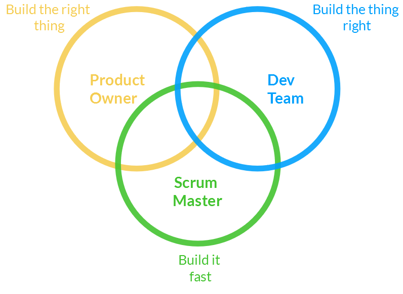
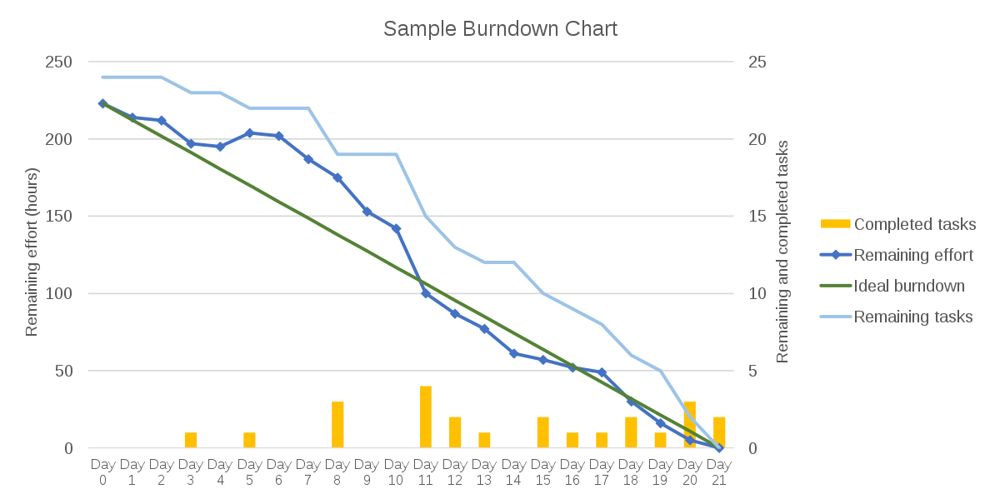
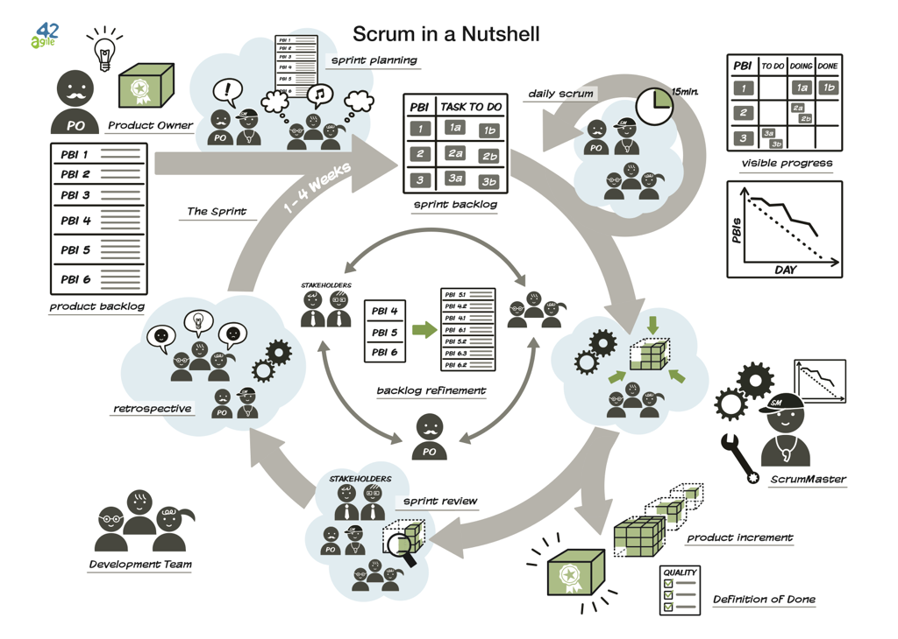

# Metodologia Scrum

---

## Software development

- **Software development** is computer **programming**, **documentation**, **testing** and **error correction** involved in creating and maintaining applications
  - It results in a software product
- It refers to the **structured** and **planned** process of writing and maintaining source code, but in a broader sense of the term
- Most important **development methodologies**:
  - **"Waterfall" methodology**
  - **"Agile" methodology**. For example, **Scrum**

---

## Phases of the software development process

- Most methodologies share some combination of the following phases of software development:
  - **Requirements analysis**: documentation of customer needs
  - **Design**: choice of technology, design of the project architecture and its components
  - **Implementation/coding**: programming the project code
  - **Testing**: tests, trying to detect imperfections in order to correct them
  - **Deployment**: installation, or all of the activities that make a software system available for use
  - **Maintenance**: help, technical service, software improvement

---

## Waterfall model

---

## Example of agile methodology: SCRUM

- **Agile** software development **methodologies** are based on the **adaptability** of any **change** to increase the chances of success of a project
- **Scrum** is an agile framework for developing, delivering, and sustaining complex product
  - The goal is to develop and create a product in a given period where a team of different people work together to reach a common goal.
  - It is based on the premise that, during product development, customers will change their opinions about what they want and what they need.
  - Accepts that the problem is not fully understood and defined
  - It focuses on maximizing the team's ability to deliver quickly on time and respond to last-minute needs

---

## Introduction to Scrum

<!-- markdownlint-disable MD033 -->
<iframe width="560" height="315" src="https://www.youtube.com/embed/9TycLR0TqFA?si=23BW6jMyI44x22eq" title="YouTube video player" frameborder="0" allow="accelerometer; autoplay; clipboard-write; encrypted-media; gyroscope; picture-in-picture; web-share" referrerpolicy="strict-origin-when-cross-origin" allowfullscreen></iframe>
<!-- markdownlint-enable MD033 -->

---

## SCRUM, an agile methodology

Phases, documents and roles of the Scrum methodology

---

## Scrum: sprint

- An **Sprint** (or **iteration**) is the **basic unit of development** in Scrum
  - The length is between one week and one month
  - **Starts** with a **sprint planning** event that establishes a sprint goal
  - **Ends** with a **sprint review** and **sprint retrospective**, that reviews progress to show to stakeholders and identify lessons and improvements

---

## Scrum: roles

- **Product Owner**
  - Represents stakeholders and the voice of the customer
  - Is responsible for maximizing the value of the product resulting from work of the Development Team
- **Scrum Team** (development team)
  - Responsible for delivering the different parts of the product within the established periods (Sprint)
- **Scrum Master**
  - Eliminates obstacles that prevent the team from reaching the goal of each sprint
  - He is not the leader of the team (since it’s self-organized), but acts as a protection between the team and any influence that distracts him

---

## Scrum roles

---

## Scrum: meetings

- **Daily Scrum**
  - **Every day of the Sprint** a meeting is held on the status of the project, typically at the beginning of the day.
  - 15-minute time-boxed event
  - Three questions are answered: "What did I do yesterday?", "What will I do today?", "Do I see any impediment that prevents me from meeting the Sprint Goal?"
- **Sprint Planning Meeting**
  - At the **beginning of the Sprint**, this meeting plans the work to be performed
- **Sprint Review Meeting**
  - At the **end of the Sprint**, to review work that has been completed and work that has not
- **Sprint Retrospective**
  - At the **end of the Sprint**, to identify the positive aspects and those that need to be improved to optimize team performance

---

## Agile Estimating and Planning

<!-- markdownlint-disable MD033 -->
<iframe width="560" height="315" src="https://www.youtube.com/embed/gE7srp2BzoM?si=QWUp0FxcKBICWav8" title="YouTube video player" frameborder="0" allow="accelerometer; autoplay; clipboard-write; encrypted-media; gyroscope; picture-in-picture; web-share" referrerpolicy="strict-origin-when-cross-origin" allowfullscreen></iframe>
<!-- markdownlint-enable MD033 -->

---

## Scrum: documents

- **Product backlog**
  - It contains generic descriptions of the requirements, desirable functionalities, existing errors to be solved, etc.
  - Prioritized according to the criteria of the Product Owner
- **Sprint backlog**
  - Defines the tasks required to perform the requirements assigned to the current Sprint
  - Tasks should be detailed enough for their duration to be short (e.g. less than 2 days).
- **Sprint burn-down chart**
  - Measures the number of Product Backlog requirements assigned to the current Sprint that are pending to be finished

---v

---

## Advantages of Scrum

- Flexibility to change
- Reduced time to be able to see the product, even if it is not finished
- Better software quality
- Better productivity
- Best time estimates
- Risk reductions

---

---

## 🔗 Enllaços

- [Scrum: The Art of Doing Twice the Work in Half the Time (Jeff Sutherland)](https://amzn.eu/d/fBbLyZd)
- [Mastering Professional Scrum (Ockerman Stephanie, Reindl Simon)](https://amzn.eu/d/781dVum)
- [Essential Scrum: A Practical Guide to the Most Popular Agile Process (Kenneth S. Rubin)](https://amzn.eu/d/aFBOZ14)
