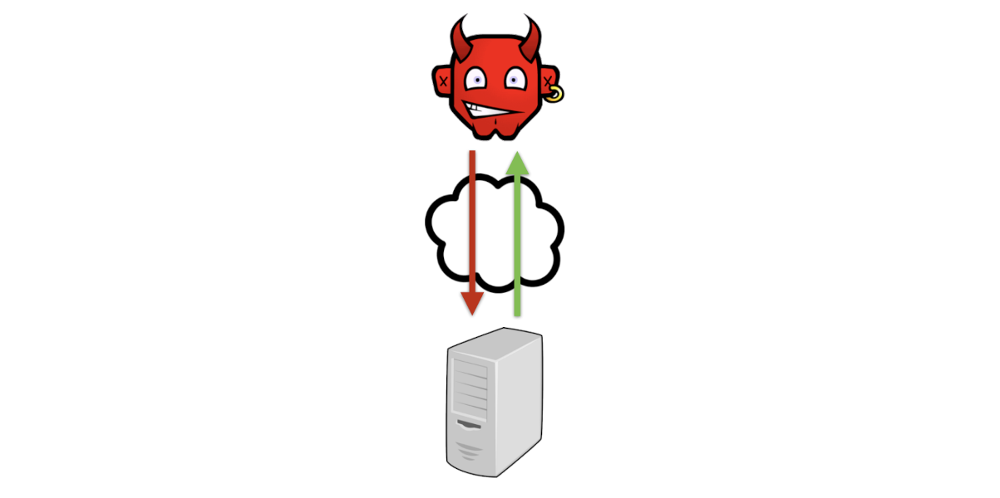
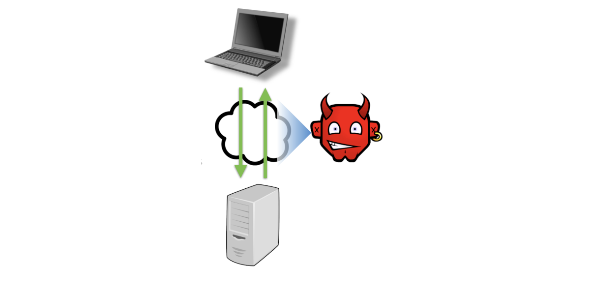
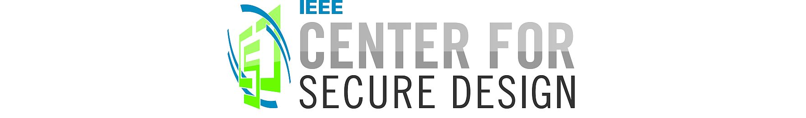

# Desenvolupament segur de software

---

## Disseny i construcció de programari segur: Introducció

> Designing and Building Secure Software

---

## Elaboració de programari segur

- **Enfocament defectuós**: dissenyeu i creeu programari, i al principi ignoreu la seguretat
  - Afegiu seguretat un cop es compleixin els requisits funcionals
- **Millor enfocament**: **incorporar seguretat** des del principi
  - Incorporar un pensament de seguretat en totes les fases del procés de desenvolupament

---

## Procés de desenvolupament

- Molts processos de desenvolupament; **quatre fases comunes**:
  - **Requisits**
  - **Disseny**
  - **Implementació**
  - **Proves/assegurament**
  - Les fases de desenvolupament s'apliquen a tot el projecte, als seus components individuals i als seus perfeccionaments/iteracions
- On encaixa l'enginyeria de seguretat?
  - **Totes les fases!**

---

## Waterfall model

---

## SCRUM, an agile methodology

Phases, documents and roles of the Scrum methodology

---

## Activitats sobre enginyeria de seguretat a cada fase del desenvolupament del software

---

## Software vs. Hardware

- **El disseny del sistema conté programari i maquinari**
  - Principalment, ens centrarem en el software
- **El programari és maleable** i es pot canviar fàcilment
  - Avantatges per a la funcionalitat bàsica
  - **Perjudicial per a la seguretat** (i el rendiment)
- **El maquinari és ràpid**, però difícil de canviar
  - Desavantatge per a l'evolució
  - **Avantatge per a la seguretat**
    - No es pot explotar fàcilment, ni es pot canviar per un atac

---

## Exemple de funcionament: banca en línia

- Volem escriure un programari que permeti als titulars de comptes d'un banc tenir accés en línia als seus comptes
- Requisits:
  - Permetre dipòsits als comptes
  - Garantir que només els titulars autoritzats gestionin els fons
  - Assegurar l'accés del titular per retirar o transferir fons
  - Evitar interferències de tercers
  - Altres requisits de seguretat a determinar

---

## Modelització d'amenaces o anàlisi de riscos arquitectònics

> Threat Modeling, or Architectural Risk Analysis

---

## Modelització d'amenaces

- La **modelització d'amenaces** fa **explícits els poders assumits per l'adversari**
  - Conseqüència: la modelització d'amenaces ha de coincidir amb la realitat, en cas contrari l'anàlisi de risc del sistema serà errònia
- El  modelització d'amenaces és **de vital importància**
  - Si no sou explícit sobre què pot fer l'atacant, com podeu avaluar si el vostre disseny repel·lirà aquest atacant?
- Això forma part de l'**anàlisi del risc arquitectònic**
  - És el procés d'avaluació del risc d'una fallada de seguretat en funció de la probabilitat i el cost de diversos atacs. I fent el possible per minimitzar aquest risc.

---

## Exemple: Usuari de xarxa

- Un usuari (anònim) que es pot connectar a un servei a través de la xarxa
- Podrà:
  - **mesurar** la mida i el moment de les peticions i respostes cap al servei i del servei
  - realitzar **sessions paral·leles**
  - proporcionar **entrades amb format incorrecte, missatges amb format incorrecte**
  - **deixar anar o enviar missatges addicionals**

---v

- **Exemples d'atacs**: injecció SQL, cross site-scripting (XSS), cross site request fogerty (CSRF), buffer overrun/ROP payloads,...

---

## Exemple: Usuari espia (_snooping user_)

- Usuari d'Internet **a la mateixa xarxa** que altres usuaris d'algun servei
  - Per exemple, algú connectat a una xarxa Wi-Fi no xifrada en una cafeteria
- Per tant, pot:
  - **Llegir/mesurar** els **missatges** dels altres
  - **Interceptar**, **duplicar** i **modificar missatges**

---v

- **Exemples d'atacs**: **segrest de sessions** (i altres robatoris de dades), llegir comunicació no encriptada, aprendre coses de les comunicacions xifrades inferint propietats en funció de la mida o la freqüència dels missatges, **denegació de servei**

---

## Exemple: Usuari co-ubicat (_co-located user_)

- Usuari d'Internet **a la mateixa màquina** que altres usuaris d'algun servei
  - Per exemple, **programari maliciós** (_**malware**_) instal·lat a l'ordinador portàtil d'un usuari
- Per tant, pot:
  - **Llegir/escriure** fitxers de l'usuari (p. ex., _cookies_) i memòria
  - **Llegir pressions de tecles** i altres esdeveniments
  - Llegir/escriure la **pantalla** de l'usuari (p. ex., per **falsificar**)

---v

- **Exemples d'atacs**: **robatori de contrasenya** (i altres credencials/secrets)

---

## Disseny orientat a amenaces**

- Diferents models d'amenaça provocaran respostes diferents
- Els **atacants només de xarxa** impliquen que el trànsit de **missatges** és **segur**
  - No cal xifrar les comunicacions
  - Això és el que suposava el programari d'inici de sessió remot de telnet
- **Atacants _snooping_** impliquen que el trànsit de **missatges** és **visible**
  - Per tant, utilitzeu wifi encriptat (WPA2, capa d'enllaç), capa de xarxa xifrada (IPsec) o capa d'aplicació xifrada (SSL).
    - Quin és el més adequat per al vostre sistema?
- L'**atacant co-ubicat** pot **accedir a fitxers locals, i a la memòria**
  - No es poden emmagatzemar secrets sense xifrar, com ara contrasenyes
  - Proporcionar als usuaris un dispositiu independent que participi en el procés d'autenticació, però que no estigui connectat a l'ordinador (p. ex., login als bancs)

---

## Mal model = Mala seguretat

- Qualsevol **suposició** que feu al vostre model són **forats potencials que l'adversari pot explotar**
- P. ex.: Suposar que no hi ha usuaris espies (_snooping users_) ja no és vàlid
  - Prevalència de xarxes wi-fi en la majoria de desplegaments
- Altres suposicions errònies
  - **Suposició**: el trànsit xifrat no porta informació
    - No és cert! Mitjançant l'anàlisi de la mida i la distribució dels missatges, podeu inferir l'estat de l'aplicació
  - **Suposició**: el temps (_timing_) i característiques d'una comunicació porten poca informació
    - No és cert! Les mesures de temps de les implementacions prèvies de RSA (criptografia asimètrica) es podrien utilitzar eventualment per revelar una clau secreta SSL remota

---

## Trobar un bon model

- **Comparar amb sistemes similars**
  - A quins atacs s'enfronta el vostre disseny?
- **Comprendre atacs passats (estat de l'art) i patrons d'atac**
  - Com s'apliquen al vostre sistema?
- **Desafia els supòsits del teu disseny**
  - Quines capacitats ha de tenir un atacant per derrotar els mecanismes de defensa que esteu pensant utilitzar?
  - Quina és la probabilitat que un atacant tingui aquestes capacitats? Com ho sabràs? I quin seria el cost d'un fracàs?
  - Què et costaria potencialment un incompliment?
  - Què costaria un desenvolupament més segur?

---

## Requisits de seguretat

> Security Requirements

---

## Requisits de seguretat

- Els **requisits de software** generalment són sobre **què hauria de fer el software**
- També volem tenir **requisits de seguretat**
  - **Objectius** (o **polítiques**) **relacionats amb la seguretat**
    - Exemple: el saldo del compte bancari d'un usuari no hauria de ser conegut ni modificat per un altre usuari, tret que estigui autoritzat
  - **Mecanismes** necessaris **per fer-los complir**
    - Exemple:
    - Els usuaris s'identifiquen mitjançant contrasenyes,
    - Les contrasenyes han de ser "fortes" i
    - La base de dades de contrasenyes només és accessible al programa d'inici de sessió

---

## Tipus típics de requisits

- Polítiques
  - Confidencialitat (i privadesa i anonimat)
  - Integritat
  - Disponibilitat
- Mecanismes de suport a les polítiques
  - Autenticació
  - Autorització
  - Auditabilitat

---

## Privadesa i confidencialitat

- Definició: **informació sensible no filtrada** a persones no autoritzades
  - Es diu **privadesa** per a les persones, **confidencialitat** per a les dades
- Exemple de política: l'estat del compte bancari (inclòs el saldo) només pot ser conegut pel propietari del compte
- Filtració directes o per canals laterals
  - Exemple: manipular el sistema per mostrar directament el saldo bancari d'en Bob a l'Alice
  - Exemple: determinar que Bob té un compte al Banc A perquè hi ha un temps de retard més curt quan hi ha una fallada d'inici de sessió
- Una **filtració directa** es produeix mitjançant el mecanisme d'interacció previst del sistema de programari, mentre que una **filtració de canal lateral** prové de mesuraments d'altres funcions del sistema, com ara el temps, l'ús d'energia o l'ús de l'espai

---

## Anonimat

- Un **tipus específic de privadesa**
- Exemple: els no titulars de comptes bancaris haurien de poder navegar pel lloc d'informació bancària sense ser rastrejats
  - Aquí l'adversari és el propi banc
  - També ho podrien ser altres anunciants (_third party advertisers_)
  - Els exemples anteriors consideraven com a possibles adversaris altres titulars de comptes

---

## Integritat

- Definició: **informació sensible no danyada** per (computacions que actuen en nom de) parts no autoritzades
- Exemple: només el propietari del compte pot autoritzar retirades del seu compte
- Les violacions de la integritat també poden ser **directes** o **indirectes**
  - Exemple: poder retirar-se específicament del compte versus confondre el sistema perquè ho faci (amb un _cross-site request fogery_)

---

## Disponibilitat

- Definició: un sistema **té capacitat de resposta davant les peticions**
- Exemple: un usuari sempre pot accedir al seu compte per a consultes o retirades de saldo
- Els **atacs de denegació de servei** (_**Denial of Service, DoS**_) intenten **comprometre la disponibilitat**
  - ocupant un sistema amb feina inútil
  - o tallant l'accés a la xarxa

---

## Mecanismes de suport

- Mecanismes proporcionats per un sistema per fer complir els seus requisits:
  - **Au**tenticació
  - **Au**torització
  - **Au**ditoria
- Els mecanismes de suport són **alhora requisits i una mena de disseny**
  - El tipus de polítiques que s'autoritzen determina el mecanisme d'autorització
  - El tipus d'usuaris que té un sistema determina com s'han d'autenticar

---

## Autenticació

- Quin és el **subjecte** de les **polítiques de seguretat**?
  - Necessitat de definir una **noció d'identitat** i una **manera de connectar una acció amb una identitat**
    - també conegut com a **director** (persona, servei o programa)
-  **Com pot el sistema dir que un usuari és qui diu que és?**
  - Què (només) **sap** (per exemple, contrasenya)
  - Què **és** (p. ex., biomètric)
  - Què **té** (p. ex., telèfon intel·ligent, targeta)
  - Els mecanismes d'autenticació que utilitzen més d'un d'aquests factors s'anomenen **autenticació multifactor**
    - Per exemple, el banc pot utilitzar contrasenyes i el text d'un codi especial al telèfon intel·ligent d'un usuari

---

## Autorització

- Defineix **quan un director pot realitzar una acció**
- Exemple: Bob està autoritzat a accedir al seu propi compte, però no al compte de l'Alice
- Hi ha una gran varietat de **polítiques** que defineixen quines accions es poden autoritzar
  - Per exemple, polítiques de control d'accés, que podrien estar basades en **rols**, basades en **usuaris**, etc.

---

## Auditoria

- Conservar la informació suficient per poder **determinar les circumstàncies d'una infracció o una mala conducta** (o establir que no s'ha produït cap)
  - Aquesta informació, que sovint s'emmagatzema en **fitxers de registre (_logs_)**, s'ha de protegir de manipulacions i d'accés que pugui infringir altres polítiques.
- Exemple: cada acció relacionada amb el compte es registra localment i es reflecteix en un lloc independent

---

## Definició dels requisits de seguretat

- Podeu utilitzar molts **processos per decidir els requisits de seguretat**
- Exemple: **preocupacions generals de política**
  - Per **normativa**/lleis/estàndards (HIPAA per dades mèdiques a USA, SOX per dades financeres a USA, LOPD de protecció de dades, etc.)
  - Per **valors organitzatius** (p. ex., valorar la privadesa)
- Exemple: **Política derivada de la modelització d'amenaces**
  - Quins **atacs** causen **més preocupació**?
    - Quins són els possibles adversaris i quins són els seus objectius i mètodes?
  - Quins **atacs** ja **s'han produït**?
    - Dins de l'organització, o en altres llocs dels sistemes relacionats?

---

## Casos d'abús

- Els **casos d'abús** il·lustren **els requisits de seguretat**
- Els **casos d'ús** descriuen el que hauria de fer un sistema, i els **casos d'abús** descriuen el que **no hauria de fer**
- Exemple de **cas d'ús**: el sistema permet als gestors del banc modificar el tipus d'interès d'un compte
- Exemple de **cas d'abús**: un usuari pot falsificar com a gestor i, per tant, canviar el tipus d'interès d'un compte

---

## Definició de casos d'abús

- Utilitzant patrons d'atac i escenaris probables, construïu casos en què l'**exercici del poder d'un adversari** pugui **violar un requisit de seguretat**.
  - Basat en el model d'amenaça
  - Què podria passar si s'eliminés una mesura de seguretat?
- Exemple: un atacant coubicat roba el fitxer de contrasenyes i aprèn totes les contrasenyes d'usuari
  - Possible si el fitxer de contrasenyes no està xifrat
- Exemple: un atacant _snooping_ (espia) torna a reproduir un missatge capturat (_**replay attack**_), efectuant una retirada bancària
  - Possible si els missatges no tenen _nonce_

---

## Casos d'ús vs. casos d'abús

---

## Evitar defectes de disseny amb principis

> Avoiding Flaws with Principles

---

## Defecte de disseny = _Flaw_

- Recordeu que els defectes del software consisteixen tant en **errors de codi** (_**bugs**_) com en **errors de disseny** (_**flaws**_)
  - _**Flaws**_: problemes en el disseny
  - _**Bugs**_: problemes en la implementació
- **Evitem els _flaws_ durant la fase de disseny!!**
- Segons Gary McGraw, el **50% dels problemes de seguretat són defectes de disseny**
  - Per tant, aquesta fase és molt important

---

## Disseny vs. Implementació?

- Hi ha molts **nivells diferents de decisions de disseny de sistemes**
  - _Nivell més alt_: actors principals (**processos**, com servidor web i servidor de bases de dades), **interaccions** i llenguatge(s) de programació a utilitzar
  - _Nivell següent_: **descomposició** d'un actor en **mòduls/components**, identificar les funcionalitats bàsiques i com funcionen juntes.
  - _Següent nivell_: com **implementar tipus de dades** i funcions, etc.
- Els dos últims podrien ser implementació o disseny, o tots dos
  - La distinció és una mica difusa

---

## Disseny de programari segur

- El procés de disseny de programari té com a objectiu produir una arquitectura de programari segons bons principis i regles
- Aquest és un procés iteratiu.
  - Primer feim el nostre disseny inicial.
  - I després realitzem una anàlisi basada en el risc d'aquest disseny.
  - Com a resultat, podem determinar que cal millorar el disseny
  - Per tant, apliquem els nostres principis i regles i després millorem fins que estem satisfets.

---

## Principis i normes

- Un **principi** és un objectiu de disseny d'alt nivell amb moltes manifestacions possibles
- Una **regla** és una pràctica específica de desenvolupament que està en consonància amb els principis de disseny
  - La **diferència entre aquests dos pot ser difusa**, de la mateixa manera que el disseny i la implementació ho són.
    - Per exemple, sovint hi ha un principi subjacent a pràctiques específiques
  - **Els principis sovint es superposen**
- La **fase de disseny del programari** tendeix a **centrar-se en principis** per evitar defectes de disseny (_flaws_)

---

## Categories de principis

- **Prevenció**
  - Objectiu: Eliminar completament els defectes del programari
  - Exemple: errors de _buffer overflow_ es poden evitar utilitzant un llenguatge segur de memòria (_memory-safe_), com Java o Rust
- **Mitigació**
  - Objectiu: Reduir el dany de l'explotació de defectes desconeguts
  - Dissenyar el nostre programari de manera sigui més difícil que un adversari exploti aquests defectes d'una manera que li sigui rendible
  - Exemple: executar cada pestanya del navegador en un procés independent, de manera que l'explotació d'una pestanya no permet accedir a les dades en una altre
- **Detecció** (i **recuperació**)
  - Objectiu: identificar i comprendre un atac (i desfer el dany)
  - Exemple: monitorització i _snapshots_ per revertir a un estat anterior

---

## Els Principis

- Afavoreix la simplicitat
  - Utilitzeu valors predeterminats segurs (_fail-safe defaults_)
  - No espereu usuaris experts
- Confiar amb reticències
  - Utilitzar una petita base informàtica de confiança
  - Concedir el mínim privilegi possible
    - Fomentar la privadesa
    - Compartimentar
- Defensar en profunditat
  - No dependre d'un sol tipus de defensa
  - Utilitzeu els recursos de la comunitat (codi endurit i dissenys verificats): no hi ha seguretat per l'obscuritat
- Monitoritzar i rastrejar

---

## Categoria de disseny: afavoreix la simplicitat

> Design Category: Favor Simplicity

---

## Afavorir la simplicitat

- Feu-ho tan senzill que és evident que és correcte
  - S'aplica a la interfície externa, el disseny intern i la implementació
    - Es coneix clàssicament com a **economia de mecanisme**
  - **Categoria: Prevenció**

---v

- _"Hem vist errors de seguretat en gairebé tot: sistemes operatius, programes d'aplicacions, maquinari i programari de xarxa i els mateixos productes de seguretat. Aquest és un resultat directe de la complexitat d'aquests sistemes. Com més complex és un sistema, com més opcions té, més funcionalitat té, més interfícies té, més interaccions té, més difícil és analitzar [la seva seguretat]"_. —Bruce Schneier

[https://www.schneier.com/essays/archives/1999/11/a_plea_for_simplicit.html](https://www.schneier.com/essays/archives/1999/11/a_plea_for_simplicit.html)

---

---

## Utilitzeu valors predeterminats a prova d'errors (_fail-safe_)

- Algunes **opcions de configuració o ús afecten** la **seguretat** d'un sistema
  - La longitud de les claus criptogràfiques
  - L'elecció d'una contrasenya
  - Quines entrades es consideren vàlides
- **L'opció predeterminada hauria de ser segura (_fail-safe_)**
  - **La longitud de la clau predeterminada és segura** (p. ex., claus RSA de 2048 bits)
  - **Sense contrasenya predeterminada**: no es pot executar el sistema sense escollir-ne una
  - **Llista blanca** d'objectes vàlids, en lloc de llista negra d'objectes no vàlids

---

## No espereu usuaris experts

- Els dissenyadors de programari haurien de considerar com la **mentalitat i les habilitats** dels **usuaris** (dels menys sofisticats) d'un sistema **afectaran la seguretat**
- Afavorir les **interfícies d'usuari senzilles**
  - **L'elecció natural o òbvia és l'opció segura**
    - O eviteu les opcions, si és possible, pel que fa a la seguretat
  - **No feu que els usuaris prenguin decisions de seguretat freqüents**
    - Evitar la fatiga de l'usuari

---

## Contrasenyes

- Objectiu: **fàcil de recordar** però **difícil d'endevinar**
  - Resulta **equivocat** en molts casos!
    - Difícil d'endevinar = Difícil de recordar!
  - **Problema agravant**: **ús repetit** de contrasenyes
- Les **eines de trencament de contrasenyes** entrenen les dades publicades per endevinar ràpidament les contrasenyes habituals
  - John the Ripper, [http://www.openwall.com/john/](http://www.openwall.com/john/)
  - Project Rainbow, [http://project-rainbowcrack.com/](http://project-rainbowcrack.com/)
  - molts més ...
  - Les **10 pitjors contrasenyes** de 2022: 123456, 123456789, qwerty, password, 1234567, 12345678, 12345, iloveyou, 111111, 123123 (de [SplashData](https://www.emcrc.co.uk/post/most-common-passwords-of-the-year-revealed-is-yours-on-the-list))

---

## Gestor de contrasenyes (_password manager_)

- Un **gestor de contrasenyes** (_**Password Manager**_**, PM**) emmagatzema una **base de dades de contrasenyes, indexades per lloc**
  - Xifrat amb **una única contrasenya mestra** escollida (i recordada) per l'usuari, utilitzada com a clau
  - **PM genera contrasenyes complicades per cada lloc web**
    - Difícil d'endevinar, difícil de recordar, però això últim no importa!

---v

- **Beneficis**
  - Només una única contrasenya perquè l'usuari la recordi
  - La contrasenya de l'usuari en qualsevol lloc és difícil d'endevinar
  - El compromís de la contrasenya en un lloc no permet un compromís immediat en altres llocs
- **Però**:
  - Encara s'ha de **protegir** i **recordar** la **contrasenya mestra** segura

---

## Mesurador de força de contrasenya

- **Ofereix _feedback_ als usuaris** sobre la **força** de la **contrasenya**
  - Destinat a mesurar la **capacitat d'endevinar**
  - La investigació demostra que **poden funcionar**, però el disseny ha de ser **estricte** (per exemple, forçant caràcters inusuals)
- Per exemple: [https://www.passwordmonster.com/](https://www.passwordmonster.com/)

---

## Phishing (1)

- L'**usuari és enganyat** perquè pensi que un **lloc** o un **correu electrònic** és legítim, en lloc d'una estafa
  - I després és enganyat perquè instal·li programari maliciós o realitzi altres accions perjudicials

---

## Phishing (i 2)

- Error: **lloc o correu electrònic no (realment) autenticat**
  - Correu electrònic d'Internet i protocols web **no varen dissenyats originalment per a l'autenticació remota**
  - La solució és **difícil de desplegar**
    - Utilitzeu nocions d'identitat difícils de falsificar, com ara la criptografia de clau pública. Però quin sistema? Com actualitzar gradualment?

---

## Categoria de disseny: confiança amb reticències

> Design Category: Trust With Reluctance

---

## Confia amb reticència, _Trust with Reluctance_ (TwR)

- La **seguretat de tot el sistema** depèn del **funcionament segur de les seves parts**
  - Aquestes parts són **de confiança**
- Així: **Millorar la seguretat reduint la necessitat de confiança**
  - Mitjançant un millor disseny
  - Mitjançant un millor procés d'implementació
  - En no fer suposicions innecessàries
    - Si utilitzeu codi de tercers, com sabeu què fa?
    - Si no ets un expert en criptografia, per què creus que pots dissenyar/implementar el teu propi algorisme?
- **Categories: Prevenció i mitigació**

---

## Petita base informàtica de confiança (_Trusted Computing Base, TCB_)

- Mantingueu el **TCB petit** (i senzill) per **reduir la susceptibilitat general al compromís**
  - La base informàtica de confiança (TCB) comprèn els components del sistema que han de funcionar correctament per garantir la seguretat
  - **Categoria: Prevenció**
- Exemple: nuclis de sistemes operatius
  - Els nuclis imposen polítiques de seguretat, però sovint són milions de línies de codi
    - El compromís en un controlador de dispositiu compromet la seguretat en general
  - Millor: minimitza la mida del nucli per reduir els components de confiança
    - Els controladors de dispositiu es van moure fora del nucli en dissenys de micro-nucli

---

## Privilegi mínim

- No doneu a una part del sistema més privilegis dels que necessita per fer la seva feina
  - **Categoria: Mitigació**
- Exemple: Atenuar les delegacions
  - El programa de correu delega a l'editor per crear correus
    - vi, emacs
  - Però molts editors permeten escapar a un intèrpret d'ordres per executar programes arbitraris: massa privilegis!
  - Millor disseny: utilitzeu un editor restringit (pico)

---

## Lliçó: La confiança és transitiva

- **Si confies en alguna cosa, confies en allò en què confia**
  - Aquesta confiança es pot equivocar
- Exemple de client de correu electrònic anterior
  - Programa de correu delega a un editor arbitrari
  - L'editor permet executar codi arbitrari
  - Per tant, el correu permet executar codi arbitrari

---

## Regla: validació d'entrada

- La validació d'entrada és **una mena de privilegis mínims**
  - Només **confieu en un subsistema** en **determinades circumstàncies**
  - Validar que aquestes circumstàncies es compleixen
- Diversos **exemples** fins ara:
  - Confiar en una funció determinada si el rang dels seus paràmetres és limitat (p. ex., dins de la longitud d'un buffer)
  - Confiar en un camp de formulari de client si no conté etiquetes `<script>` (i altres cadenes interpretables amb codi)
  - Confieu en una cadena codificada en YAML si no conté cap codi

---

---

---

## Promoure la privadesa

- Un bon objectiu general del sistema és **restringir el flux de dades sensibles** tant com sigui possible
  - En fer-ho, promou la privadesa **reduint la confiança/privilegi**
  - **Categoria: Mitigació**
- Exemple: un sistema d'admissió d'estudiants rep cartes de recomanació (sensibles) com a fitxers PDF
  - Un disseny típic permetria als revisors descarregar aquests fitxers per veure'ls als seus ordinadors locals
  - Però després el compromís d'aquests ordinadors filtra informació privada
  - Millor: els PDF només es poden veure al navegador; no s'ha baixat cap dada a la màquina client

---

## Compartimentació

- **Aïllar un component del sistema** en un compartiment, o _**sandbox**_, reduint-ne els privilegis fent impossibles determinades interaccions
  - **Categoria: Prevenció i Mitigació**
- Exemple: Desconnecteu la base de dades d'expedients d'estudiants d'Internet
  - Concedir l'accés només a terminals directes

---

## Categoria de disseny: Defensa en profunditat, Seguiment/Traçabilitat

> Design Category: Defense in Depth, Monitoring/Traceability

---

## Defensa en profunditat

- **Seguretat per diversitat**
  - Si es trenca una capa, n'hi ha una altra de caràcter materialment diferent que cal evitar
  - **Categories: Prevenció/Mitigació**
- Exemple: feu totes les accions següents, no només una
  - Utilitzeu un tallafoc per impedir l'accés a través de ports no web
  - Xifra les dades que es transmeten
  - Utilitzeu un llenguatge segur per evitar vulnerabilitats de baix nivell

---

## Utilitzeu els recursos de la comunitat

- Utilitzeu codi **endurit** (_**hardened**_), potser d'altres projectes
  - Per exemple, biblioteques criptogràfiques
  - Però assegureu-vos que s'adapti a les vostres necessitats
- Estigueu al dia de les amenaces i investigacions recents
  - NIST per a estàndards
  - OWASP, CERT, Bugtraq per als informes de vulnerabilitats
  - Notícies SANS per a les últimes amenaces principals
  - Conferències i revistes acadèmiques i de la indústria sobre tendències, tecnologia i riscos a llarg termini

---

## Seguiment i traçabilitat

- **Si ets atacat, com ho sabràs?**
  - Un cop après, com **discerniràs la causa**?
- El programari s'ha de dissenyar per **registrar (_log_) la informació operativa rellevant**
  - Què registrar? Per exemple, esdeveniments gestionats, paquets processats, sol·licituds satisfetes,...
  - **Categoria: Detecció i Recuperació**
- **Agregació de registres (_log aggregation_)**: correlacionar les activitats de diverses aplicacions quan es diagnostica una incompliment
  - Per exemple, l'agregador de registres splunk

---

## Principals defectes de disseny

> Top Design Flaws

---

## Principals defectes de disseny?

- El nostre enfocament en **principis** i **regles** pretén **evitar defectes de seguretat**
  - Hem vist diversos exemples de defectes fins ara
- Llançament recent: **IEEE Center for Secure Design**
  - Comprèn els millors professionals de la seguretat de la indústria, la investigació i el govern
- Enfoc inicial del centre: **quins són els principals defectes de disseny de seguretat del programari?**

[https://ieeecybersec.wpengine.com/center-for-secure-design/](https://ieeecybersec.wpengine.com/center-for-secure-design/)

---

## Els 10 defectes principals (1)

1. Assumeixen la confiança, en lloc de donar-la o concedir-la explícitament
2. Utilitzen un mecanisme d'autenticació que es pugui evitar o manipular
3. Autoritzen sense tenir en compte el context suficient
4. Confonen les dades i les instruccions de control, i processen les instruccions de control de fonts no fiables
5. No validen les dades de manera explícita i exhaustiva
6. No utilitzen correctament la criptografia
7. No s'han pogut identificar les dades sensibles i com gestionar-les
8. Ignoren els usuaris
9. Integren components externs sense tenir en compte la seva superfície d'atac
10. Limiten de manera rígida els canvis futurs als objectes i als actors

---

## Els 10 defectes principals (i 2)

> Ja n'hem tractat diversos. Anem a veurer-ne d’altres

1. Assumeixen la confiança, en lloc de donar-la o concedir-la explícitament
2. **Utilitzen un mecanisme d'autenticació que es pugui evitar o manipular**
3. Autoritzen sense tenir en compte el context suficient
4. Confonen les dades i les instruccions de control, i processen les instruccions de control de fonts no fiables
5. No validen les dades de manera explícita i exhaustiva
6. **No utilitzen correctament la criptografia**
7. **No s'han pogut identificar les dades sensibles i com gestionar-les**
8. Ignoren els usuaris
9. **Integren components externs sense tenir en compte la seva superfície d'atac**
10. Limiten de manera rígida els canvis futurs als objectes i als actors

---

## Error: Bypass d'autenticació (1)

- Clients obligats a acceptar certificats SSL no vàlids
  - Omet l'autenticació del client del servidor:
    - Realment estic parlant amb el meu banc o amb un lloc que pretén ser el meu banc?
- El navegador web presenta un avís
  - Però quants usuaris faran clic?

---

## Error: Bypass d'autenticació (2)

- Les aplicacions mòbils utilitzen SSL entre bastidors; què passa quan una aplicació rep un certificat no vàlid?
  - "Tot i que és comprensible que els desenvolupadors desactivin la validació del certificat SSL en la fase de desenvolupament, aquests desenvolupadors bàsicament es van oblidar d'eliminar el codi d'acceptació de tot quan van llançar les seves aplicacions".
    - Fahl et al, "Rethinking SSL Development in an Appified World", CCS'13 (Competició NSA 2014 Best Cybersecurity Paper)
- Recordeu: **la seguretat no és una característica**
  - Necessitat de provar què no hauria de passar

---

## Error: Bypass d'autenticació (i 3)

- **Tokens d'autenticació amb timeouts llargs**
  - Motiva els intents de força bruta de robar _cookies_ de sessió
    - Recordeu l'error d'auth_token de Twitter de la unitat de seguretat web
  - Però no es pot fer massa curt o irritarà els usuaris
- En general: eviteu la derivació de l'autenticació desenvolupant bons casos d'abús, violant la suposició de coneixement o possessió únics.
  - Com podria un adversari aprendre una contrasenya? Falsar una biomètrica? Voleu robar un identificador de sessió?

---

## Error: criptografia dolenta (o incorrecta)

- **(Recordau) No utilitzeu la vostra pròpia criptografia**
  - Exemples d'ús-recursos comunitaris: tant el disseny com la implementació són difícils d'encertar
- No assumir que et dóna una cosa que no:
  - L'algorisme de xifratge pot protegir la **confidencialitat** però no la **integritat**.
  - El hashing protegeix la **integritat** però no la **confidencialitat**.
- **Saber utilitzar-lo correctament**
  - Utilitzeu claus de mida suficient generades correctament
  - Protegiu les claus del compromís
    - No els codifiqueu ni els incrusteu en binaris desplegats

---

## Error: ignorar quines dades són sensibles

- **Penseu bé en les fonts de dades**: quines requereixen protecció?
  - Informació d'identificació personal, lectures de sensors, claus criptogràfiques, fitxes de sessió, dades de geolocalització, ...
    - Falla: dades privades exposades a l'accés general
- Com canvien les dades i la seva exposició a mesura que l'**aplicació evoluciona al llarg del temps**?

---v

---

## Falla: ignora la superfície d'atac dels components externs

- **Superfície d'atac**: Elements d'un sistema que un adversari pot atacar o utilitzar en un atac
- **Els components de tercers només fan el que jo vull?**
- Falla de _**shellshock**_: "Bourne again shell" (bash) —utilitzat pels llocs web (per a CGI) DHCP i altres funcions— és molt més potent del necessari per a aquestes tasques
  - Per tant: la fallada en bash comporta una greu vulnerabilitat a la xarxa

---v

---

## Security Design Principles

<iframe width="560" height="315" src="https://www.youtube.com/embed/LUW8FCTgS2I?si=CulWeFo4CRw8Wrli" title="YouTube video player" frameborder="0" allow="accelerometer; autoplay; clipboard-write; encrypted-media; gyroscope; picture-in-picture; web-share" referrerpolicy="strict-origin-when-cross-origin" allowfullscreen></iframe>

---

## Microsoft Security Development Lifecycle

> MSDL

---

## Microsoft Security Development Lifecycle (1)

- El cicle de vida de desenvolupament de seguretat de Microsoft (_Security Development Lifecycle, SDL_) és un procés de garantia de seguretat de programari líder en el sector
- Una iniciativa de Microsoft i una política obligatòria des del 2004, l'SDL ha tingut un paper fonamental a l'hora d'incorporar la seguretat i la privadesa al programari i la cultura de Microsoft.
- La incorporació de seguretat a **cada fase SDL** del cicle de vida del desenvolupament ajuda a **detectar els problemes** aviat i ajuda a **reduir els costos** de desenvolupament.
- [https://learn.microsoft.com/en-us/windows/security/security-foundations/msft-security-dev-lifecycle](https://learn.microsoft.com/en-us/windows/security/security-foundations/msft-security-dev-lifecycle)
- [https://www.microsoft.com/en-us/securityengineering/sdl](https://www.microsoft.com/en-us/securityengineering/sdl)

---

## Microsoft Security Development Lifecycle (i 2)

---

## Simplified Implementation of the Microsoft SDL

<iframe width="560" height="315" src="https://www.youtube.com/embed/WQTvv0Gek58?si=_vw_lrodKDNJYi-v" title="YouTube video player" frameborder="0" allow="accelerometer; autoplay; clipboard-write; encrypted-media; gyroscope; picture-in-picture; web-share" referrerpolicy="strict-origin-when-cross-origin" allowfullscreen></iframe>

---

## Microsoft SDL Review

<iframe width="560" height="315" src="https://www.youtube.com/embed/rPfoD7jEXnU?si=54YVv4dMcCZ5EXOa" title="YouTube video player" frameborder="0" allow="accelerometer; autoplay; clipboard-write; encrypted-media; gyroscope; picture-in-picture; web-share" referrerpolicy="strict-origin-when-cross-origin" allowfullscreen></iframe>
