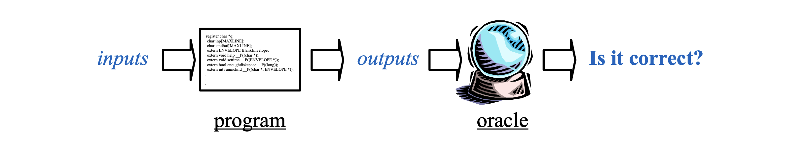
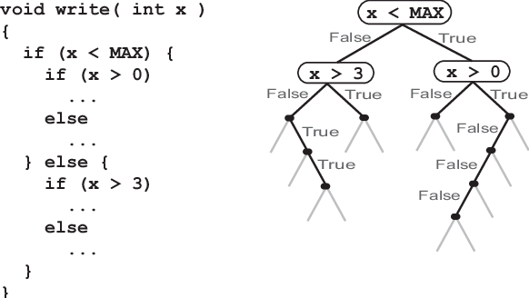
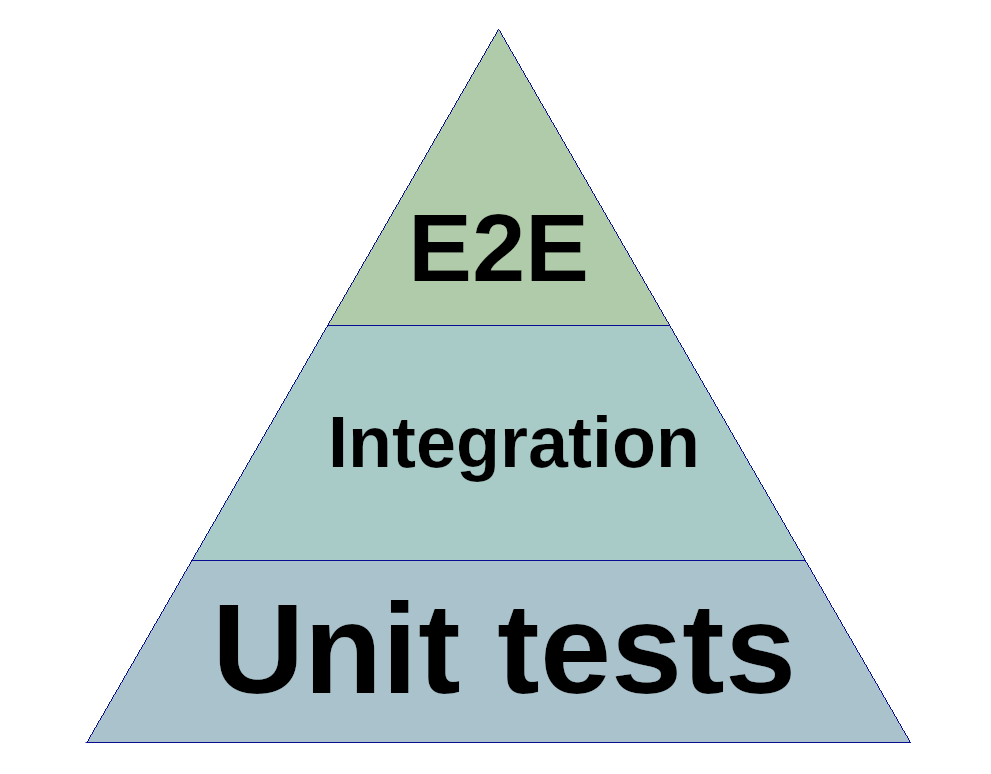

# Revisió del codi: testing i anàlisi

---

## Pràctica actual per desenvolupament segur

- **Testing**
  - Assegureu-vos que el programa s'executa correctament segons un conjunt d'entrades



- **Beneficis**: una fallada concreta demostra un problema, ajuda a solucionar-ho
- **Inconvenients**: car, difícil, difícil de cobrir tots els camins de codi, sense garanties

---

## Anàlisi estàtica

> Static Analysis

---

## Anàlisi estàtica

- **Anàlisi estàtica de software**: és un tipus d'anàlisi que es realitza sense executar el programa
  - En la majoria dels casos, l'anàlisi es realitza a alguna versió del codi font i en altres casos es realitza al codi objecte
- El terme s'aplica generalment a les anàlisis realitzades per una **eina automàtica**
- L'**anàlisi realitzada per un humà** és anomenat comprensió de programes (o enteniment de programes), o també **revisió de codi**.

---v

- Analitzar el codi del programa sense executar-lo
  - En cert sentit, estem demanant a un ordinador que faci el que podria fer un humà durant una revisió de codi
- **Beneficis**: una **cobertura (molt) més alta**
  - Raonar sobre moltes possibles execucions del programa
    - A vegades totes, aportant una garantia
  - Raonar sobre programes incomplets (per exemple, biblioteques)
- **Inconvenients**
  - Només pot analitzar propietats limitades
  - Poden faltar alguns errors o tenir falses alarmes
  - Pot ser molt llarg d'executar

---

## Impacte de l'anàlisi estàtica

- Comprova a fons propietats limitades però útils
  - **Elimina categories d'errors**
  - Els **desenvolupadors** poden **concentrar-se** en un **raonament** més profund
- **Fomenta millors pràctiques de desenvolupament**
  - Desenvolupa models de programació que eviten errors típics
  - Encoratja els programadors a reflexionar i posar de manifest els seus supòsits
    - Moltes eines d'anàlisi estàtica permeten l'ús d'anotacions que milloren la precisió de l'eina

---

## L'anàlisi estàtica és impossible?

- L'anàlisi estàtica **perfecta** **no és possible**
- L'anàlisi estàtica **útil** és perfectament **possible**, malgrat
  - **No acabament**: l'analitzador no acaba mai, o
  - **Falses alarmes**: els errors que no són realment errors, o
  - **Errors perduts**: que no es trobin errors NO significa que no hi hagi error

---

## L'art de l'anàlisi estàtica

- Compensacions de disseny d'anàlisi
  - **Precisió**: Modeleu acuradament el comportament del programa, per minimitzar les falses alarmes
  - **Escalabilitat**: Analitzar amb èxit programes grans
  - **Comprensió**: els informes d'error haurien de ser accionables
- Observació: **l'estil del codi és important**
  - Procura ser precís per als programes “bons”.
    - Està bé prohibir el codi “desagradable” en nom de la seguretat
  - Falses alarmes vistes positivament: redueix la complexitat
    - El codi més comprensible per a l'anàlisi és més comprensible per als humans

---

## Static Code Analysis: Scan All Your Code For Bugs

<!-- markdownlint-disable MD033 -->
<iframe width="560" height="315" src="https://www.youtube.com/embed/Heor8BVa4A0?si=_bV778tveEKrdccu" title="YouTube video player" frameborder="0" allow="accelerometer; autoplay; clipboard-write; encrypted-media; gyroscope; picture-in-picture; web-share" referrerpolicy="strict-origin-when-cross-origin" allowfullscreen></iframe>
<!-- markdownlint-enable MD033 -->

---

## Exemples d'eines d'anàlisi estàtica**

- **Rust**
  - **Clippy**: Una col·lecció de lints per millorar el codi Rust i trobar errors comuns i inusuals.
  - **Rust Analyzer**: Proporciona una sèrie d'analitzadors estàtics per millorar la codificació en Rust.
  - **Cargo Check**: Executa una comprovació ràpida del codi per verificar errors sense compilar el programa completament. **cargo check**
- **Python**
  - **Pylint**: Analitza codi Python per trobar bugs i senyals de codi de mala qualitat.
  - **PyFlakes**: Detecta errors en codi Python com mòduls o variables no utilitzats.
  - **Mypy**: Verifica tipus de manera estàtica per assegurar que el codi s'adhereix als tipus esperats.

---v

- **Java**
  - **Checkstyle**: Es centra en la conformitat amb els estàndards de codificació.
  - **PMD**: Detecta possibles bugs, codi no òptim, complicat o dubtós.
  - **FindBugs**/**SpotBugs**: Identifica patrons de bugs coneguts en el codi Java.
- **C/C++**
  - **Cppcheck**: Eina d'anàlisi estàtica per a codi C/C++ que detecta diversos tipus d'errors.
  - **Clang Static Analyzer**: Ofereix anàlisi de codi integrat amb el compilador Clang per trobar bugs en codi C/C++. Clang
  - **Coverity**: Proporciona anàlisi avançada per identificar defectes de software en C, C++, i altres.

---v

- **JavaScript**
  - **ESLint**: Eina extensible que detecta problemes trobats en el codi JavaScript, permetent personalitzar regles.
  - **JSHint**: Una eina de validació de codi que ajuda a detectar errors i problemes potencials.
  - **Flow**: Verificador de tipus estàtic per JavaScript que també pot detectar errors en temps de compilació.

---

## Clippy

- Instal·lació:
  - `rustup component add clippy`
- Executar Clippy:
  - `cargo clippy`
- Configuració al fitxer `clippy.toml` o `.clippy.toml` del projecte
- Llista de regles:
  - [https://rust-lang.github.io/rust-clippy/master/index.html](https://rust-lang.github.io/rust-clippy/master/index.html)

---

## Linting Rust Code With Clippy CLI Rules

<!-- markdownlint-disable MD033 -->
<iframe width="560" height="315" src="https://www.youtube.com/embed/_YFZZc5jIfY?si=wTml1CftD01OjVH9" title="YouTube video player" frameborder="0" allow="accelerometer; autoplay; clipboard-write; encrypted-media; gyroscope; picture-in-picture; web-share" referrerpolicy="strict-origin-when-cross-origin" allowfullscreen></iframe>
<!-- markdownlint-enable MD033 -->

---

## Anàlisi de flux

> Flow Analysis

---

<!-- markdownlint-disable MD024 -->

## Anàlisi de flux

<!-- markdownlint-enable MD024 -->

- L'**anàlisi de flux** és un mètode d'**anàlisi estàtica** que estudia el camí que segueixen les dades a través del codi per identificar possibles problemes de lògica o seguretat.
  - L'**objectiu principal** és detectar condicions errònies, fluxos de dades incorrectes, i altres vulnerabilitats que podrien passar desapercebudes en una revisió superficial o durant l'execució habitual del programa

---

## Tipus d'anàlisi de flux

- **Anàlisi de Flux de Dades**: Estudia els camins que recorren les dades dins del programa.
  - Permet detectar l'ús de dades no inicialitzades, fugues de memòria i accessos a memòria no vàlids.
- **Anàlisi de flux de control**: Analitza les rutes de control del programa, com ara condicions, branques i bucles.
  - Serveix per assegurar que el flux del programa és correcte, identificar codi inassolible i prevenir bucles infinits.

---

## Mètodes i tècniques

- **Graf de flux de control (CFG)**: Representació gràfica on els nodes simbolitzen blocs bàsics d'instruccions, i les arestes indiquen el flux de control entre aquests blocs.
- **Anàlisi _tainting_**: Tècnica que rastreja la propagació de dades provinents de fonts no fiables (com l'entrada de l'usuari), per determinar si poden arribar a parts crítiques del programa sense haver estat degudament validades o sanejades.


---

## Anàlisi de flux: Exemple



---

## Execució simbòlica

> Symbolic Execution

---

<!-- markdownlint-disable MD024 -->

## Execució simbòlica

<!-- markdownlint-enable MD024 -->

- L'**execució simbòlica** és una tècnica de testing que executa el codi utilitzant **valors simbòlics** en lloc de dades concretes.
- Permet explorar múltiples **camins d'execució alhora**, simulant una gran varietat de possibles entrades.

> 🎯 Objectiu: detectar errors lògics, condicions de fallada i vulnerabilitats analitzant el comportament del programa amb tot tipus d'entrades, inclosos casos límit difícils de reproduir manualment.

---

## Conceptes bàsics

- **Valors simbòlics**: són variables que representen qualsevol possible valor d'entrada.
- **Arbre d'execució**: cada decisió condicional en el codi crea una branca; el conjunt de totes les branques forma un arbre amb tots els camins possibles del programa.
- **Restriccions de camí**: condicions que s'acumulen a mesura que el codi s'executa simbòlicament (ex: `x > 5`, `y == 0`).

---

## Resolució de camins

- Quan fem execució simbòlica, el programa **genera condicions** segons les decisions que pren (ex: `x > 5`).
- Un **solver de restriccions** és una eina que **cerca valors reals** (com `x = 6`) que compleixin aquestes condicions.

➡️ Així podem generar **entrades concretes** que fan que el programa segueixi un camí específic.

---v

### Exemple:

```rust
if x > 5 {
    // camí interessant
}
```

- **Execució simbòlica**: `x` és un valor simbòlic.
- **Solver**: cerca un valor concret per `x` que compleixi la condició (ex: `x = 6`).
- **Entrada generada**: `x = 6` per activar el camí interessant.

---

## Exemples de vulnerabilitats detectables

- **Desbordament de buffer**: si una entrada simbòlica pot superar una mida màxima no controlada.
- **Condicions de carrera**: en anàlisi simbòlica concurrent, es poden detectar conflictes en l'accés simultani a recursos compartits.

---

## Avantatges principals

- ✅ **Alta cobertura**: explora molts més camins que el testing tradicional.
- ✅ **Detecta bugs amagats** que només apareixen amb condicions molt específiques.
- ✅ **Automatitza la generació de proves**, reduint l'esforç manual.

---

## Execució simbòlica vs. Anàlisi de flux

- Ambdues analitzen el comportament del codi, però amb objectius diferents:
  - **Execució simbòlica**: simula execucions amb valors arbitraris per provar totes les condicions possibles.
  - **Anàlisi de flux**: segueix com les dades es mouen i canvien dins del programa.
- Sovint es combinen: l'anàlisi de flux pot ajudar a enfocar millor l'execució simbòlica.

---



---

## Tests unitaris

> Unit tests

---

<!-- markdownlint-disable MD024 -->

## Tests unitaris

<!-- markdownlint-enable MD024 -->

- Els **tests unitaris** són procediments que verifiquen el comportament d'una **unitat específica de codi** per assegurar-se que funciona correctament.
- **Unitat**: Una unitat pot ser una **funció**, un **mètode**, o una **classe** dins del software que es pot provar de forma aïllada.

---

## Principis bàsics dels tests unitaris

- **Aïllament**: Cada test unitari ha de ser independent dels altres; això implica que no ha d'interactuar amb bases de dades, fitxers, o components de xarxa, i es deuen utilitzar tècniques com a _**mockups**_ (**maquetes**) o _**stubs**_.
  - _**Stub**_: tros de codi que es fa servir per representar alguna funcionalitat d'un component al procés de desenvolupament de programari
- **Repetibilitat**: Cada test ha de poder ser executat múltiples vegades i en qualsevol entorn, sempre amb el mateix resultat.
- **Automatització**: Els tests unitaris són generalment escrits i executats automàticament per eines de software. Això permet integrar-los en processos d'integració contínua.

---

## Mètodes i tècniques de tests unitaris

- **Frameworks de Testing**: Utilització de frameworks especialitzats, com **JUnit** per **Java**, **PyTest** per **Python**, o **NUnit** per **C#**. Aquests frameworks faciliten la creació, execució, i organització dels tests.
  - A **Rust**, el framework de testing està **integrat** i no requereix biblioteques externes.
- _**Asserts**_: S'utilitzen afirmacions per comprovar que el codi realitza les operacions correctes. Per exemple, verificar que el resultat d'una funció és el valor esperat.

---

## Exemples de tests unitaris

- **Funció Suma**: Per una funció que suma dos nombres, un test unitari podria comprovar que la suma de 2 i 3 retorni 5.
- **Validació d'Usuari**: Per una funció que valida noms d'usuari, un test unitari podria verificar que el nom "usuari123" sigui acceptat i que "usuari#123" sigui rebutjat.

---

## Beneficis dels tests unitaris

- **Detecció Precoç de Bugs**: Ajuda a detectar errors en les fases inicials del desenvolupament, facilitant la seva solució abans que afectin altres parts del sistema.
- **Documentació de Codis**: Els tests serveixen com a documentació que mostra com es suposa que el codi ha de ser utilitzat.
- **Confiança en Refactoritzacions**: Permet als desenvolupadors modificar el codi existent amb la confiança que no estan introduint errors en funcions ja testejades.

---

## Millors pràctiques

- **Cobertura de Codi**: Intentar cobrir totes les ramificacions i camins possibles dins del codi per assegurar una completa validació.
- **Mantenir els Tests Actualitzats**: Actualitzar els tests unitaris quan el codi canvia per assegurar que continuen sent rellevants i útils.

---

## Tests d'integració

> Integration tests

---

<!-- markdownlint-disable MD024 -->

## Tests d'integració

<!-- markdownlint-enable MD024 -->

- Els **tests d'integració** verifiquen la correcta interacció i funcionament conjunt de múltiples components o mòduls d'un sistema de software.
- **Objectiu**: Detectar problemes associats amb les interfícies entre components, garantint que funcionen junts com s'espera.

---

## Principis bàsics dels tests d'integració

- **Integració Incremental**: Aquesta tècnica comença amb dos components, testeja la seva interacció, i afegeix progressivament més components per testejar. Això pot seguir un enfocament "big bang", "top-down", "bottom-up" o "sandwich".
- Ús de **Stubs** i **Drivers**: En absència d'alguns mòduls, s'utilitzen **stubs** (per mòduls **cridats**) i **drivers** (per mòduls **que criden**) per simular les funcions dels components encara no desenvolupats o integrats.

---

## Mètodes i tècniques de tests d'integració

- **Top-Down**: Comença amb els nivells superiors de control del programa i progressivament integra els nivells inferiors.
- **Bottom-Up**: Contràriament al top-down, aquest enfocament comença amb els mòduls a nivell més baix i avança cap als nivells superiors.
- **Big Bang**: Tots els components o mòduls s'integren en un sol pas i el sistema complet es testeja en conjunt.
- **Sandwich** (**Híbrid):** Combina els enfocaments **top-down** i **bottom-up**.

---

## Exemples de Tests d'Integració

- **Integració de Sistema de Pagament**: Testejant la integració entre un carret de compra en línia i un sistema de processament de pagaments per assegurar que les transaccions es processen correctament.
- **Interacció entre Base de Dades i API**: Verificant que una aplicació web pot recuperar i enviar dades correctament a una base de dades a través d'una API.

---

## Beneficis dels tests d'integració

- **Cobertura de Interaccions**: Assegura que les interaccions entre components són com s'espera, detectant errors que no es poden trobar en tests unitaris.
- **Validació de Disseny**: Confirma que l'arquitectura global del sistema suporta les funcionalitats requerides.
- **Identificació Precoç de Problemes**: Ajuda a descobrir i solucionar problemes d'integració abans que avancin a etapes posteriors de desenvolupament, potencialment estalviant temps i recursos.

---

## Consideracions

- **Planificació**: Requereix una planificació cuidadosa per decidir l'ordre i l'estratègia d'integració.
- **Dependències**: Pot ser desafiador gestionar les dependències entre els components, especialment en sistemes grans i complexes.

---

## Tests de sistema

> System testing or end-to-end (E2E) testing

---

<!-- markdownlint-disable MD024 -->

## Tests de sistema

<!-- markdownlint-enable MD024 -->

- Els t**ests de sistema** són la validació d'un programa de software **complet** i **integrat** per verificar que compleix amb els **requisits** especificats.
- **Objectiu**: Confirmar que totes les parts integrades del software funcionen en harmonia sota condicions que simulen l'ús real, cobrint totes les funcionalitats i fluxos de l'usuari.

---

## Principis bàsics dels tests de sistema

- **Cobertura Completa**: Engloba totes les funcions del sistema en un entorn que imita la producció, incluint la interacció amb bases de dades, xarxes, i altres aplicacions.
- **Tests d'Escenaris d'Usuari**: S'executen escenaris que un usuari real podria realitzar, des de l'inici fins al final, per verificar la resposta del sistema.

---

## Mètodes i tècniques de tests de sistema

- **Automatització de Tests**: Molts tests de sistema són automatitzats per cobrir escenaris complexos i repetitius, utilitzant eines com _Selenium_, _TestComplete_, o _Cypress_.
- **Tests Manual**: Alguns escenaris, especialment els que impliquen percepcions subjectives com la usabilitat, poden requerir intervenció manual.

---

## Exemples de tests de sistema

- **Procés de Compra Online**: Un test E2E podria simular un usuari realitzant una compra completa a una botiga online, des de la selecció de productes fins a la finalització del pagament i recepció de la confirmació.
- **Aplicació Bancària**: Testejar un escenari on un usuari accedeix al seu compte, realitza una transferència, i verifica les transaccions, tot a través de diferents dispositius o plataformes.

---

## Beneficis dels tests de sistema**

- **Assoliment de Conformitat**: Assegura que el sistema compleix amb tots els requisits funcionals i no funcionals.
- **Prevenció de Defectes**: Ajuda a identificar problemes abans que el software arribi als usuaris finals, millorant la satisfacció de l'usuari.
- **Validació d'Experiència d'Usuari**: Confirma que l'experiència de l'usuari és coherent i satisfactòria a través de tot el sistema.

---

## Consideracions dels tests de sistema

- **Complexitat**: Els tests de sistema poden ser complexos i costosos de planificar i executar degut a la seva naturalesa exhaustiva i el necessari entorn de simulació de producció.
- **Manteniment d'Escenaris**: Els tests E2E requereixen manteniment regular per assegurar que segueixen sent rellevants a mesura que el software evoluciona.

---


---

## Testing en Rust

Rust incorpora un sistema de testing **integrat** i molt potent, sense necessitat de biblioteques externes:

- Els tests s'escriuen al mateix fitxer `.rs` o a fitxers separats
- Es compilen i executen amb `cargo test`

---

## Estructura bàsica d'un test

```rust
fn sum(a: i32, b: i32) -> i32 {
    a + b
}

#[cfg(test)]
mod tests {
    use super::*;

    #[test]
    fn test_sum() {
        assert_eq!(sum(2, 2), 4);
    }
}
```

- `#[cfg(test)]`: compila el codi només en mode test
- `#[test]`: marca la funció com a test
- `assert_eq!`: compara el resultat esperat amb el resultat obtingut

---

## Assertions més habituals

- `assert!(condicio)` → falla si la condició és falsa
- `assert_eq!(a, b)` → falla si `a != b`
- `assert_ne!(a, b)` → falla si `a == b`

---

## Organització dels tests

- **Tests unitaris**: dins del mateix fitxer `.rs`, al final, en un mòdul `#[cfg(test)]`
- **Tests d'integració**: a `tests/`, cada fitxer és un binari separat

```text
project/
|- src/
|  |- lib.rs
|- tests/
|  |- integration_test.rs
```

---

## Write Unit Tests in Rust

<!-- markdownlint-disable MD033 -->
<iframe width="560" height="315" src="https://www.youtube.com/embed/0G_5uUe_NXk?si=IqnoBNKgtUo-odrx" title="YouTube video player" frameborder="0" allow="accelerometer; autoplay; clipboard-write; encrypted-media; gyroscope; picture-in-picture; web-share" referrerpolicy="strict-origin-when-cross-origin" allowfullscreen></iframe>
<!-- markdownlint-enable MD033 -->

---

## Auditories de codi

> Code audits

---

## Auditoria de codi

- Una **auditoria de codi** és una revisió sistemàtica del codi font per identificar **errors**, **vulnerabilitats** de seguretat, i **ineficiències**.
  - Serveix per assegurar que el software compleix amb els estàndards de codificació i pràctiques recomanades.
- **Objectiu**: millorar la qualitat del software i garantir que està lliure de defectes que podrien afectar la seva funcionalitat o seguretat


---

## Components clau de l'auditoria de codi

- **Revisió de Seguretat**: Analitza el codi per identificar vulnerabilitats que podrien ser explotades per atacants, com a injeccions SQL, desbordament de buffers, i fallades de gestió de sessions.
- **Anàlisi de Qualitat de Codi**: Evalua el codi per assegurar que segueix les millors pràctiques de programació, està ben estructurat, i és fàcil de mantenir.
- **Comprovació de Conformitat**: Verifica que el codi compleix amb els estàndards de la indústria i normatives legals, com GDPR per a protecció de dades o HIPAA per a informació sanitària.

---

## Mètodes utilitzats

- **Anàlisi Estàtica**: Utilitza eines que examinen el codi sense executar-lo per detectar errors o patrons de codi problemàtics.
- **Anàlisi Dinàmica**: Implica executar el codi en un entorn controlat per identificar problemes en temps d'execució.
- **Revisions de Codi Manual**: Experts en codi revisen el codi font manualment per detectar problemes que les eines automàtiques poden no detectar.

---

## Beneficis de l'auditoria de codi

- **Millora de la Seguretat**: Redueix el risc de vulnerabilitats de seguretat i exposició a atacs.
- **Augment de la Qualitat del Producte**: Assegura una major estabilitat i rendiment del software.
- **Conformitat amb Normatives**: Garanteix que el software compleix amb les lleis i regulacions aplicables, evitant possibles sancions legals.

---

## Clean code i tests

<!-- markdownlint-disable MD033 -->
<iframe width="560" height="315" src="https://www.youtube.com/embed/AlK4Vir5fMQ?si=FsBi8WWJyuq86_Wv" title="YouTube video player" frameborder="0" allow="accelerometer; autoplay; clipboard-write; encrypted-media; gyroscope; picture-in-picture; web-share" referrerpolicy="strict-origin-when-cross-origin" allowfullscreen></iframe>
<!-- markdownlint-enable MD033 -->
