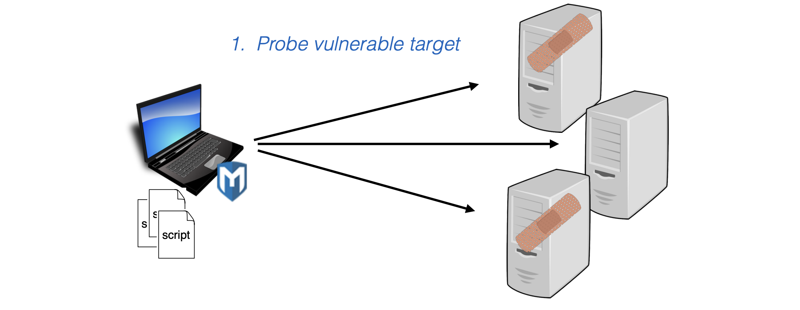
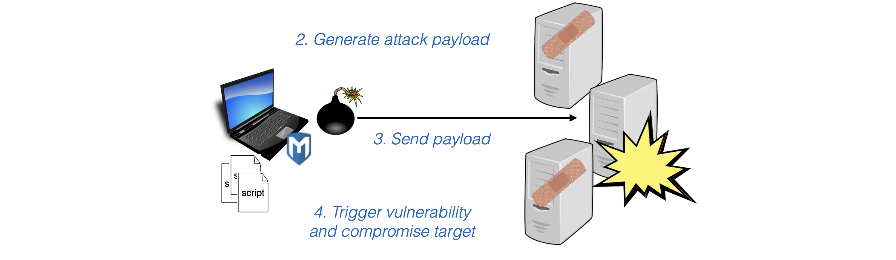
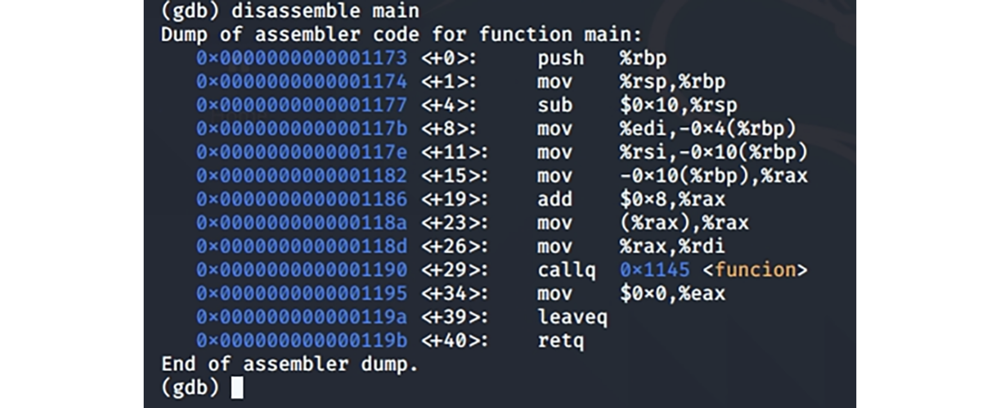
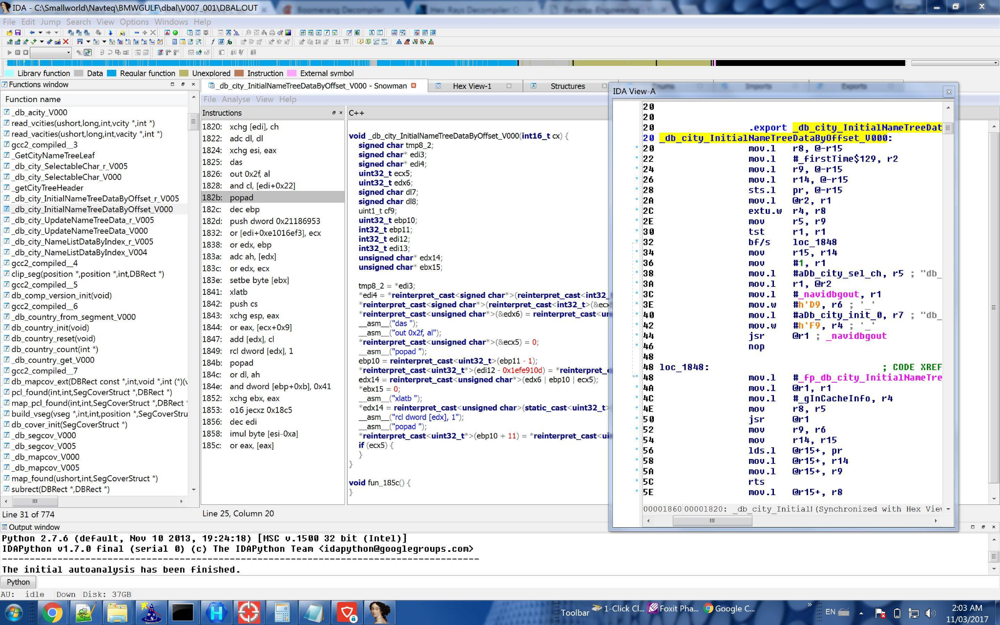

# Proves de penetració (Pentesting)

---

## Penetration testing: Introducció

> Prova de penetració

---

## Què és _penetration testing_?

- Les **proves de penetració** avaluen la seguretat intentant activament **trobar vulnerabilitats explotables**
  - Activitat de _**black hat**_ (amb un bon propòsit). Els practicants també s'anomenen _**red teams**_, _**tiger teams**_, etc.
- Es pot aplicar a diferents nivells de granularitat
  - **programa** (procés únic)
  - **sol·licitud completa** (processos de comunicació)
  - **xarxa** de moltes aplicacions
  - generalment no a biblioteques ni fragments de codi incomplets

---

## Qui, i com

- Els _**pen testers**_ utilitzen **enginy** i **eines** **automatitzades**
  - Per explorar ràpidament la superfície d'atac d'un sistema, cercant les debilitats per explotar
- Normalment **duit a terme per un grup separat** dins o fora d'una organització, independent dels desenvolupadors
  - **Evita la visió de túnel**: la mateixa raó per la qual els metges solen no tractar-se a ells mateixos ni a les seves pròpies famílies
- Podem simular **accés variat a les parts internes del sistema**
  - Des de **no tenir accés**, com un atacant extern, fins a l'**accés total**, com una persona interna amb coneixements

---

---

## Beneficis

- Les **penetracions** són **certes** i **reproduïbles**, demostrades per proves
  - **No és hipotètic**
  - **Aplicat** a **tot un component**
    - no a fragments de codi
  - **Sense falses alarmes** (com l'anàlisi estàtic)
- Factor “sentir-se bé”.
  - Produeix **evidències de vulnerabilitats reals** que, d'altra manera, no s'haurien solucionat
  - D'aquesta manera es tradueix en una **clara millora de la seguretat**

---

## Inconvenients

- L'**absència** de **penetracions** **no és una prova de seguretat**
  - Després d'arreglar qualsevol problema, pot haver-hi altres encara a l'aguait
- Els canvis al sistema requereixen una nova prova
  - La seguretat no és compositiva: un canvi a un component pot fer que un altre component sigui insegur
    - Per tant, cal tornar a provar tot el sistema
  - Però els canvis són habituals!
    - Pot ser car tornar a provar amb massa freqüència
- No obstant això, **val la pena fer proves de penetració**

---

## Pen Testing

> Prova de penetració

---

## Què és _pen testing_?

> "Science is what we understand well enough to explain to a computer. Art is everything else we do." - Donald Knuth

- _Pen testing_ és tant art com ciència
  - Els humans proven i interactuen amb un sistema, cercant diferents debilitats o vectors d'atac
    - Utilitzant l'intel·ligència, l'adaptació i l'enginy
- Un cop sorgeixen els patrons d'exploració i explotació, es poden fer programes informàtics (eines) per fer el treball
  - Enginy/creativitat automatitzat

---

## Caixa d'eines del _pen tester_

- **Un _pen tester_ s'acosta a un objectiu sabent...**
  - el **funcionament** del domini objectiu (p. ex., el web)
  - .. com **està construït** el sistema en aquest domini
    - **Protocols** (p. ex., HTTP, TCP, ...)
    - **Llenguatges** (p. ex., PHP, Java, Ruby, ...)
    - **Frameworks** (p. ex., Rails, Dream Weaver, Drupal)
  - ... **debilitats comunes** en el programari/sistema
    - **Errors** (p. ex., injeccions SQL, XSS, CSRF, ...)
    - **Configuracions incorrectes, mal disseny** (p. ex., contrasenyes predeterminades, fitxers “ocults”, ...)

---

## Eines

- Hi ha una llista completa a [http://sectools.org/](http://sectools.org/)
- Els pen testers utilitzen eines per
  - **Sondejar** un objectiu
  - **Recollir informació** i **provar** hipòtesis al respecte
  - **Explotar** una vulnerabilitat (o intentar-ho)
- Quina eina utilitzar depèn de l'objectiu
  - Si es tracta d'una **xarxa empresarial**, volem trobar, investigar i explotar màquines, encaminadors, topologia, etc.
  - Si es tracta d'**una única màquina**, volem tenir en compte programari instal·lat, programes en execució, fitxers interessants
  - Si es tracta d'**un sol programa**, volem explorar i explotar possibles entrades i interaccions

---

## _nmap_ per al sondeig de la xarxa

- `nmap` significa "mapejador de xarxa"
- Per descobrir:
  - quins **hosts** estan disponibles a la xarxa,
  - quins **serveis** (nom i versió de l'aplicació) ofereixen aquests hosts,
  - quins **sistemes operatius** (i versions del sistema operatiu) estan executant,
  - quin tipus de **filtres de paquets/tallafocs** s'utilitzen
  - ... i més
- Funciona enviant **paquets IP raw** (en brut) a la xarxa i **observant-ne els efectes**
- Gratuït, codi obert: [http://nmap.org](http://nmap.org)

---

## Trobar hosts i serveis

- `nmap` farà **ping** a un **interval d'adreces IP** especificat
  - Sol·licitud d'**echo ICMP** i/o sol·licitud de **timestamp**
    - Protocol estàndard “ping”.
  - **TCP SYN** al port 443, **TCP SYN/ACK** al port 80
    - Cercant executar servidors HTTPS o HTTP
  - Altres coses, segons determini l'operador
    - Paquets UDP específics del protocol a ports concrets
    - Proves a altres ports TCP
    - Proves que provoquen respostes diferents en diferents sistemes operatius ("empremtes digitals")
- Sigues sigilós
  - Es pot detectar una ràfega d'activitat d'escaneig
  - Controla la velocitat d'escaneig per "treballar sota el radar"

---

## Zap (Zed Attack Proxy)

- **ZAP** és una eina de **seguretat web** desenvolupada per OWASP
- Permet **inspeccionar i modificar paquets** capturats mitjançant una interfície gràfica (GUI).
- Suporta **punts d'interrupció** (_breakpoints_) per controlar el flux dels paquets.

---v

- **Funcionalitats principals**:
  - **Escaneig actiu**: detecta vulnerabilitats com XSS i injecció SQL.
  - **Fuzzing**: proves amb càrregues útils adaptades al context.
  - **Spider**: explora i mapeja l'estructura d'un lloc web.

---

## Metasploit

- **Metasploit** és una plataforma de codi obert per **desenvolupar, provar i executar exploits**.
- Inclou un model modular per combinar **exploits** i **payloads**.
  - **Exploit**: és un codi o tècnica que aprofita una vulnerabilitat en un sistema (software o servei) per executar accions no desitjades
  - **Payloads**: codi que s'executa un cop l'exploit ha tingut èxit

---v

- Procés típic:
  1. Sondejar objectiu cercant serveis vulnerables
  2. Triar un exploit
  3. Triar un payload
  4. Codificar el payload per evitar detecció
  5. Executar (`exploit`) i obtenir shell remot

---v

---v

---v

## Capacitats de Metasploit

- Centenars de mòduls:
  - **Exploits** per vulnerabilitats conegudes
  - **Sniffing** de contrasenyes
  - **Escalada de privilegis**
  - **Keylogging** i **backdoors**
- Suporta atacs **actius i passius**
- Més info: [Metasploit Unleashed](https://www.offsec.com/metasploit-unleashed/)

---

## Como Usar METASPLOIT Framework en Kali Linux

<!-- markdownlint-disable MD033 -->
<iframe width="560" height="315" src="https://www.youtube.com/embed/sgA8ru5OIU4?si=1p9MxM88V4npLJol" title="YouTube video player" frameborder="0" allow="accelerometer; autoplay; clipboard-write; encrypted-media; gyroscope; picture-in-picture; web-share" referrerpolicy="strict-origin-when-cross-origin" allowfullscreen></iframe>
<!-- markdownlint-enable MD033 -->

---

## Kali Linux

- Kali és una **distribució de Linux** amb moltes eines de **pen testing** de codi obert **instal·lades i configurades**

---v

- Els que ja hem esmentat:
  - `nmap`, Zap, Metasploit, Burp Suite
- i desenes més
  - **John the Ripper** per descobriment de contrasenyes
  - **Valgrind** per a l'anàlisi binària dinàmica
  - **Reaver** per trencar contrasenyes Wifi
  - **peepdf** per escanejar fitxers PDF per cercar vectors d'atac
  - ... i més
- [http://www.kali.org](http://www.kali.org)

---

## Kali Linux Tutorial For Beginners

<!-- markdownlint-disable MD033 -->
<iframe width="560" height="315" src="https://www.youtube.com/embed/WUMo7LMRdwA?si=v54iw7jARPD9frpX" title="YouTube video player" frameborder="0" allow="accelerometer; autoplay; clipboard-write; encrypted-media; gyroscope; picture-in-picture; web-share" referrerpolicy="strict-origin-when-cross-origin" allowfullscreen></iframe>
<!-- markdownlint-enable MD033 -->

---

## Enginyeria inversa

> Reverse engineering

---

## Reverse engineering (Enginyeria inversa)

- Consisteix a **desmuntar un programa executable** per entendre com funciona.
- En programari, implica convertir el **codi màquina** en una forma llegible (codi font o quasi font).
- **Objectius principals**:
  - Analitzar el funcionament intern del programa
  - Crear programari compatible o millorat
  - Detectar funcionalitats ocultes (com portes del darrere)
  - Identificar **vulnerabilitats** o decisions de disseny insegures

---v

- Entre les **eines** més habituals per a l'enginyeria inversa existeixen:
  - descompiladors (_decompilers_)
  - depuradors (_debuggers_)
  - desassembladors (_disassemblers_)
  - framewoks, etc.

---v

- L'anàlisi inclou:
  - Rastreig del flux d'execució i crides a funcions
  - Inferència de tipus de dades i estructura de la pila
  - Observació de valors en registres i flags
- **Eines populars**: com _IDA Pro_ (desassemblador i depurador)
- **Riscs potencials**:
  - Modificació no autoritzada del codi
  - Fuites de codi confidencial si no es protegeix adequadament

---

## Llenguatge d'Assemblador

- El **llenguatge d'assemblador** és un llenguatge de **baix nivell** molt proper al **codi màquina**, comprensible pels humans.
  - Es basa en instruccions que corresponen gairebé directament a les operacions del **microprocessador**.
  - Exemple: `mov rax, 1` o `cmp rax, rbx`

---v

### 🦀 Rust → Compilació a codi màquina

- **Rust no s'interpreta**: es **compila** directament a **codi màquina** mitjançant el compilador `rustc`.
- Durant la compilació:
  1. El codi Rust es transforma internament a LLVM IR (Intermediate Representation)
  2. LLVM optimitza i genera el **codi d'assemblador**
  3. L'assemblador es converteix finalment en binari executable

---v

### 🛠️ Anàlisi i enginyeria inversa

- Es pot **desassemblar** un binari compilat en Rust o C/C++ per obtenir **codi d'assemblador**.
- Tot i la seguretat i abstractions de Rust, **els binaris resultants es poden analitzar** com qualsevol altre executable en C/C++.
- Eines com `objdump`, `GDB`, `IDA Pro`, `radare2` o `Ghidra` permeten veure i depurar el resultat final en llenguatge d'assemblador.

---

## Desassembladors (_Dissassemblers_)

- Un **desassemblador** converteix **codi màquina** en **llenguatge d'assemblador** per analitzar el funcionament intern d'un executable.
- En programes Rust (compilats a codi nadiu), permet **examinar el resultat del procés de compilació**.
- **Eines habituals**:
  - `objdump` – eina clàssica per veure el codi assemblador (`objdump -d target/debug/nom`)
  - `radare2`, `IDA Pro`, `Ghidra` – entorns més potents per anàlisi i enginyeria inversa
  - Alguns **depuradors** com `GDB` també mostren desassemblat

> 📌 Útil per estudiar el codi generat per Rust i optimitzacions aplicades.

---

## Descompiladors (_decompilers_)

- Un **descompilador** és una eina que intenta recuperar **codi font llegible** a partir d'un executable compilat.
- En el cas de **Rust**, la descompilació és **especialment difícil** perquè:
  - El codi es compila a **LLVM IR**, i després a **codi màquina** molt optimitzat.
  - L'**optimització** i l'ús intensiu de **tipus avançats** complica la recuperació del codi original.

---v

### 🔍 Què pots obtenir, a partir d'un binari Rust?

- Amb eines com **Ghidra**, **IDA Pro** o **Radare2** pots:
  - Visualitzar el **codi d'assemblador** resultant
  - Fer anàlisi del **flux de control** i dels **tipus de dades**
- Però **no** és possible recuperar el codi Rust tal com estava escrit originalment.
  - El millor que pots obtenir és una **representació aproximada en C** o pseudo-codi.

---v

### Exemples de descompiladors per a C/C++

- **Boomerang**
  - Disponible per a Windows i Linux
  - Intenta generar codi en C, però sovint mostra parts en **assemblador** quan no pot reconstruir bé l'estructura
  - [https://boomerang.sourceforge.net/](https://boomerang.sourceforge.net/)
- **REC Studio**
  - Pot descompilar executables de **Windows, Linux i macOS** (32 i 64 bits)
  - Genera una **representació llegible en C** a partir del binari
  - [http://www.backerstreet.com/rec/recdload.htm](http://www.backerstreet.com/rec/recdload.htm)

---

## Depuradors (_Debuggers_)

- Un **depurador** permet **executar pas a pas** un programa, **inspeccionar variables**, la memòria i trobar errors.
- En Rust, es poden usar depuradors de baix nivell perquè el codi es compila a binaris nadius.
- **Eines habituals**:
  - **GDB** (GNU Debugger) – molt usat a Linux
    [https://www.sourceware.org/gdb/](https://www.sourceware.org/gdb/)
  - **LLDB** – depurador de LLVM, compatible amb Rust (`rust-lldb`)
  - **VS Code** + extensió **CodeLLDB** – entorn gràfic molt pràctic

> ✅ Compila amb `cargo build` (mode debug) per permetre la depuració.

---v

## GDB

- **GDB** (GNU Debugger) és una eina de línia d'ordres per **depurar programes nadius**, permetent executar-los pas a pas i inspeccionar-ne l'estat intern (variables, pila, registres...)

---

## IDA Pro: eina d'anàlisi de binaris

- **IDA Pro** (Interactive DisAssembler) és una eina **comercial** molt potent per a **enginyeria inversa i desassemblatge**.
- Compatible amb **Windows, Linux i macOS**, admet **múltiples arquitectures**.
- Funcionalitats principals:
  - **Desassemblador interactiu**
  - **Depuració** de binaris (local i remota)
  - Vista gràfica del **flux de control**
  - Suport per a **plugins i scripting en Python**

> Molt utilitzada en **recerca de vulnerabilitats**, **anàlisi de malware** i **auditories de seguretat**.

🔗 [https://hex-rays.com](https://hex-rays.com)

---v

---

## Radare2: eina d'enginyeria inversa

- **Radare2** és un framework de codi obert per a **enginyeria inversa i anàlisi de binaris**.
- Compatible amb **Linux, Windows, macOS, Android, iOS** i més (inclòs a Kali Linux).
- Funcionalitats:
  - **Desassemblador i depurador** per a múltiples arquitectures
  - **Anàlisi de codi i forense**
  - Suport per **scripts (Python, etc.)** i treball col·laboratiu
- Més info: [radare.org](https://www.radare.org/)

---

## Tot el necessari sobre Radare2

<!-- markdownlint-disable MD033 -->
<iframe width="560" height="315" src="https://www.youtube.com/embed/UGlYvPlIJKs?si=mQPqCQ5UgGRV5hrx" title="YouTube video player" frameborder="0" allow="accelerometer; autoplay; clipboard-write; encrypted-media; gyroscope; picture-in-picture; web-share" referrerpolicy="strict-origin-when-cross-origin" allowfullscreen></iframe>
<!-- markdownlint-enable MD033 -->

---

## Ghidra: eina d'enginyeria inversa

- **Ghidra** és una eina de codi obert per a **enginyeria inversa**, desenvolupada per la **NSA** (Agència de Seguretat Nacional).
- Compatible amb **Windows, Linux i macOS** (32 i 64 bits).
- Permet **desassemblar, descompilar i analitzar binaris** amb una interfície gràfica avançada.
- Es pot **extendre amb plugins** escrits en **Java o Python**.
  - Ex.: `dex2jar` per analitzar aplicacions Android.

🔗 [https://ghidra-sre.org](https://ghidra-sre.org)

---

## Enginyeria inversa utilitzant Ghidra

<!-- markdownlint-disable MD033 -->
<iframe width="560" height="315" src="https://www.youtube.com/embed/aQICC0EtG90?si=JxJFkZiMiW2a1-2_" title="YouTube video player" frameborder="0" allow="accelerometer; autoplay; clipboard-write; encrypted-media; gyroscope; picture-in-picture; web-share" referrerpolicy="strict-origin-when-cross-origin" allowfullscreen></iframe>
<!-- markdownlint-enable MD033 -->

---

## Ghidra for Reverse Engineering

<!-- markdownlint-disable MD033 -->
<iframe width="560" height="315" src="https://www.youtube.com/embed/oTD_ki86c9I?si=R2_dqoHprWzvTgWt" title="YouTube video player" frameborder="0" allow="accelerometer; autoplay; clipboard-write; encrypted-media; gyroscope; picture-in-picture; web-share" referrerpolicy="strict-origin-when-cross-origin" allowfullscreen></iframe>
<!-- markdownlint-enable MD033 -->

---

## Fuzzing

> Un tipus de random testing

---

<!-- markdownlint-disable MD024 -->

## Fuzzing

<!-- markdownlint-enable MD024 -->

- El **fuzzing** és una tècnica automatitzada de **proves aleatòries** per detectar errors o vulnerabilitats.
- Consisteix a injectar **dades malformades o inesperades** per provar la robustesa del codi.

---

## Tècniques de fuzzing

- **Black-box**: no coneix el programa ni l'entrada. Fàcil d'aplicar però poc profund.
- **White-box**: utilitza informació del codi (ex: cobertura de línies) per generar les entrades. Més eficient, però més costós.
- **Basat en gramàtica**: genera entrades vàlides seguint estructures conegudes.

---

## Estratègies d'entrada al fuzzing

- **Mutació**: canvis aleatoris sobre entrades conegudes
- **Generacional**: creació d'entrades des de zero, per exemple, a partir de gramàtiques
- **Combinat**: barreja dels dos enfocaments

> 📌 Després d'un **crash**, cal analitzar si és **reproduïble**, **simplificable** i si representa una **vulnerabilitat real**.

---

## Learn How to Fuzz Your Rust Code in 10 Minutes

<!-- markdownlint-disable MD033 -->
<iframe width="560" height="315" src="https://www.youtube.com/embed/ePD_ojZxI0c?si=fGJh4_4Gbt059ihJ" title="YouTube video player" frameborder="0" allow="accelerometer; autoplay; clipboard-write; encrypted-media; gyroscope; picture-in-picture; web-share" referrerpolicy="strict-origin-when-cross-origin" allowfullscreen></iframe>
<!-- markdownlint-enable MD033 -->

---

## Resum

- Els pen testers simulen atacants reals
  - Intenten trobar vulnerabilitats explotables en sistemes complets
- Les penetracions indiquen **problemes reals**
  - La manca de penetracions **no és prova d'impossibilitat**
- Els pen testers utilitzen una **varietat d'eines**
  - Escàners, proxies, injectors d'exploits, fuzzers
- I requereixen **enginy** i **astucia**

---

## Hacking ètic

- Les eines de pen testing estan destinades a **revelar vulnerabilitats de seguretat**
  - **Perquè es puguin arreglar**
  - No perquè es puguin explotar
- **Però** hi ha gent que utilitza eines amb **finalitats nefastes**
  - **No siguis un d'ells!**

