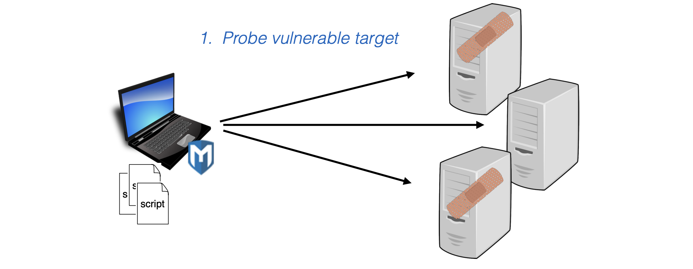
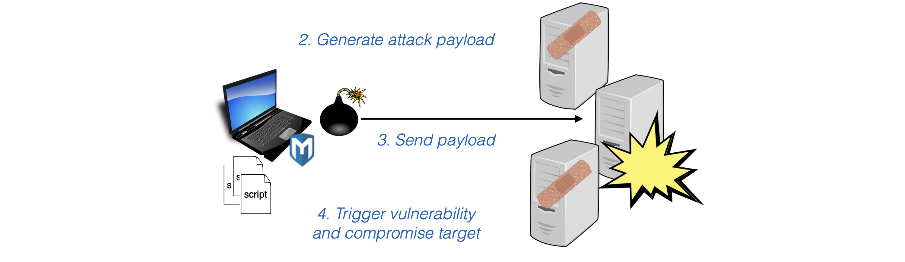
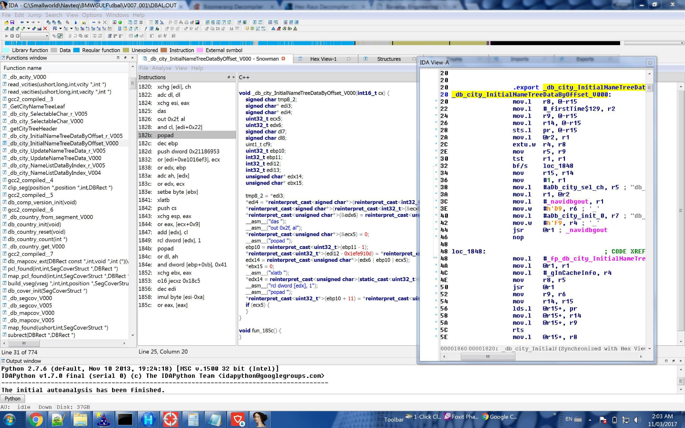
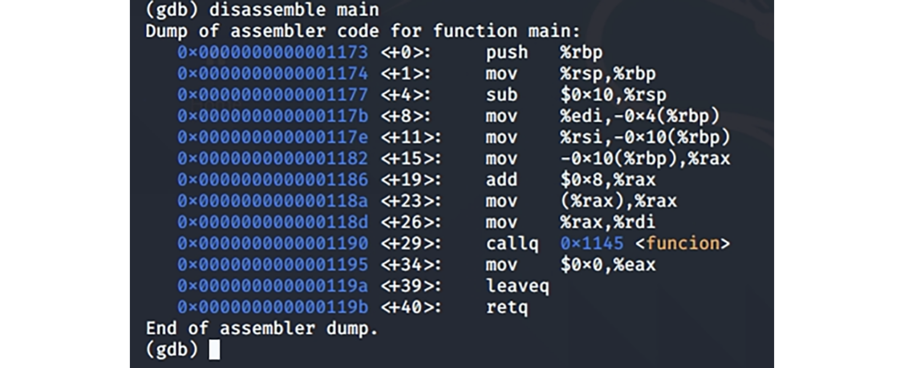

# Proves de penetració (Pentesting)

---

## Penetration testing: Introducció

> Prova de penetració

---

## Què és _penetration testing_?

- Les **proves de penetració** avaluen la seguretat intentant activament **trobar vulnerabilitats explotables**
  - Activitat de _**black hat**_ (amb un bon propòsit). Els practicants també s’anomenen _**red teams**_, _**tiger teams**_, etc.
- Es pot aplicar a diferents nivells de granularitat
  - **programa** (procés únic)
  - **sol·licitud completa** (processos de comunicació)
  - **xarxa** de moltes aplicacions
  - generalment no a biblioteques ni fragments de codi incomplets

---

## Qui, i com

- Els _**pen testers**_ utilitzen **enginy** i **eines** **automatitzades**
  - Per explorar ràpidament la superfície d'atac d'un sistema, cercant les debilitats per explotar
- Normalment **duit a terme per un grup separat** dins o fora d'una organització, independent dels desenvolupadors
  - **Evita la visió de túnel**: la mateixa raó per la qual els metges solen no tractar-se a ells mateixos ni a les seves pròpies famílies
- Podem simular **accés variat a les parts internes del sistema**
  - Des de **no tenir accés**, com un atacant extern, fins a l'**accés total**, com una persona interna amb coneixements

---


---

## Beneficis

- Les **penetracions** són **certes** i **reproduïbles**, demostrades per proves
  - **No és hipotètic**
  - **Aplicat** a **tot un component**
    - no a fragments de codi
  - **Sense falses alarmes** (com l’anàlisi estàtic)
- Factor “sentir-se bé”.
  - Produeix **evidències de vulnerabilitats reals** que, d'altra manera, no s'haurien solucionat
  - D'aquesta manera es tradueix en una **clara millora de la seguretat**

---

## Inconvenients

- L'**absència** de **penetracions** **no és una prova de seguretat**
  - Després d'arreglar qualsevol problema, pot haver-hi altres encara a l'aguait
- Els canvis al sistema requereixen una nova prova
  - La seguretat no és compositiva: un canvi a un component pot fer que un altre component sigui insegur
    - Per tant, cal tornar a provar tot el sistema
  - Però els canvis són habituals!
    - Pot ser car tornar a provar amb massa freqüència
- No obstant això, **val la pena fer proves de penetració**

---

## Què veurem?

- Visió general i eines
  - El _pen testing_ és **art** i **ciència**
  - La ciència es plasma en **eines**
  - Considerarem breument:
    - `nmap` per a l'exploració de xarxa
    - Proxy web Zap per a sondeig, explotació
    - Metasploit per a l'explotació d'ús general
    - ... i indicacions a més eines
- Tècnica útil: **Fuzzing**
  - Trobar inputs mal manejats
    - on el fracàs implica una bona oportunitat d'explotació

---

## Pen Testing

> Prova de penetració

---

## Què és _pen testing_?


- _Pen testing_ és tant art com ciència
  - Els humans proven i interactuen amb un sistema, buscant diferents debilitats o vectors d'atac
    - Utilitzant l’intel·ligència, l'adaptació i l'enginy
- Un cop sorgeixen els patrons d'exploració i explotació, es poden fer programes informàtics (eines) per fer el treball
  - Enginy/creativitat automatitzat

---

## Caixa d’eines del _pen tester_

- **Un _pen tester_ s'acosta a un objectiu sabent...**
  - el **funcionament** del domini objectiu (p. ex., el web)
  - .. com **està construït** el sistema en aquest domini
    - **Protocols** (p. ex., HTTP, TCP, ...)
    - **Llenguatges** (p. ex., PHP, Java, Ruby, ...)
    - **Frameworks** (p. ex., Rails, Dream Weaver, Drupal)
  - ... **debilitats comunes** en el programari/sistema
    - **Errors** (p. ex., injeccions SQL, XSS, CSRF, ...)
    - **Configuracions incorrectes, mal disseny** (p. ex., contrasenyes predeterminades, fitxers “ocults”, ...)

---

## _Web hacking_

- Un 70% del problema està als paràmetres
- Si l'URL és `http://tgt.com/buy?item=1&price=5.00`
- A continuació, canvieu-lo a:
  - Els paràmetres del client són de confiança?
    - `/buy?item=1&price=0,01`
    - `/buy?item=10&price=5,00`
  - Susceptible a XSS?
    - `/buy?item=1&price=5.00<script>alert(“test”);</script>`
  - Susceptible a altres injeccions?
    - `/buy?item=1&price=5,00’`

---v

- 10% de contrasenyes predeterminades
  - Busqueu sempre la contrasenya predeterminada i proveu-la
    - Funciona molt més sovint del que et penses
- 10% d'arxius i directoris ocults
  - Busqueu pistes als manuals
  - Força bruta del directori
- 10% altres
  - Problemes d'autenticació (bypass, replay, ...)
  - Serveis web insegurs
  - La pàgina de configuració proporciona la vostra contrasenya de root

---

## Eines

- Hi ha una llista completa a [http://sectools.org/](http://sectools.org/)
- Els pen testers utilitzen eines per
  - **Sondejar** un objectiu
  - **Recollir informació** i **provar** hipòtesis al respecte
  - **Explotar** una vulnerabilitat (o intentar-ho)
- Quina eina utilitzar depèn de l'objectiu
  - Si es tracta d'una **xarxa empresarial**, volem trobar, investigar i explotar màquines, encaminadors, topologia, etc.
  - Si es tracta d'**una única màquina**, volem tenir en compte programari instal·lat, programes en execució, fitxers interessants
  - Si es tracta d'**un sol programa**, volem explorar i explotar possibles entrades i interaccions

---

## _nmap_ per al sondeig de la xarxa

- `nmap` significa "mapejador de xarxa"
- Per descobrir:
  - quins **hosts** estan disponibles a la xarxa,
  - quins **serveis** (nom i versió de l'aplicació) ofereixen aquests hosts,
  - quins **sistemes operatius** (i versions del sistema operatiu) estan executant,
  - quin tipus de **filtres de paquets/tallafocs** s'utilitzen
  - ... i més
- Funciona enviant **paquets IP raw** (en brut) a la xarxa i **observant-ne els efectes**
- Gratuït, codi obert: [http://nmap.org](http://nmap.org)

---

## Trobar hosts i serveis

- `nmap` farà **ping** a un **interval d'adreces IP** especificat
  - Sol·licitud d'**echo ICMP** i/o sol·licitud de **timestamp**
    - Protocol estàndard “ping”.
  - **TCP SYN** al port 443, **TCP SYN/ACK** al port 80
    - Cercant executar servidors HTTPS o HTTP
  - Altres coses, segons determini l'operador
    - Paquets UDP específics del protocol a ports concrets
    - Proves a altres ports TCP
    - Proves que provoquen respostes diferents en diferents sistemes operatius ("empremtes digitals")
- Sigues sigilós
  - Es pot detectar una ràfega d'activitat d'escaneig
  - Controla la velocitat d'escaneig per "treballar sota el radar"

---

## Proxies web


- Les **aplicacions web** són objectius habituals de pen testing
- Els servidors proxie web es troben entre el **navegador** i el **servidor**
  - **Visualitzant** els paquets intercanviats
  - **Modificant**\-los segons les indicacions del verificador
- Alguns servidors proxy tenen funcions addicionals per a l’escaneig/explotació de vulnerabilitats, sondeig del lloc, etc.

---

## Zap


- Zed Attack Proxy (Zap) de OWASP
  - Inspecció/modificació basada en GUI dels paquets capturats
  - Pot establir “punts d'interrupció” (breakpoints) per permetre que els paquets passin fins que es compleixi una determinada condició

---v

- Característiques adicionals
  - Escaneig actiu: intents XSS, injecció SQL, etc.
  - Fuzzing: càrregues útils específiques del context
  - Spider: explora un lloc per construir un model de la seva estructura
- Gratuït, codi obert [https://code.google.com/p/zaproxy/](https://code.google.com/p/zaproxy/)
- Vegeu també la suite Burp [http://portswigger.net/burp/](http://portswigger.net/burp/)

---

## Metasploit (1)


- **Metasploit**, **plataforma** avançada de codi obert per **desenvolupar**, **provar** i **utilitzar** codi d'explotació
  - Compta amb un **model extensible** mitjançant el qual es poden integrar payloads, codificadors, generadors no-op (sense operació) i exploits.

---v

- Atacs de script
  - **Sondejar** el lloc remot a la recerca de serveis vulnerables
  - **Construir** payload en funció de les versions, i altres característiques
  - **Codificar** el payload per evitar la detecció
  - **Injectar** payload
  - **Espereu** que el codi shell es torni a connectar; símbol d'ordres!

---

## Metasploit (2)

- Metasploit sondeja els sistemes objectiu vulnerables i potser és capaç de trobar un servidor vulnerable



---

## Metasploit (3)

- A continuació, construeix el payload d'atac
- Que després envia, segons l'script, activant la vulnerabilitat i comprometent l'objectiu
- En el millor dels casos, l'objectiu es tornarà a connectar, proporcionant el shell remot.



---

## Metasploit (i 4)

- El procés general que realitza Metasploit per dur a terme una explotació és el següent:
  - Triar i configurar l'exploit:
    - `search`, `use`, `showinfo`, `showoptions`, `set`
  - Confirmar si l'objectiu és susceptible a l'exploit
  - Triar i configurar el payload:
    - `show payloads`, `use`, `show options`, `set`
  - Triar l'encode de l'exploit per evitar ser detectat pels antivirus de l'equip
  - Executar l'exploit:
    - `exploit`

---

## Metasploit UI

- `msfconsole`. consola interactiva per executar ordres metasploit
  - També interfície de línia d'ordres i interfície basada en web
  - Admet ordres de **sondeig** i **comunicacions**, **construcció de payloads** (i codificació)
  - Admet atacs **actius** (aneu a buscar-los) i **passius** (espera fins que ens arribin).
- _**Meterpreter**_: processador d'ordres injectat a l'objectiu, per exemple, a la memòria d'un procés compromès
  - Permet que el pen tester sondegi de manera més furtiva
- `msfpayload`, `msfencode`. genera codi d'intèrpret d'ordres (shellcode)

---

## Centenars de mòduls i scripts a Metasploit

- **Exploits** contra **vulnerabilitats particulars**
  - Juntament amb stagers i altres modificadors per generalitzar aquests exploits a diferents plataformes
- **Sniffing de contrasenya**
  - Llegir contrasenyes sense protecció fora de la xarxa
- **Escalada de privilegis**
  - Després de penetrar, intenteu obtenir privilegis de SISTEMA
- **Keylogging** i **backdoors**
  - Per presència persistent
- ... i molt més
- [https://www.offsec.com/metasploit-unleashed/](https://www.offsec.com/metasploit-unleashed/)

---

## Como Usar METASPLOIT Framework en Kali Linux

<!-- markdownlint-disable MD033 -->
<iframe width="560" height="315" src="https://www.youtube.com/embed/sgA8ru5OIU4?si=1p9MxM88V4npLJol" title="YouTube video player" frameborder="0" allow="accelerometer; autoplay; clipboard-write; encrypted-media; gyroscope; picture-in-picture; web-share" referrerpolicy="strict-origin-when-cross-origin" allowfullscreen></iframe>
<!-- markdownlint-enable MD033 -->

---

## Kali Linux


- Kali és una **distribució de Linux** amb moltes eines de **pen testing** de codi obert **instal·lades i configurades**

---v

- Els que ja hem esmentat:
  - `nmap`, Zap, Metasploit, Burp Suite
- i desenes més
  - **John the Ripper** per descobriment de contrasenyes
  - **Valgrind** per a l'anàlisi binària dinàmica
  - **Reaver** per trencar contrasenyes Wifi
  - **peepdf** per escanejar fitxers PDF per buscar vectors d'atac
  - ... i més
- [http://www.kali.org](http://www.kali.org)

---

## Kali Linux Tutorial For Beginners

<!-- markdownlint-disable MD033 -->
<iframe width="560" height="315" src="https://www.youtube.com/embed/WUMo7LMRdwA?si=v54iw7jARPD9frpX" title="YouTube video player" frameborder="0" allow="accelerometer; autoplay; clipboard-write; encrypted-media; gyroscope; picture-in-picture; web-share" referrerpolicy="strict-origin-when-cross-origin" allowfullscreen></iframe>
<!-- markdownlint-enable MD033 -->

---

## Enginyeria inversa

> Reverse engineering

---

## Què és l’enginyeria inversa?

- L'**enginyeria inversa** és el procés de **descompondre** i **analitzar** un producte, sistema o tecnologia complexa
- Té com objectiu de comprendre la seva estructura interna, els seus components i el seu funcionament.
  - L'enginyeria inversa de programari permet obtenir o deduir el codi font d'un programa a partir del fitxer executable
- Entre les eines més habituals per a l’enginyeria inversa existeixen:
  - descompiladors (_decompilers_)
  - depuradors (_debuggers_)
  - desassembladors (_disassemblers_)
  - framewoks, etc.

---

## Reverse engineering (1)

- Es tracta de desarmar un objecte per veure com funciona i així poder-lo duplicar o millorar
  - L'enginyeria inversa de programari implica invertir el codi de màquina d'un programa executable a codi font
- Objectius de l'enginyeria inversa:
  - Investigar i descobrir com funciona un programa
  - Construir un programa compatible
  - Localitzar-ne alguna funcionalitat oculta, com per exemple l'accés a través de portes posteriors
  - Buscar vulnerabilitats del programari ja sigui per l'ús de funcions no segures o per un disseny inconsistent.

---



---

## Reverse engineering (i 2)

- Anàlisi:
  - Rastrejar, observar el codi per comprendre com funciona
  - Poder generar codi d'alt nivell a mesura que avança
  - Observar i deduir el flux de crides a les funcions
  - Determinar els tipus de dades utilitzades en un programa
  - Observar els valors dels registres, pila, flags...
- Però l'enginyeria inversa també té els seus riscs en cas d'usar-se per modificar el codi amb finalitats malintencionades
  - Per exemple, quan s'inclou codi confidencial en un entorn en el qual un atacant pot obtenir accés, ens hauríem de preocupar pels riscs de l'enginyeria inversa o la modificació no autoritzada del codi

---

## Llenguatge d'assemblador

- Partirem d'un fitxer executable i el desassemblarem
  - Per tant obtendrem el codi en llenguatge d'assemblador
- Exemple simple del procés de llenguatge C...

```c
if (a > b) {
  maxA = 1;
  maxB = 0;
}
```

- ...a llenguatge d'assemblador

```assembly
mov rax, qword [a]    ;Es carreguen les variables a registres
mov rbx, qword [b]
cmp rax, rbx          ;Se'n fa la comparació
jg cert               ;Si es compleix la condició, salta
                      ; a l'etiqueta cert
jmp fin               ;Si no es compleix la condició, salta
                      ; a l'etiqueta fi
cert:
  mov byte [maxA], 1  ;Aquestes instruccions només s'executen
  mov byte [maxB], 0  ;quan es compleix la condició
fi:
```

---

## Descompiladors (_decompilers_) (1)

- Un **descompilador** és una eina fonamental en enginyeria inversa
  - Permet obtenir el codi font d'un programa a partir d'una aplicació compilada
- Aquest procés de descompilació no implica que el codi font obtingut sigui exactament igual al codi font original
  - No obstant això, el codi font obtingut pot ser modificat i tornar-lo a compilar per ser funcional
- Existeixen diversos descompiladors per diversos llenguatges de programació, per exemple: C#, Java. C i C++, etc.

---

## Descompiladors (_decompilers_) (i 2)

- Exemples de descompiladors:
  - **Boomerang**
    - Disponible per a Windows i Linux
    - Quan descompila, genera gran part dels mètodes com a codi assemblador, de manera que no realitza equivalència amb el llenguatge C
    - [https://boomerang.sourceforge.net/](https://boomerang.sourceforge.net/)
    - [https://github.com/BoomerangDecompiler/boomerang](https://github.com/BoomerangDecompiler/boomerang)
  - **REC Studio**:
    - Pot llegir arxius executables de Windows, Linux, Mac OS X, ja siguin de 32 o de 64 bits
    - Intenta produir una representació similar a la del codi C
    - [http://www.backerstreet.com/rec/recdload.htm](http://www.backerstreet.com/rec/recdload.htm)


---

## Debugger

- És una eina que permet provar i depurar els possibles errors dels programes
  - També es pot tractar d'un depurador a baix nivell o de llenguatge de màquina o d'assemblador
  - En aquest cas, es mostra el codi d'un programa executable en forma de desassemblatge en codi d'assemblador, que permet controlar l'execució de processos a baix nivell (codi de màquina i llenguatge d'assemblador).
- A Linux, el debugger més conegut és GDB (The GNU Project Debugger)
  - [https://www.sourceware.org/gdb/](https://www.sourceware.org/gdb/)
- A Windows: OllyDbg, WinDbg, Immunity, IDA Pro...

---

## GDB

- És un depurador que inclou la funció de desassemblador
- [https://www.sourceware.org/gdb/](https://www.sourceware.org/gdb/)

`apt-get install gbd`



---

## Dissassemblers

- El **desassemblador** és una eina que tradueix el llenguatge de màquina d'un programa executable a llenguatge d'assemblador
- Cal tenir en compte que algunes eines com els _**debugguers**_ (**depuradors**) també inclouen aquesta funció de desassemblatge
- Desassembladors més difosos:
  - nasm, ndisasm, objdump, radare, ida, etc.

---

## Radare (1)


- Forma part d'un framework que inclou una àmplia gamma d'eines per a enginyeria inversa
- Està disponible per a Linux, Windows, OSX, Android, iOS, Solaris i Haiku
- També està inclòs dins Kali Linux
- [https://www.radare.org/](https://www.radare.org/)
- Lectura recomanada:
  - [https://medium.com/@williamkhepri/radare-2-reversing-framework-4211d7e35920](https://medium.com/@williamkhepri/radare-2-reversing-framework-4211d7e35920)

---

## Radare (i 2)

- Les funcionalitats principals que proporciona són les següents:
  - Assemblador i desassemblador per a múltiples arquitectures
  - Depuració, que admet diversos depuradors natius
  - Anàlisi forense, que admet diversos sistemes de fitxers
  - Admet el treball col·laboratiu
  - Admet la visualització de l'estructura de diversos formats
  - Proporciona anàlisi de codi
  - Admet l'automatització a través de diversos llenguatges de scripting, com Python

---

## Tot el necessari sobre Radare2

<!-- markdownlint-disable MD033 -->
<iframe width="560" height="315" src="https://www.youtube.com/embed/UGlYvPlIJKs?si=mQPqCQ5UgGRV5hrx" title="YouTube video player" frameborder="0" allow="accelerometer; autoplay; clipboard-write; encrypted-media; gyroscope; picture-in-picture; web-share" referrerpolicy="strict-origin-when-cross-origin" allowfullscreen></iframe>
<!-- markdownlint-enable MD033 -->

---

## Ghidra

- Ghidra és una eina d'enginyeria inversa lliure i de codi obert desenvolupada per l'Agència de Seguretat Nacional (NSA) nord-americana
  - Admet les plataformes en 32 i 64 bits a Windows, Linux i OS X
- Els plugins Ghidra es poden desenvolupar a Java o a Python
  - Per exemple, a la instal·lació de Ghidra cal afegir-li la instal·lació del plugin dex2jar per poder treballar amb arxius Android.

---

## Enginyeria inversa utilitzant Ghidra

<!-- markdownlint-disable MD033 -->
<iframe width="560" height="315" src="https://www.youtube.com/embed/aQICC0EtG90?si=JxJFkZiMiW2a1-2_" title="YouTube video player" frameborder="0" allow="accelerometer; autoplay; clipboard-write; encrypted-media; gyroscope; picture-in-picture; web-share" referrerpolicy="strict-origin-when-cross-origin" allowfullscreen></iframe>
<!-- markdownlint-enable MD033 -->

---

## Ghidra for Reverse Engineering

<!-- markdownlint-disable MD033 -->
<iframe width="560" height="315" src="https://www.youtube.com/embed/oTD_ki86c9I?si=R2_dqoHprWzvTgWt" title="YouTube video player" frameborder="0" allow="accelerometer; autoplay; clipboard-write; encrypted-media; gyroscope; picture-in-picture; web-share" referrerpolicy="strict-origin-when-cross-origin" allowfullscreen></iframe>
<!-- markdownlint-enable MD033 -->

---

## Fuzzing

> Un tipus de random testing

---

<!-- markdownlint-disable MD024 -->

## Fuzzing

<!-- markdownlint-enable MD024 -->

- **Fuzzing** és una tècnica de **proves aleatòries** per a testejar el programari o altres aspectes del sistema.​
  - **Objectiu**: assegurar-se **que no passin certes coses dolentes**, passi el que passi
- Consisteix en la **recerca d'errors** o **vulnerabilitats** d'implementació mitjançant la **injecció de dades mal formades**, **inesperades** o **a l’atzar**, de forma automatitzada i aleatòria.​

---

## Tipus de fuzzing

- **Black box**
  - L'eina no sap res del programa ni de la seva entrada
  - **Fàcil d'utilitzar** i començar, però **només explorarà estats poc profunds** tret que tingui sort
- **Basat en la gramàtica**
  - L'eina genera entrada informada per una gramàtica
  - **Més feina per poder-se utilitzar**, per produir la gramàtica, però **pot aprofundir** en l'espai d'estat
- **White box**
  - L'eina genera noves entrades informades almenys parcialment pel codi del programa
  - Sovint **fàcil d'utilitzar**, però **computacionalment car**

---

## Entrades del fuzzing

- **Mutació**
  - Prendre **una entrada legal i mutar-la**, utilitzant-la com a entrada
  - L'entrada legal pot ser produïda per humans o automatitzada, per exemple, a partir d'una consulta de gramàtica
    - La mutació també es pot veure obligada a adherir-se a la gramàtica
- **Generacional**
  - **Generar** entrada des de zero, per exemple, a partir d'una **gramàtica**
- **Combinacions**
  - Generar entrada **inicial**, mutar N, generar noves entrades, ...
  - Generar **mutacions** segons la gramàtica

---

## Tractar els crashes

- Fas **fuzz**. Es produeix un **crash**. **Preguntes**:
- Quina és la **causa principal** (perquè es pugui solucionar)?
  - Hi ha alguna manera de fer que l'entrada sigui més petita, de manera que sigui més comprensible?
  - Dos o més crashs indiquen el mateix error?
    - Sí, si "minimitzen" a la mateixa entrada
- El crash indica una vulnerabilitat explotable?

---

## Qué es el FUZZING y cómo Utilizarlo para Descubrir DIRECTORIOS WEB con KALI LINUX

<!-- markdownlint-disable MD033 -->
<iframe width="560" height="315" src="https://www.youtube.com/embed/AcvqZDbwOJE?si=EVBwcgwRDe8l1SuK" title="YouTube video player" frameborder="0" allow="accelerometer; autoplay; clipboard-write; encrypted-media; gyroscope; picture-in-picture; web-share" referrerpolicy="strict-origin-when-cross-origin" allowfullscreen></iframe>
<!-- markdownlint-enable MD033 -->

---

## Eines de fuzz testing

- **American Fuzzy Lop (AFL)**. Fuzzer de caixa gris popular, basat en mutacions
- **Libfuzzer**. Un fuzzer que és similar en esperit a AFL, desenvolupat a Google
- **OSSFuzz**. Un servei de Google per combinar projectes de programari de codi obert; utilitza AFL, Libfuzzer i Honggfuzz
- **Radamsa**. Fuzzer de caixa negra basat en mutacions
- **SPIKE**. Framework de fuzzing de xarxa

---

## Resum

- Els pen testers simulen atacants reals
  - Intenten trobar vulnerabilitats explotables en sistemes complets
- Les penetracions indiquen **problemes reals**
  - La manca de penetracions **no és prova d'impossibilitat**
- Els pen testers utilitzen una **varietat d'eines**
  - Escàners, proxies, injectors d'exploits, fuzzers
- I requereixen **enginy** i **astucia**

---

## Hacking ètic

- Les eines de pen testing estan destinades a **revelar vulnerabilitats de seguretat**
  - **Perquè es puguin arreglar**
  - No perquè es puguin explotar
- **Però** hi ha gent que utilitza eines amb **finalitats nefastes**
  - **No siguis un d'ells!**


