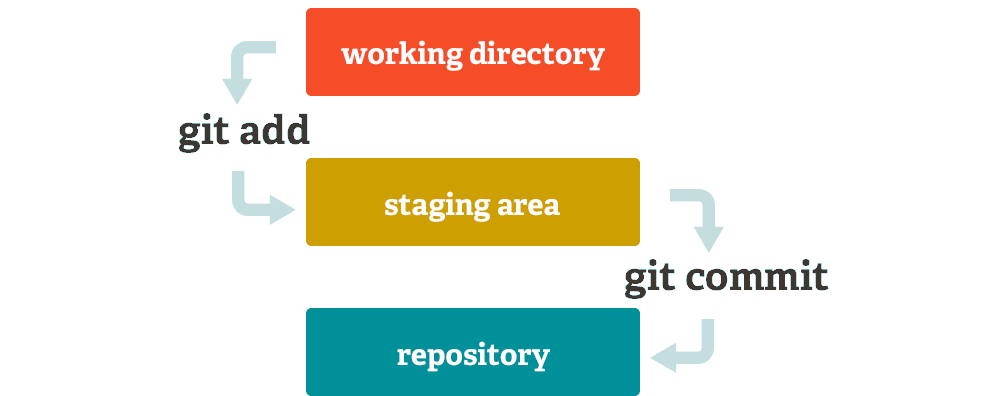
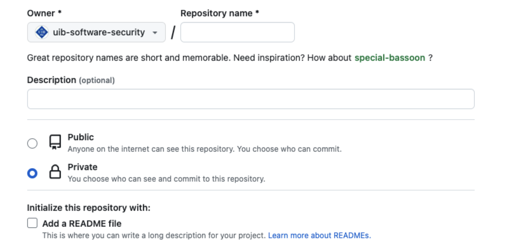
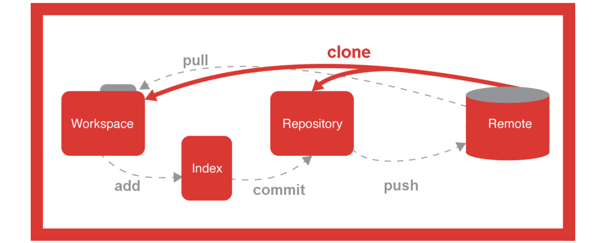
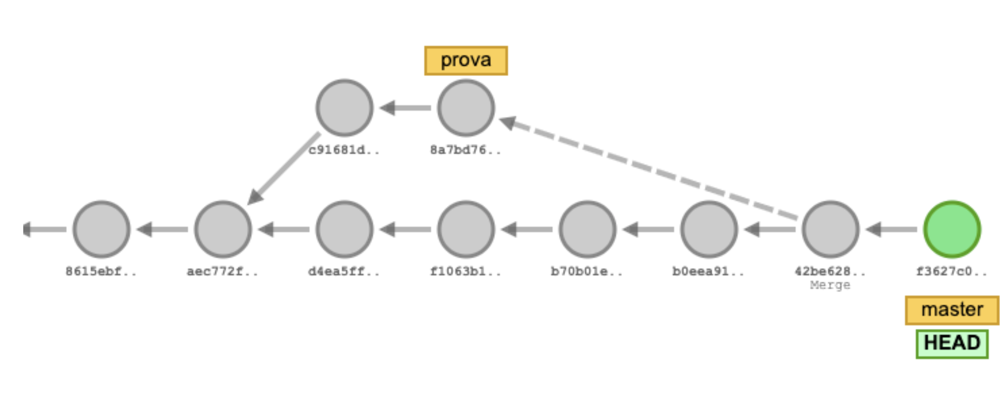
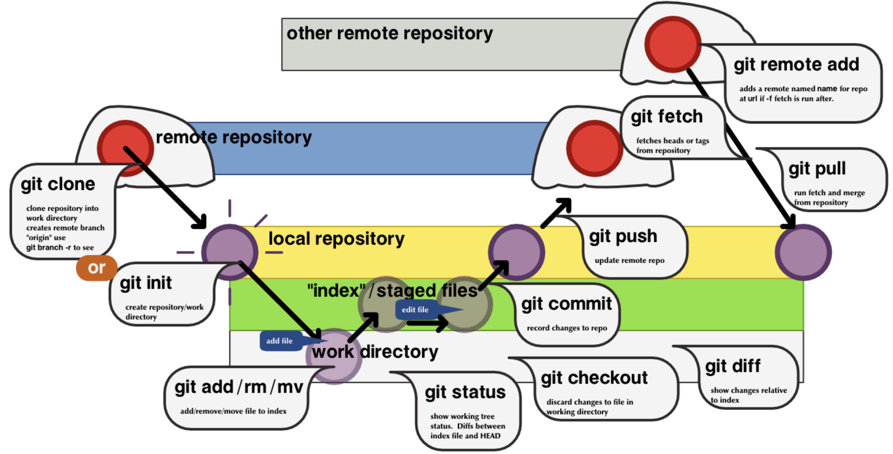

# Git i GitHub. Sistemes de control de versions

---

## Git: sistema de control de versions

- **Git** és un sistema de control de versions (**Version Control System, VCS**) dissenyat per fer el seguiment dels canvis en fitxers i coordinar el treball entre múltiples persones.
- És utilitzat principalment per a la gestió del codi font en el desenvolupament de programari.
- Cada directori Git en qualsevol ordinador és un **repositori complet**, amb historial complet i capacitats de seguiment de versions, independentment de l'accés a la xarxa o a un servidor central.
- Git va ser creat per **Linus Torvalds** per al desenvolupament del kernel de Linux.
- És un programari lliure distribuït sota els termes de la **GNU General Public License versió 2**.

---

## Instal·lació de Git

- **Windows**: descarregar des de [https://git-scm.com/download/win](https://git-scm.com/download/win)
- **Linux**: executar la comanda
  ```bash
  sudo apt install git
  ```
- **macOS**: instal·lar Xcode des de l'App Store i executar
  ```bash
  xcode-select --install
  ```

---

## Configuració de Git

- **Nom i correu electrònic**: cal configurar el nom i correu electrònic per a identificar els commits.
  ```bash
  git config --global user.name "<user-name>"
  git config --global user.email "<user-email>"
  ```
- **Visualització de la configuració**:
  ```bash
  git config --list
  ```

---

## Estructura d'un repositori

- **El directori de treball (*working tree*):** conté els fitxers en què estàs treballant actualment.
- **L'índex (*staging area*):** és una àrea de preparació on es configuren els canvis per validar-los (**commits**).
- **El repositori (*HEAD*):** és la ubicació final on es guarden els canvis validats.


---

## Flux de treball

1. Els canvis fets al directori de treball han de ser primer afegits a l'índex.
2. Només els canvis que es trobin a l'índex seran realment validats (**committed**) al repositori.



---

## Comandes bàsiques de Git

- Inicialitzar un repositori nou:
   ```bash
   git init
   ````
   - Crea un nou repositori local (`/.git`).
- Afegir fitxers a l'índex
   ```bash
   git add [-u] [filename | . | pattern]
   ```
   - Agafa una instantània dels fitxers per a versionar, afegint-los a l'**Index** (*staging area*).
   - L'opció `-u` també afegeix els fitxers per eliminar.
- Validar els canvis al repositori
   ```bash
   git commit -m "Missatge del commit"
   ```
   - Guarda els canvis de l'**Index** al **Repositori** (**HEAD**).

---

## Veure l'estat del repositori git

- Llistar tots els fitxers nous o modificats (comparats amb el **HEAD**)
   ```bash
   git status
   ```
- Per veure els canvis entre l'àrea de treball i el **Index** (*staging area*) 
   ```bash
   git diff <filename>
- Mostrar els canvis (commits) realitzats al **HEAD** (Repositori)
   ```bash
   git log [-p] [--graph] [--all] [--oneline]
   ```
   - `-p` mostra els detalls de cada commit.
   - `--graph` mostra un esquema de l'historial de commits.
   - `--all` mostra commits de totes les branques.
   - `--oneline` mostra els commits en una sola línia.
- Mostrar informació d'un commit
   ```bash
   git show <id_commit>
   ```

---

## Repositori remot: GitHub


- Per començar a compartir els nostres canvis amb altres persones, necessitem enviar-los a un **repositori remot**
- Utilitzarem **GitHub** com a repositori remot
- **GitHub** és un repositori de control de versions Git basat en web
- Per registrar-te a GitHub:
  - Ves a [https://github.com](https://github.com)
  - Registra un nou compte ("**Sign up**") amb el teu correu electrònic
  - Informa el professor del teu nom d'usuari perquè puguis unir-te a l'organització `@uib-software-security` [https://github.com/uib-software-security](https://github.com/uib-software-security)

---

## Crear un repositori a GitHub

- Has de triar l'opció "**New repository**" del menú "**+**" a la part superior dreta
- A la següent pantalla has de configurar:
  - **Owner**: Pot ser el teu usuari o una organització
  - **Nom del repositori**
  - **Nivell de visibilitat**: Públic o Privat
  - Opcionalment, marca "**Initialize this repository with a README**"
  - Opcionalment, afegeix un fitxer `.gitignore` del llenguatge de programació desitjat (`.gitignore` especifica els fitxers que es vol ignorar intencionadament)
  - Opcionalment, afegeix una llicència **GPL 3.0**, **MIT**,...

---v


---v



---

## URL del repositori de GitHub

- Quan estàs dins d'un repositori, pots veure la URL HTTPS del repositori per clonar-lo amb el botó "**Code**".


---

## Comandes per configurar un repositori remot

- Crea una còpia d'un repositori remot
   ```bash
   git clone <url>
   ```
- Mostra el(s) repositori(s) remot(s)
   ```bash
   git remote show [origin]
   ```
- Afegeix un repositori remot
   ```bash
   git remote add origin <url>
   ```

---

## Comandes per treballar amb un repositori remot

- Puja tots els fitxers validades de la branca local al repositori remot
   ```bash
   git push [origin] [master]
   ```
- Descarrega i incorpora els canvis del repositori remot (`git fetch` + `git merge`)
   ```bash
   git pull [origin] [master]
   ```
- Descarrega els canvis del repositori remot
   ```bash
   git fetch
   ```

---

## Esquema de treball amb Git



---

## Ús de branques

- A **Git**, cada **commit** sap quin *commit* el precedeix (historial).
- Una **branch** a Git és simplement un apuntador a un commit.
  - Cada vegada que es fa un **commit**, l'apuntador de la branca activa s'actualitza automàticament. L'historial d'una branca seria la seqüència de *commits* des de l'apuntador de la branca fins al seu inici.
- **HEAD** apunta a la **branca activa**, és a dir, a l'apuntador de l'últim *commit* de la branca activa.

---

## Branques de Git


---

## Comandes de Git amb branques

- Crear una nova branca
   ```bash
   git branch <branch_name>
   ```
- Mostrar les branques existents
   ```bash
   git branch -l
   ```
- Esborrar la branca especificada
   ```bash
   git branch -d <branch_name>
   ```

---

## Més comandes de Git amb branques

- Canviar a la branca especificada, modificant on apunta el HEAD
   ```bash
   git checkout [-b] <branch_name>
   ```
   - `-b` crea la branca si no existeix
- Crear un nou commit que integri la branca especificada a la branca activa
   ```bash
   git merge <branch_name> -m "message"
   ```
   - Aquest commit tindrà dos "commits pare". Si no s'especifica una branca, integrarà la branca remota (*origin/master*)
- Reescriure l'historial de commits, integrant la branca especificada en el punt on es va bifurcar
   ```bash
   git rebase <branch_name>
   ```

---

## Visualitzar les branques de Git



[http://git-school.github.io/visualizing-git/](http://git-school.github.io/visualizing-git/)

---

## Resum de comandes de Git



---v


---

## Altres eines de GitHub

- **Issues**: per informar d'errors, sol·licitar noves funcionalitats o fer preguntes.
- **Projects**: per organitzar i prioritzar la feina.
- **Wiki**: per documentar el projecte.
- **Pull requests**: per proposar canvis al projecte.
- **Actions**: per automatitzar el flux de treball.
- **Insights**: per analitzar el projecte.

---

## 🔗 Enllaços

- [Git & GitHub Crash Course For Beginners (Youtube)](https://www.youtube.com/watch?v=SWYqp7iY_Tc)
- [Using Projects for feature planning (Youtube)](https://www.youtube.com/watch?v=yFQ-p6wMS_Y)
- [Tools & Concepts for Mastering Version Control with Git (Youtube)](https://www.youtube.com/watch?v=Uszj_k0DGsg&t=2s)
- [ProGit book](https://git-scm.com/book/en/v2)
- [Git and GitHub learning resources](https://docs.github.com/en/get-started/quickstart/git-and-github-learning-resources)
- [GitHub Skills](https://skills.github.com/)
- [Git Cheat Sheet](https://education.github.com/git-cheat-sheet-education.pdf)
