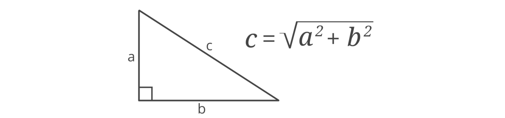
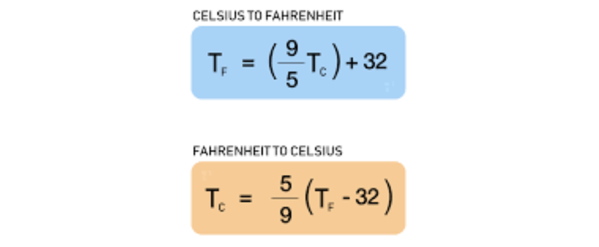

# Programació en C

---

## Requisits

- [Visual Studio Code](https://code.visualstudio.com/)
- [C/C++ Extension Pack](https://marketplace.visualstudio.com/items?itemName=ms-vscode.cpptools-extension-pack)
- Compilador de C (`gcc`):
  - [Linux](https://code.visualstudio.com/docs/cpp/config-linux)
  - [Windows](https://code.visualstudio.com/docs/cpp/config-mingw)
  - [Mac OSX](https://code.visualstudio.com/docs/cpp/config-clang-mac)

---

## Funció main

Fitxer `test.c`

```c
#include <stdio.h>

int main() {
  printf("Hello, World!\n");
  return 0;
}
```

---

## Compilar i executar

- Instrucció per compilar:
  ```bash
  gcc test.c -o test
  ```
- Instrucció per executar:
  ```bash
  ./test
  ```
- Resultat:
  ```bash
  Hello, World!
  ```

---

## Comentaris

```c
// comentari de línia

/*
  comentari
  de
  múltiples
  línies
*/
````

---

## Caràcters d'escapament (*scape characters*)

```c
// \n         - Nova línia (LF, line feed)
// \r         - Retorn de carro (CR, carriage return)
// \t         - Tabulació horitzontal
// \'         - Cometa simple
// \"         - Cometes dobles
// \\         - Barra diagonal inversa
// \x         - Valor hexadecimal, com \xFFFF
// \uhhhh     - Codi Unicode per davall de 10000 hexadecimal 
// \Uhhhhhhhh - Codi Unicode on h és un dígit hexadecimal
```

---

## Variables

```c
int x;       // declaració
x = 123;     // inicialització
int x = 123; // declaració i inicialització

int age = 21;     // integer
float gpa = 2.05; // floating point number
char grade = 'C'; // single character
char name[] = "Mike"; // array of characters - string
```

---

## Formatant strings

```c
// %s = string
// %d = decimal
// %c = character
// %f = float
// %lf = double

// %.1 = decimal precision
// %1 = minimum field width
// %- = left align

printf("Hello %s \n", name);
printf("Your gpa is %5.2f\n");
```

---

## Tipus de dades

```c
char a = 'C'; // single character %c
char b[] = "Mike"; // array of characters %s

float c = 3.141592; // 4 bytes (32 bits of precision) 6 - 7 digits %f
double d = 3.141592653589793; // 8 bytes (64 bits of precision) 15 - 16 digits %1f

bool e = true; // 1 byte (true or false) %d
```

```c
void // \0
```

---

## Tipus de dades

```c
char f = 100; // 1 byte (-128 to +127) %d or %c
unsigned char g = 255; // 1 byte (0 to +255) %d or %c

short int h = 32767; // 2 bytes (-32,768 to +32,767) %d
unsigned short int i = 65535; // 2 bytes (0 to +65,535) %d

int j = 2147483647； // 4 bytes (-2,147,483,648 to +2,147,483,647) %d
unsigned int k = 4294967295; // 4 bytes (0 to +4,294,967, 295) %u
// NOTE: long int = int

long long int 1 = 9223372036854775807; // 8 bytes (-9 quintillion to +9 quintillion) %lld
unsigned long long int m = 18446744073709551615; // 8 bytes (0 to +18 quintillion) %llu
```

---

## Constants

```c
const float PI = 3.14159;
```

---

## Operacions aritmètiques

```c
// + (addition)
// - (subtraction)
// * (multiplication)
// / (division)
// % (modulus)
// ++ (increment)
// -- (decrement)

int x = 5;
int y = 2;
int z = x + y;
float z = x / (float) y;
```

---

## Operadors d'assignaació ampliada

```c
// += ( x += 1; x = x + 1;)
// -= ( x -= 1; x = x - 1)
// *= ( x *= 2; x = x * 2)
// /= ( x /= 2; x = x / 2)
// %= ( x %= 2; x = x % 2)

i += 1; // i = i + 1;
```

---

## Introducció de dades per teclat

```c
#include <stdio.h>

int main() {
  int age;

  printf("How old are you?");
  scanf("%d", &age);
  printf("You are %d years old", age);
  return 0;
}
```

Amb `scanf`, a diferència de `printf`, cal passar punters als arguments perquè `scanf` pugui modificar-ne els valors.

---

## Introducció de dades per teclat

```c
#include <stdio.h>
#include <string.h>

int main() {
  char name[25]; // bytes

  printf("What's your name?");

  scanf ("%s", &name); // "Name Surname" --> "Name". Doesn't accept spaces
  fgets (name, 25, stdin); // "Name Surname" --> "Name Surname\n". Includes new line character
  name[strlen(name)-1] = '\0'; // Removes new line character
}
```

---

## Funcions matemàtiques

```c
#include <math.h>

sqrt(n);
pow(n, m);
round(n);
ceil(n);
floor(n);
abs(n);
fabs(n); // absolute numer of float. - 100.0 = 100.0
log(n);
sin(n);
cos(n);
tan(n);
```

---

## Proposta

Fer un programa que calculi la circumferència i l'àrea d'un cercle, donat el seu radi


---

## Proposta

Fer un programa que calculi la hipotenusa c d'un triangle, donats els seus costats a i b



---

## Condicional if

```c
if (<condition>) {
  // Statements;
} else if (<condition>) {
  // Statements;
} else {
  // Statements
}
```

---

## Condicional switch

```c
switch (<expression>) {
  case <value1>:
    // Statements;
    break;
  case <value2>:
    // Statements;
    break;
  default:
    // Statements;
}
```

---

## Operadors lògics i relacionals

```c
// Operadors lògics
// && - AND
// || - OR
// !  - NOT

// Operadors relacionals
// == - igual
// != - diferent
// >  - major
// >= - major o igual
// <  - menor
// <= - menor o igual
```

---

## Proposta

Fer un programa que converteixi temperatures de graus Celsius a Fahrenheit i viceversa



---

## Funcions

```c
return_type function_name(parameter list )
{
  // Statements
}
```

---v

```c
/* function declaration */
int max(int num1, int num2);

int main () {
  /* calling a function to get max value */
  int ret = max(100, 200);
  printf("Max value is : %d\n", ret);
  return 0;
}

/* function returning the max between two numbers */
int max(int num1, int num2) {
  /* local variable declaration */
  int result;
  if (num1 > num2)
    result = num1;
  else
    result = num2;
  return result;
}
```

---

## Operador ternari

```c
// ternary operator = shortcut to if/else when assigning/returning a value
// (condition)? value_if_true : value_if_false

int findMax(int x, int y) {
  return (x > y) ? x : y;
}
```

---

## Funcions d'string (1)

```c
#include <string.h>

strlwr(string1); // converts a string to lowercase
strupr(string1); // converts a string to uppercase
strcat(string1, string2); // appends string2 to end of string1
strncat(string1, string2, n); // appends n characters from string2 to string1
strcpy(string1, string2); // copy string2 to stringl
strncpy(string1, string2, n); // copy n characters of string2 to stringl

strset(string1, char); // sets all characters of a string to a given character
strnset(string1, char, n); //sets first n characters of a string to a given character
strrev(string1); //reverses a string
```

---

## Funcions d'string (i 2)

```c
#include <string.h>

int result = strlen(string1); // returns string length as int
int result = strcmp(string1, string2); // string compare all characters (0 equal, 1 = different)
int result = strncmp(string1, string2, 1); // string compare n characters (0 equal, 1 = different)
int result = strempi(string1, string1); // string compare all (ignore case)
int result = strnicmp(string1, string1, 1); // string compare n characters (ignore case)
```

---

## Bucles while i do/while

```c
while (condition) {
  // Statements;
}

do {
  // Statements;
} while (condition);

// continue = skips rest of code & forces the next iteration of the loop
// break = exits a loop/switch
```

---

## Bucle for

```c
for (initial_value; condition; incrementation_or_decrementation ) {
  // Statements;
}
```

Exemple:

```c
int number;
//for loop to print 1-10 numbers
for(number=1; number<=10; number++) {
  printf("%d\n",number);
}
```

---


