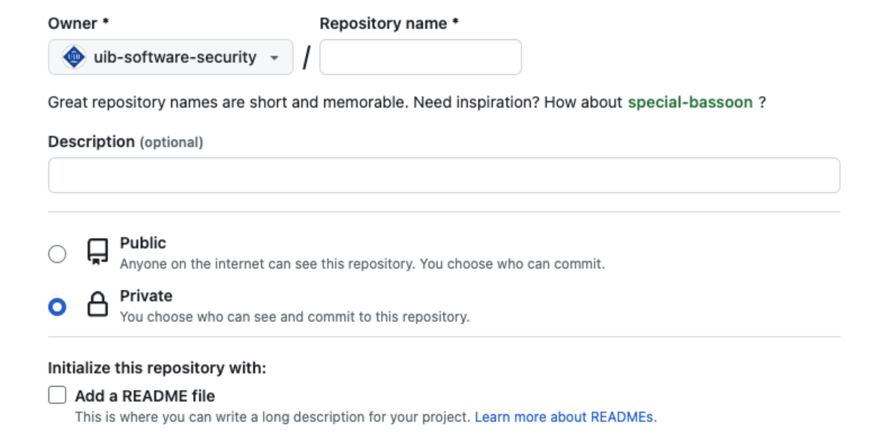
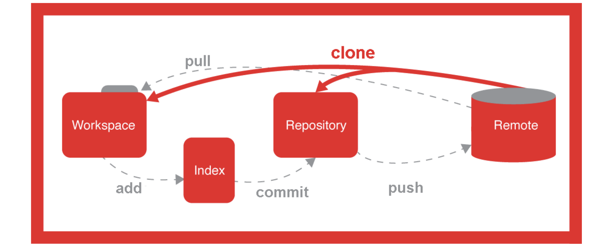
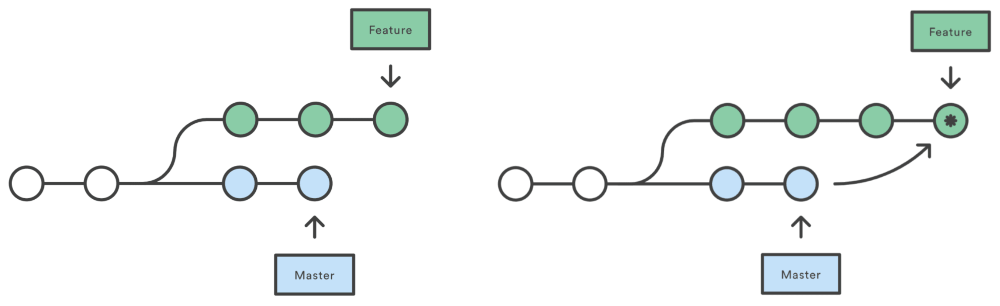
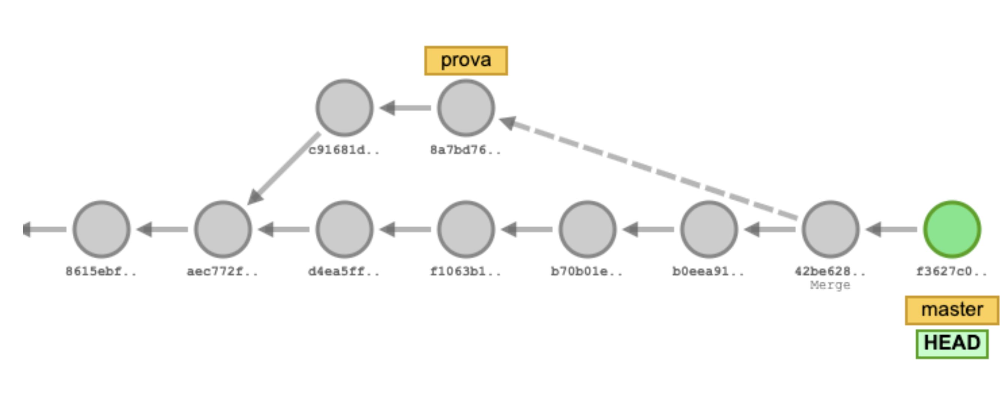

# 🌳 Git i GitHub. Sistemes de control de versions

---

## Git: sistema de control de versions

- **Git** és un sistema de control de versions (**Version Control System, VCS**) dissenyat per fer el seguiment dels canvis en fitxers i coordinar el treball entre múltiples persones.
- És utilitzat principalment per a la gestió del codi font en el desenvolupament de programari.
- Cada directori Git en qualsevol ordinador és un **repositori complet**, amb historial complet i capacitats de seguiment de versions, independentment de l'accés a la xarxa o a un servidor central.
- Git va ser creat per **Linus Torvalds** per al desenvolupament del kernel de Linux.
- És un programari lliure distribuït sota els termes de la **GNU General Public License versió 2**.

---

## Instal·lació de Git

- **Windows**: descarregar des de [https://git-scm.com/download/win](https://git-scm.com/download/win)
- **Linux**: executar la comanda
  ```bash
  sudo apt install git
  ```
- **macOS**: instal·lar Xcode des de l'App Store i executar
  ```bash
  xcode-select --install
  ```

---

## Configuració de Git

- **Nom i correu electrònic**: cal configurar el nom i correu electrònic per a identificar els commits.
  ```bash
  git config --global user.name "<user-name>"
  git config --global user.email "<user-email>"
  ```
- **Visualització de la configuració**:
  ```bash
  git config --list
  ```

---

## Estructura d'un repositori

- **El directori de treball (*working tree*):** conté els fitxers en què estàs treballant actualment.
- **L'índex (*staging area*):** és una àrea de preparació on es configuren els canvis per validar-los (**commits**).
- **El repositori (*HEAD*):** és la ubicació final on es guarden els canvis validats.


---

## Flux de treball

1. Els canvis fets al directori de treball han de ser primer afegits a l'índex.
2. Només els canvis que es trobin a l'índex seran realment validats (**committed**) al repositori.


---

## Comandes bàsiques de Git

- Inicialitzar un repositori nou:
   ```bash
   git init
   ````
   - Crea un nou repositori local (`/.git`).
- Afegir fitxers a l'índex
   ```bash
   git add [-u] [filename | . | pattern]
   ```
   - Agafa una instantània dels fitxers per a versionar, afegint-los a l'**Index** (*staging area*).
   - L'opció `-u` també afegeix els fitxers per eliminar.
- Validar els canvis al repositori
   ```bash
   git commit -m "Missatge del commit"
   ```
   - Guarda els canvis de l'**Index** al **Repositori** (**HEAD**).

---

## See git repository status

- List all new or modified files (compared to **HEAD**)
   ```bash
   git status
   ```
- To view changes between working area and **Index** (*staging area*) 
   ```bash
   git diff <filename>
- Show changes (commits) made to the **HEAD** (Repository).
   ```bash
   git log [-p] [--graph] [--all] [--oneline]
   ```
   - `-p` shows details of each commit.
   - `--graph` shows an schema history of commits
   - `--all` shows commits from all branches
   - `--oneline` shows commits on just one line
- Show commit information
   ```bash
   git show <id_commit>
   ```

---

## Remote repository: GitHub


- To start sharing our changes with others, we need to send them to a **remote repository**
- We will use **GitHub** as a remote repository
- **GitHub** is a web-based Git version control repository
- To register on GitHub
  - Go to [https://github.com](https://github.com)
  - Register a new account ("**Sign up**") with your email
  - Inform the teacher of your username so you can join the `@uib-software-security` organization [https://github.com/uib-software-security](https://github.com/uib-software-security)

---

## Create a GitHub repository

- You must choose the "**New repository**" option from the "**+**" menu option at the top right
- On the next screen you have to set:
  - **Owner**: It can be your user or an organization
  - **Repository name**
  - **Visibility Level**: Public or Private
  - Optionally, check "**Initialize this repository with a README**"
  - Optionally, add a `.gitignore` of the desired programming language (`.gitignore` specifies unchecked files intentionally to ignore them)
  - Optionally, add a **GPL 3.0**, **MIT**,... license

---v


---

## Creating a GitHub repository



---

## GitHub repository URL

- When you are in a repository, you can see the HTTPS URL of the repository so you can clone it with the "**Code**" button


---

## Commands to set up a remote repository

- Creates a copy of a remote repository
   ```bash
   git clone <url>
   ```
- Shows remote repository(s).
   ```bash
   git remote show [origin]
   ```
- Adds a remote repository
   ```bash
   git remote add origin <url>
   ```

---

## Commands to work with a remote repository

- Uploads all validated files from the local branch to the remote repository
   ```bash
   git push [origin] [master]
   ```
- Downloads and incorporates changes from the remote repository (`git fetch` + `git merge`)
   ```bash
   git pull [origin] [master]
   ```
- Downloads the changes from the remote repository
   ```bash
   git fetch
   ```

---

## Working schema with Git



---

## Use of branches

- In **Git**, each **commit** knows which *commit* precedes it (history).
- A **branch** in Git is simply a pointer to a commit.
  - Each time a **commit** is made, the active *branch* pointer is automatically updated. The history of a *branch* would be the sequence of *commits* from the pointer to the *branch* to its beginning.
- **HEAD** points to the **active branch**. That is, to the pointer of the last *commit* of the active branch.

---

## Git branches



---

## Comandes de Git amb branques

- Create a new branch
   ```bash
   git branch <branch_name>
   ```
- Show existing branches
   ```bash
   git branch -l
   ```
- Delete the specified branch
   ```bash
   git branch -d <branch_name>
   ```

---

## Més comandes de Git amb branques

- Switch to the specified branch, changing where the HEAD points.
   ```bash
   git checkout [-b] <branch_name>
   ```
   - `-b` creates the branch if it does not exist.
- Create a new commit that integrates the specified branch into the active branch.
   ```bash
   git merge <branch_name> -m "message"
   ```
   - This commit will have two "parent" commits. If no branch is specified, it will integrate the remote branch (*origin/master*).
- Rewrite the commit history, integrating the specified branch at the point where it was forked.
   ```bash
   git rebase <branch_name>
   ```

---

## Visualitzar les branques de Git



[http://git-school.github.io/visualizing-git/](http://git-school.github.io/visualizing-git/)